Leaving Athens, I flew first to Frankfurt, then to Addis Ababa, and finally to N'Djamena to see Uncle Philip, Auntie Merilee, and cousins! This is the airport in Addis Ababa.

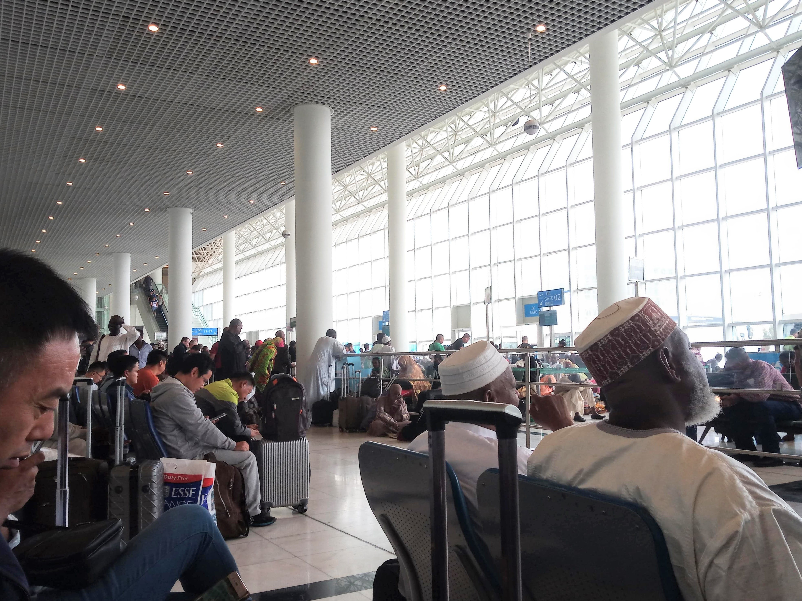

## Moundou
Uncle Philip is a pilot with Mission Aviation Fellowship (MAF), and just a day after arriving in N’Djamena (the capital city where they live), I had the opportunity to fly with Uncle Philip to Moundou (the second largest city).

::: carousel
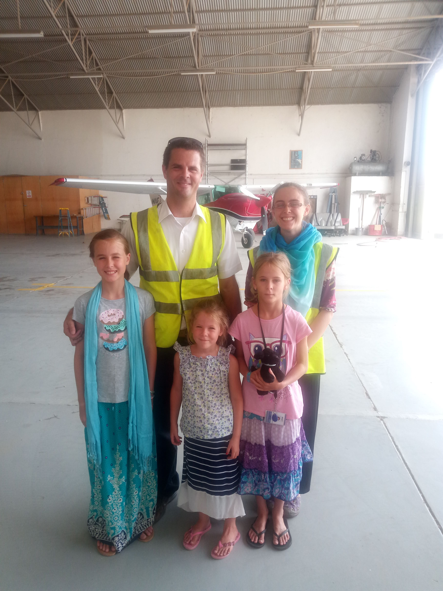

:::

The flight to Moundou was for high-ups in Samaritan’s Purse to see a distribution of Operation Christmas Child boxes.

After the distribution, we visited a restaurant in Moundou, and then spent the night with some missionaries in the city.

::: carousel

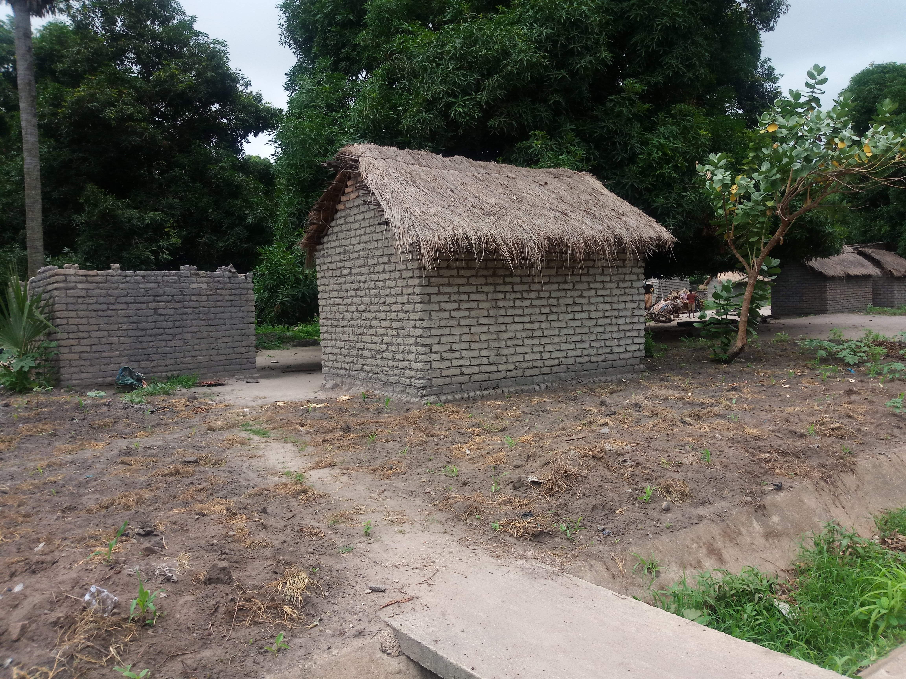

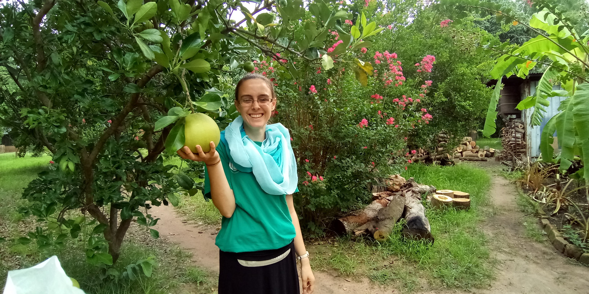

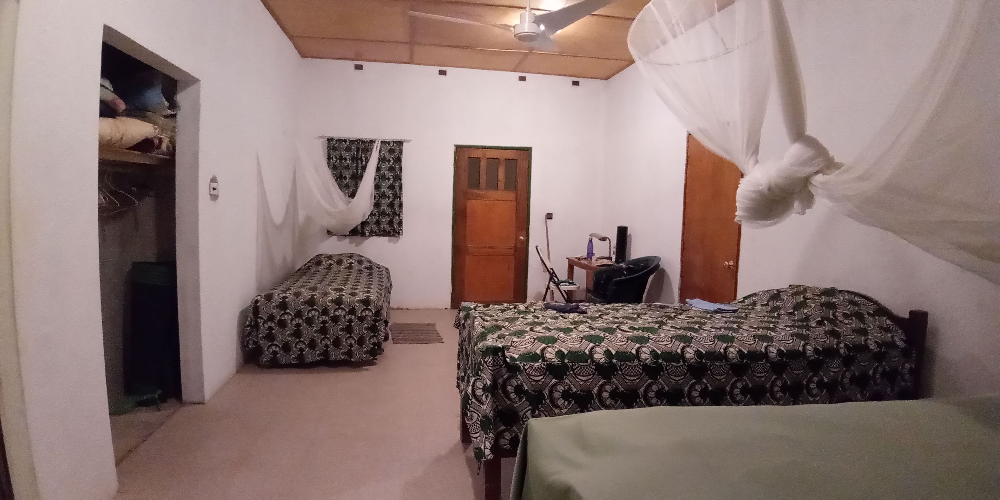
:::

The next day, we flew back to N’Djamena.

::: carousel

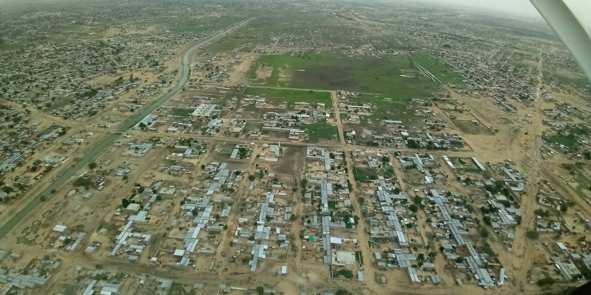
:::

## Hanging out with Cousins
It was lovely to have so much time with cousins! We played lots of board games, had a spa day, had henna done, went swimming at the Hilton hotel, attended a Chadian church, and spent a day at a retreat centre by the river.

::: carousel

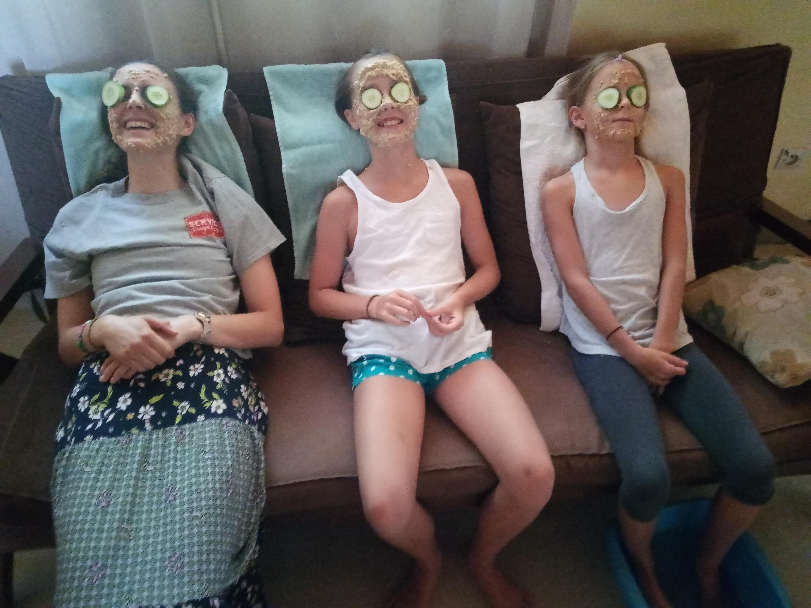
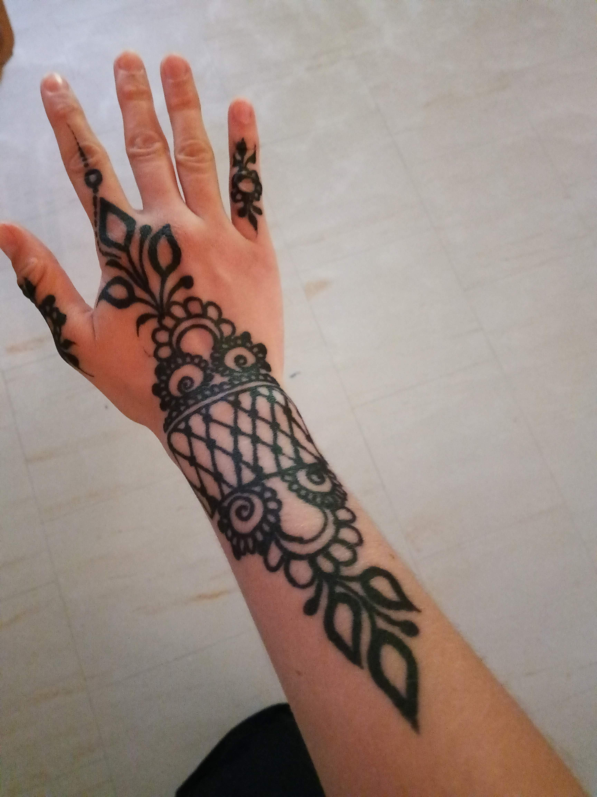
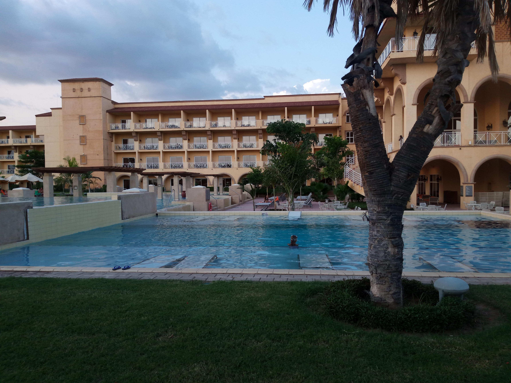
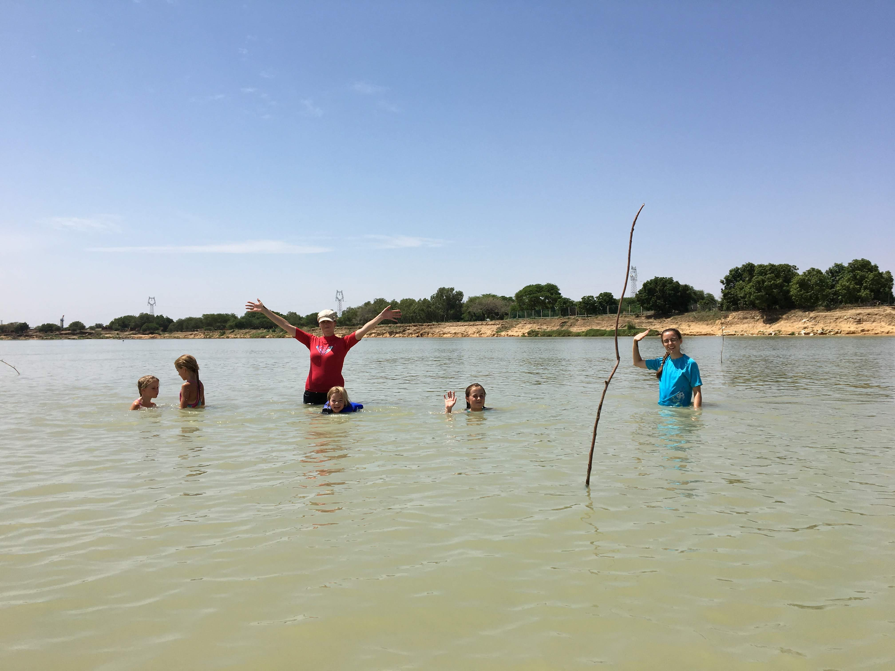

:::

## Canada Day
We had a big celebration for Canada Day, with beaver tails, board games, and a campfire with the neighbours.

::: carousel

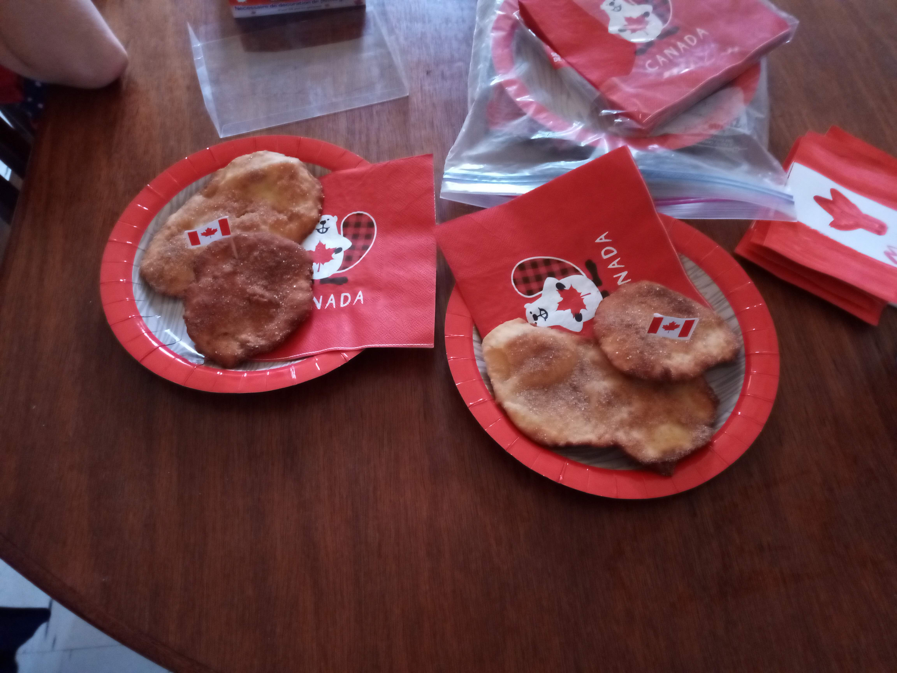
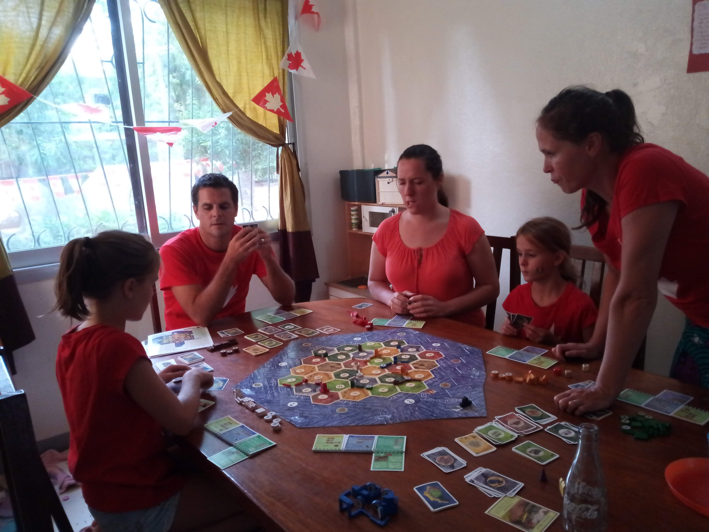
:::
