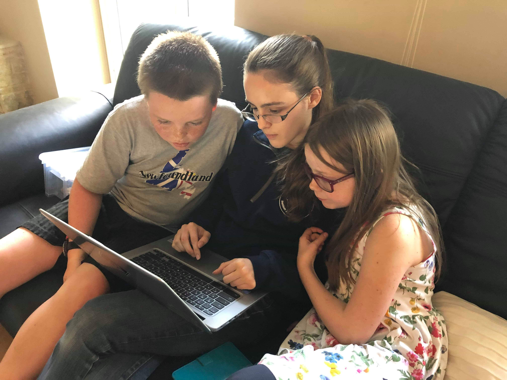
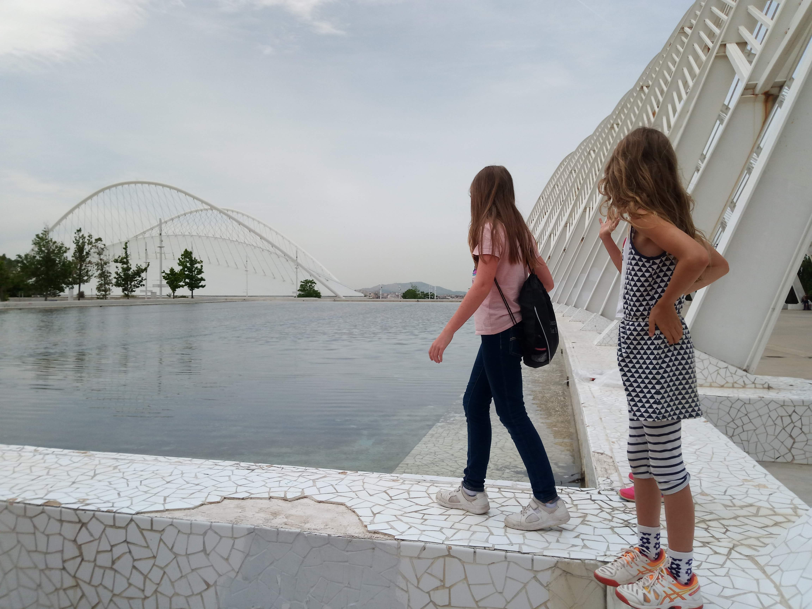
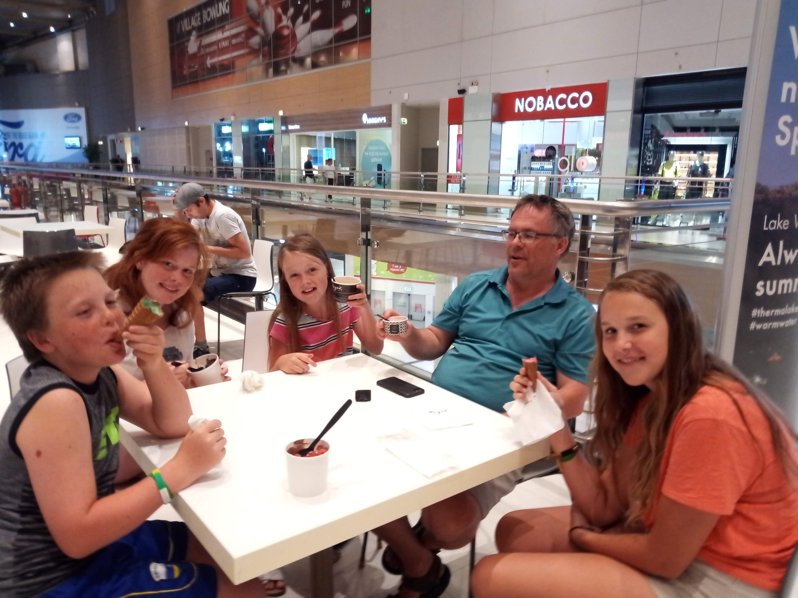
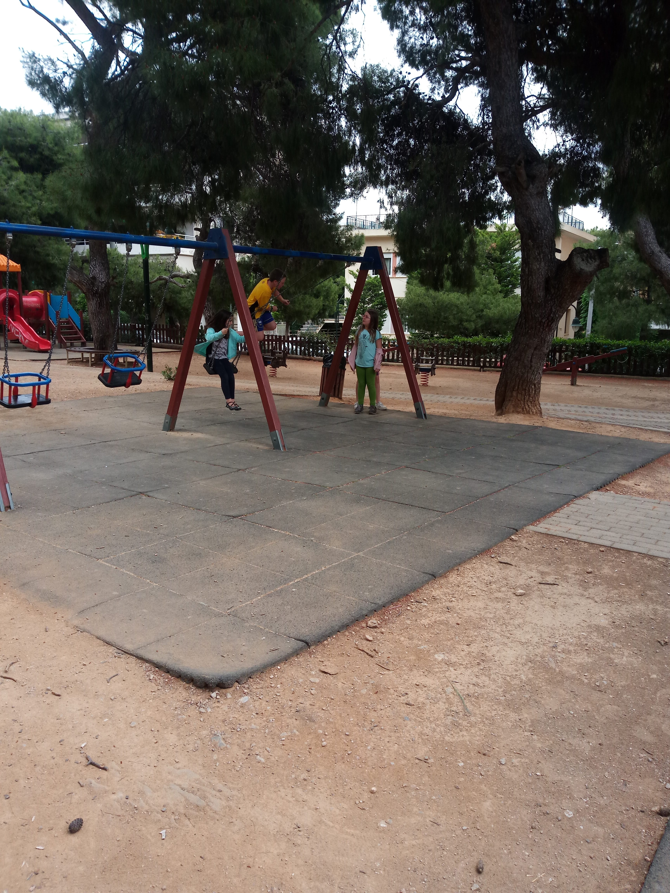
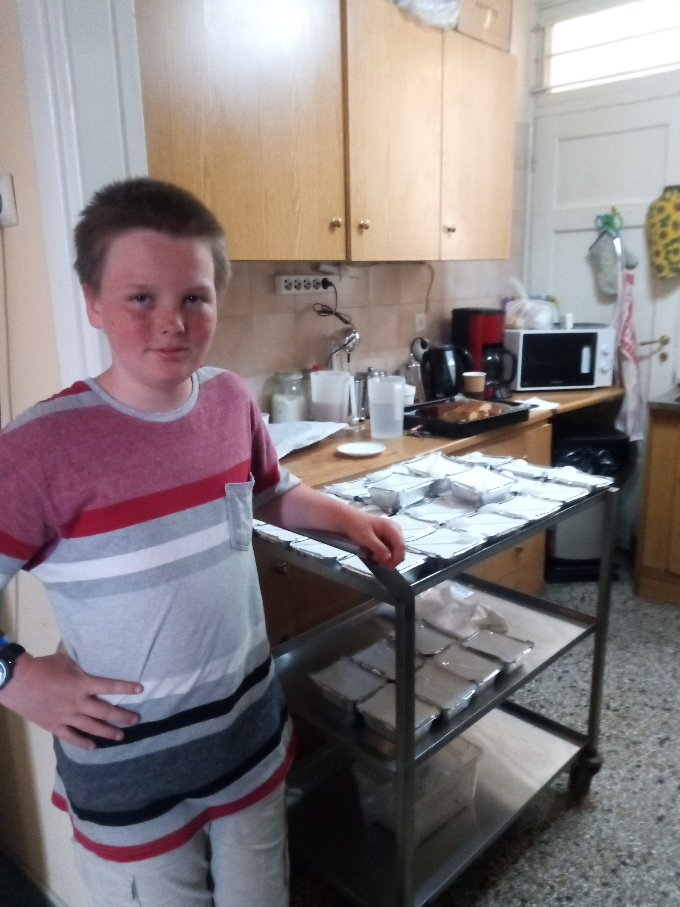
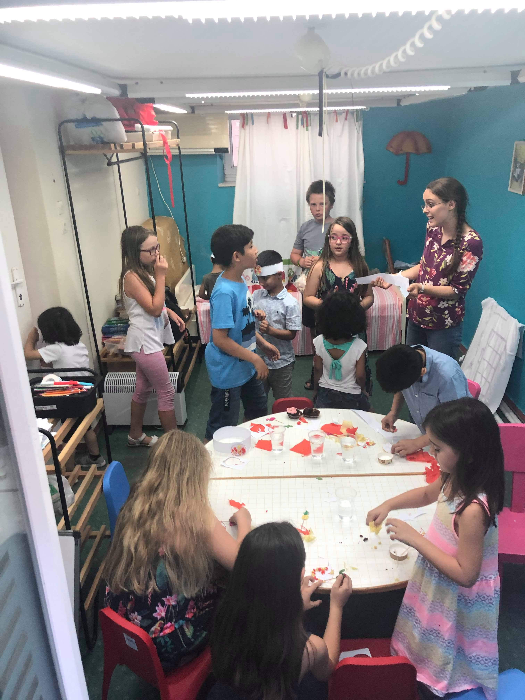
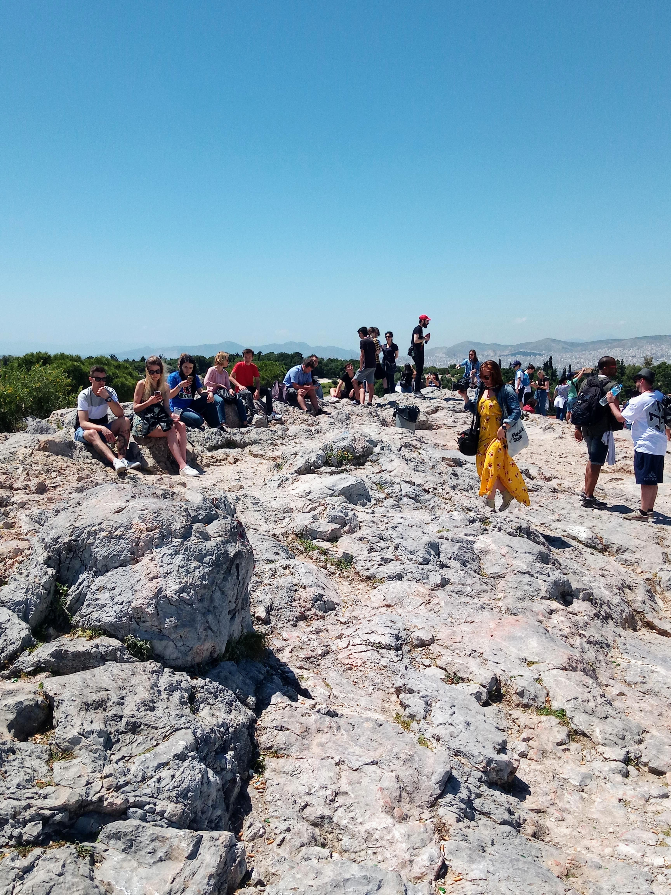
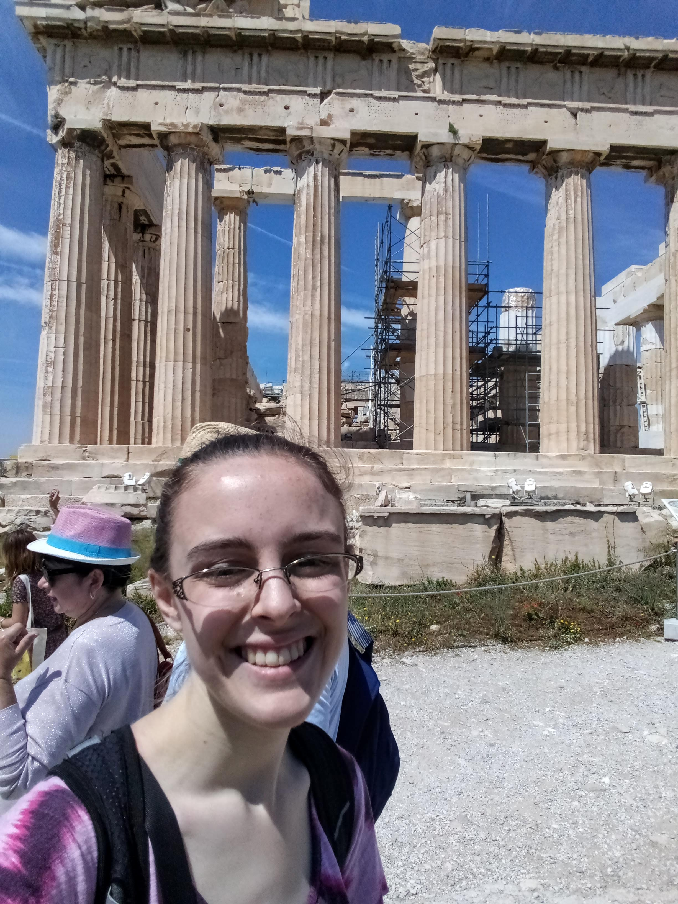
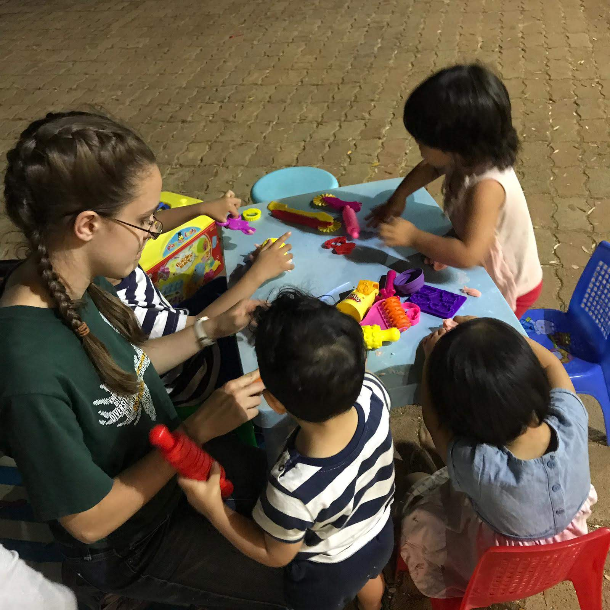

Visité Grecia durante unas 7 semanas, desde abril hasta junio de 2019, y me alojé en Atenas. Me encantan las plantas que todos cuidan en sus balcones - es tan hermoso mirar hacia la ciudad y ver color.

::: carousel

:::

## Mi Trabajo
Durante mi tiempo en Grecia, viví con amigos de la familia, los Orr, y trabajé como asistente educativo con los niños y apoyando el desarrollo de recursos para The Stoplight Approach.

::: carousel

:::

## Vida en Atenas
Este es el mercado Laiki semanal donde normalmente íbamos a comprar frutas y verduras.

Comprando helado en el centro comercial.

Visitando el parque infantil cercano con los niños.

Todos los viernes, iba con algunos de los niños a ser voluntarios en un programa para niños refugiados.

Los domingos, a menudo dirigía la escuela dominical en una iglesia de habla farsi.

De vez en cuando, hacíamos excursiones a la playa.

## Centro de Atenas
Este es el centro de Atenas, cerca de la Acrópolis.

¡Areópago, donde predicó Pablo!

El Teatro de Dionisio (justo al lado de la Acrópolis) - ¡este teatro todavía se usa para conciertos hoy!

Visitando la Acrópolis, y escuchando disimuladamente a los grupos de turistas de habla inglesa.

::: carousel

:::

## Porto Astro
Por una semana, serví en Porto Astro, un campamento cristiano, donde se llevó a cabo un retiro para refugiados de habla farsi.

::: carousel

:::

En el campamento, trabajé principalmente con niños en edad preescolar.

::: carousel

:::
