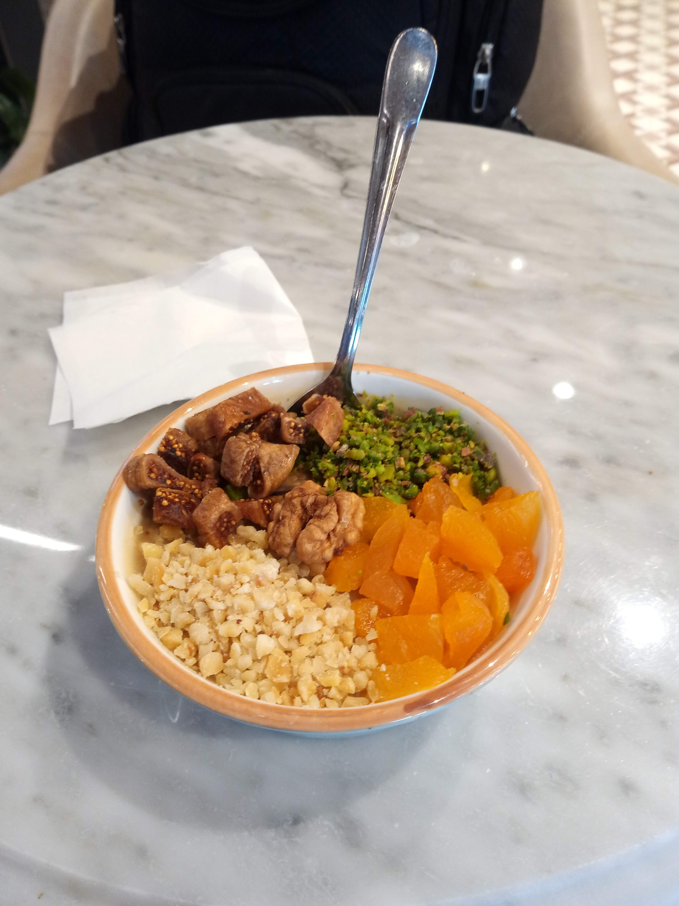
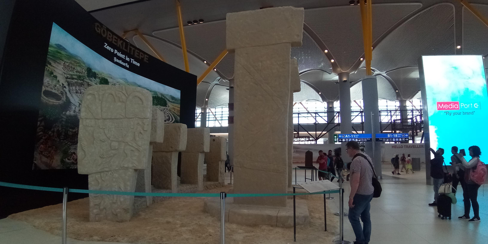
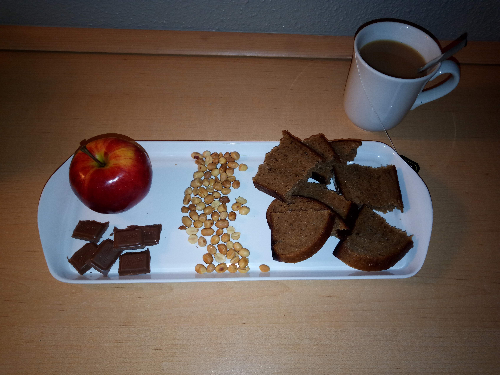
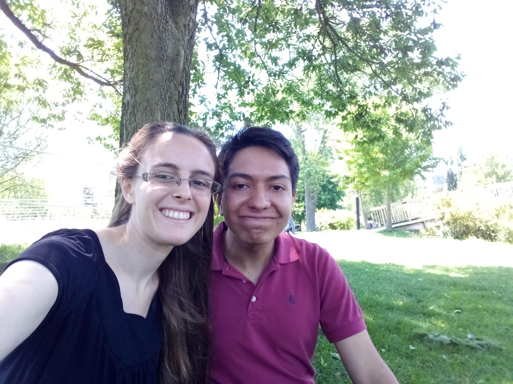
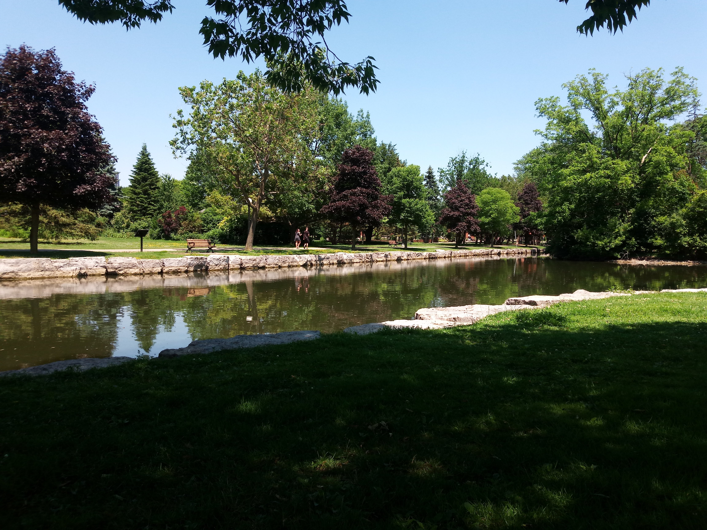
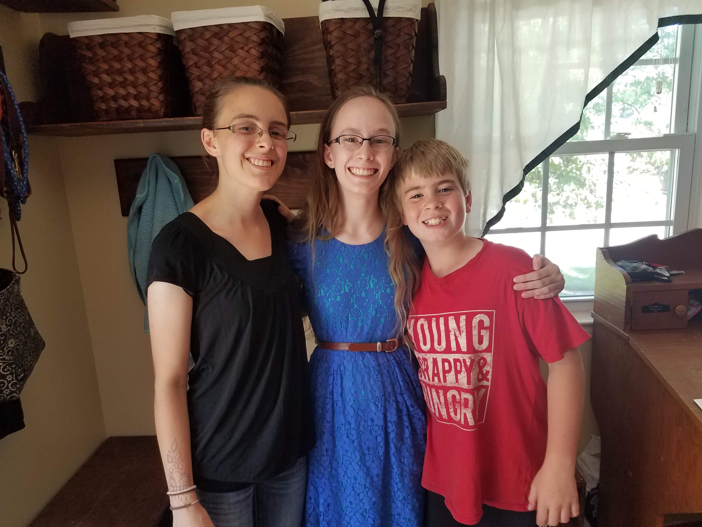

Travelling back, I flew N’Djamena -> Kinshasa (without getting off the plane) -> Istanbul (layover) -> London (one night) -> Toronto (to spend the weekend in Waterloo) -> (bus to) Baltimore.

## Istanbul
Breakfast in Istanbul. Lots to see at the airport.

::: carousel

:::

## London
I spent one night at a hotel in London due to a long layover.

::: carousel

:::

## Waterloo
Then I got to spend two days with Sebastian in Waterloo. We visited Waterloo park, went to church, and enjoyed time catching up after a few months apart.

::: carousel

:::

## Baltimore
Back to Baltimore where I spent the remaining two months of the summer with my family.

::: carousel

:::
