¡Dejé Atenas, volé primero a Frankfurt, luego a Addis Ababa, y finalmente a N'Djamena para ver al tío Philip, la tía Merilee y mis primos! Este es el aeropuerto de Addis Ababa.

## Moundou
El tío Philip es piloto de Mission Aviation Fellowship (MAF), y apenas un día después de llegar a N’Djamena (la capital donde viven), tuve la oportunidad de volar con el tío Philip a Moundou (la segunda ciudad más grande).

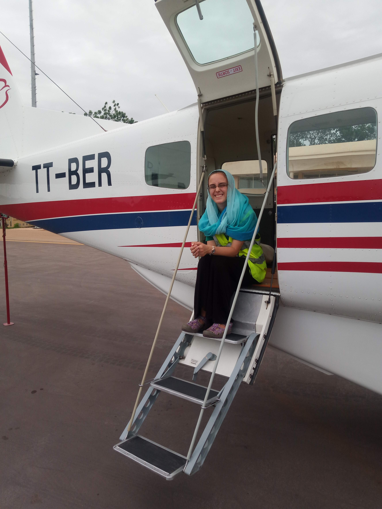
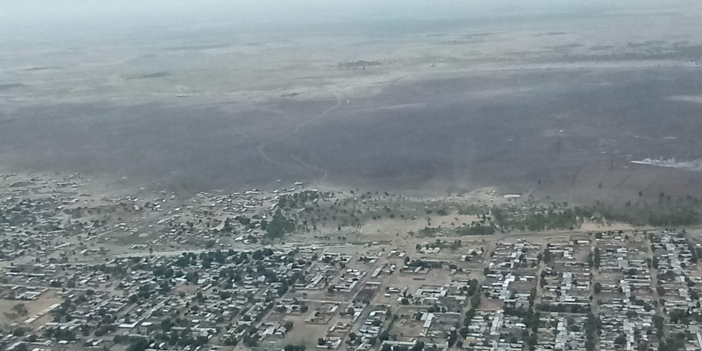

El vuelo a Moundou era para que los peces gordos de Samaritan’s Purse vieran una distribución de cajas de Operation Christmas Child.

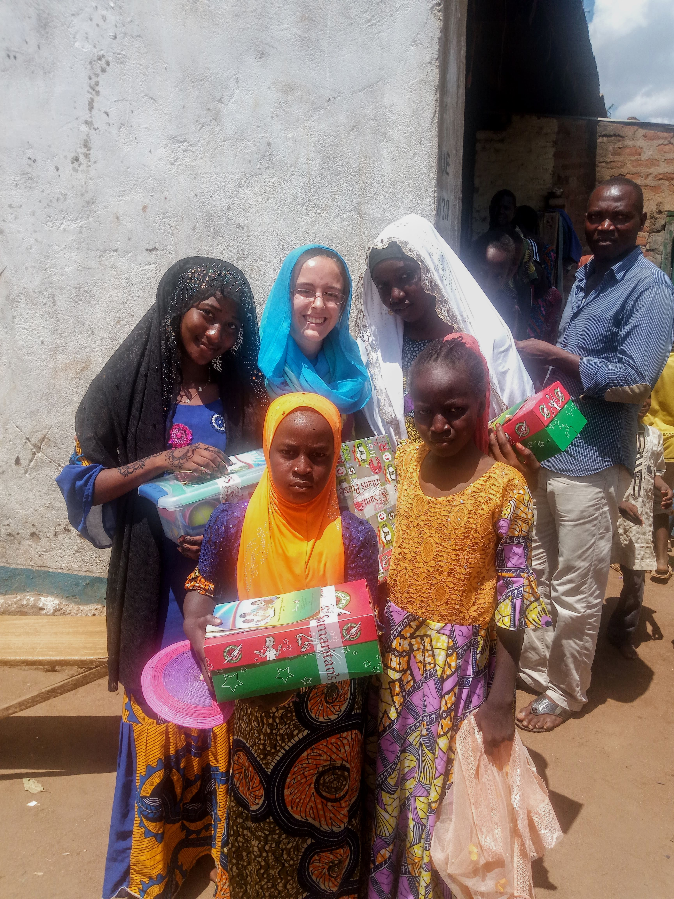

Después de la distribución, visitamos un restaurante en Moundou, y luego pasamos la noche con algunos misioneros en la ciudad.

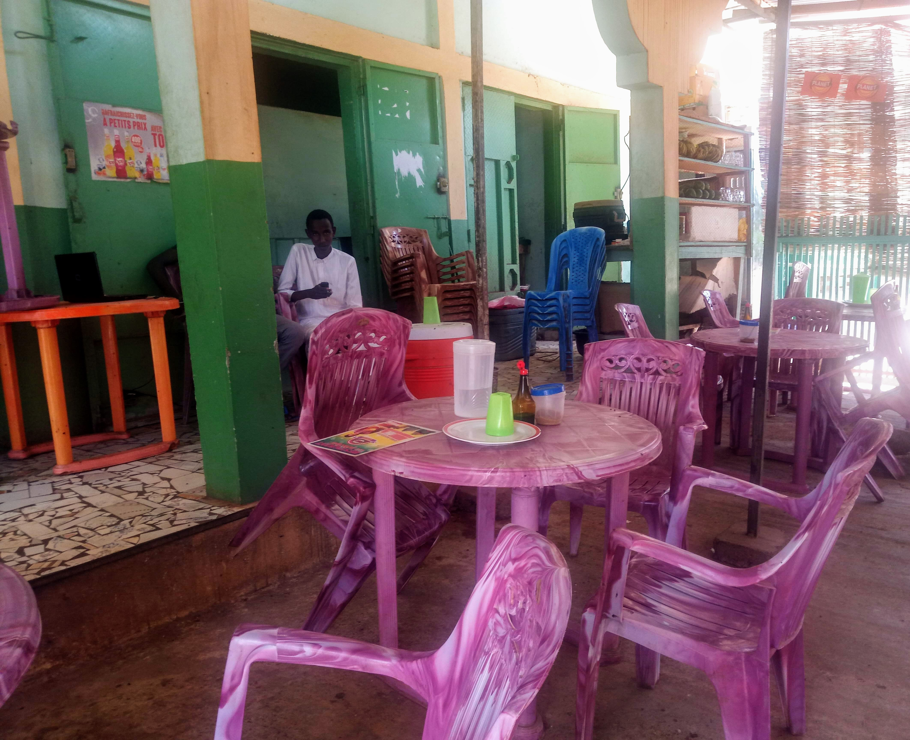

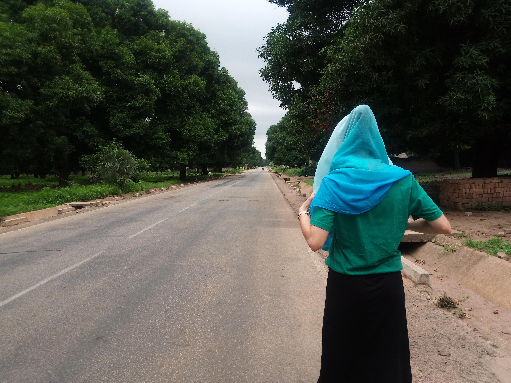

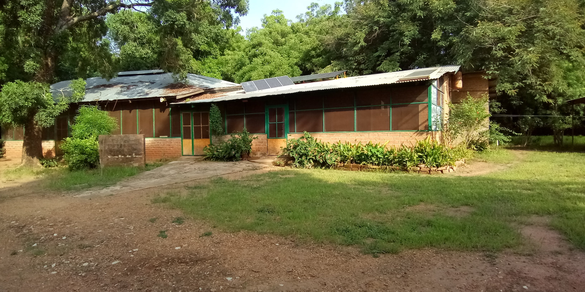

Al día siguiente, volamos de regreso a N’Djamena.

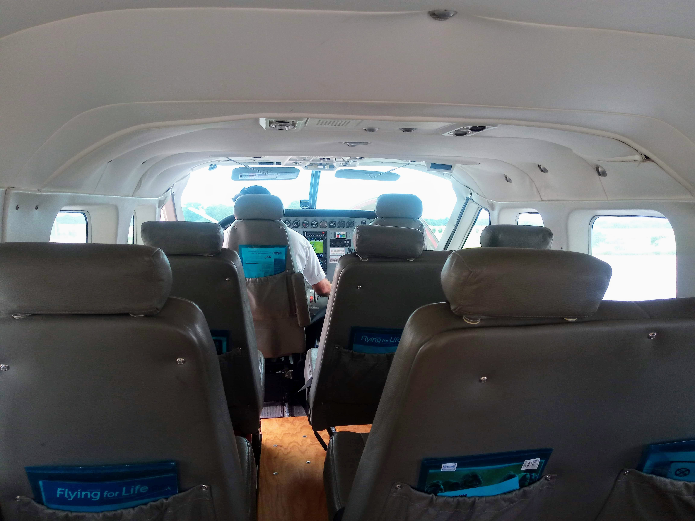
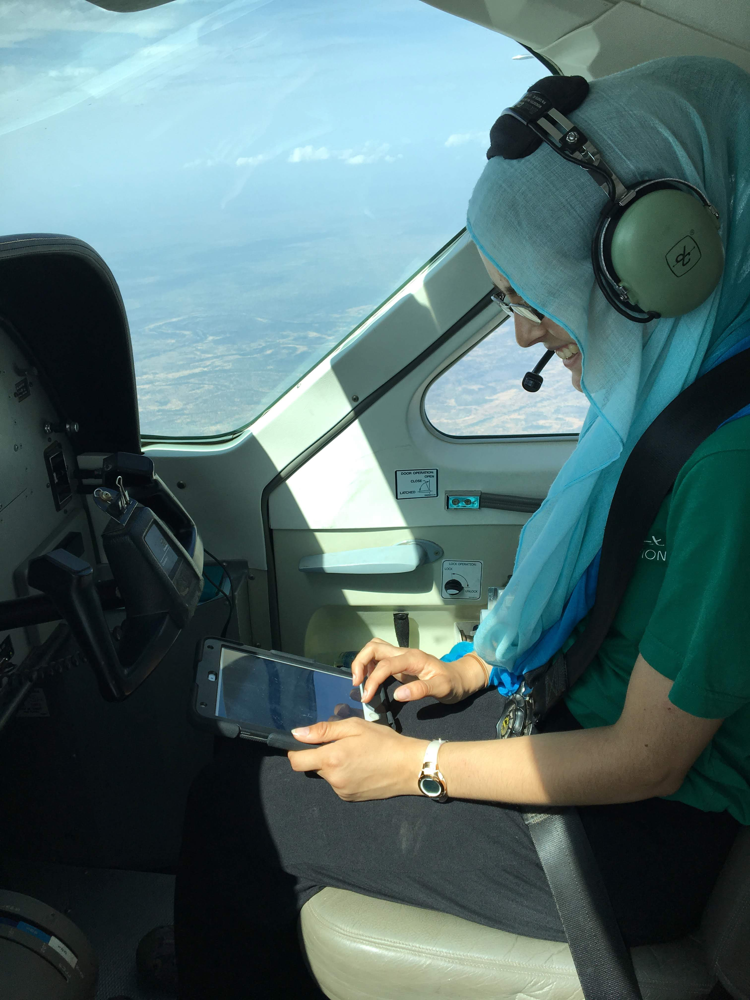

## Pasando tiempo con mis Primos
¡Fue genial pasar tanto tiempo con mis primos! Jugamos muchos juegos de mesa, tuvimos un día de spa, nos hicimos henna, fuimos a la piscina del hotel Hilton, asistimos a una iglesia chadiana y pasamos un día en un centro de retiros junto al río.

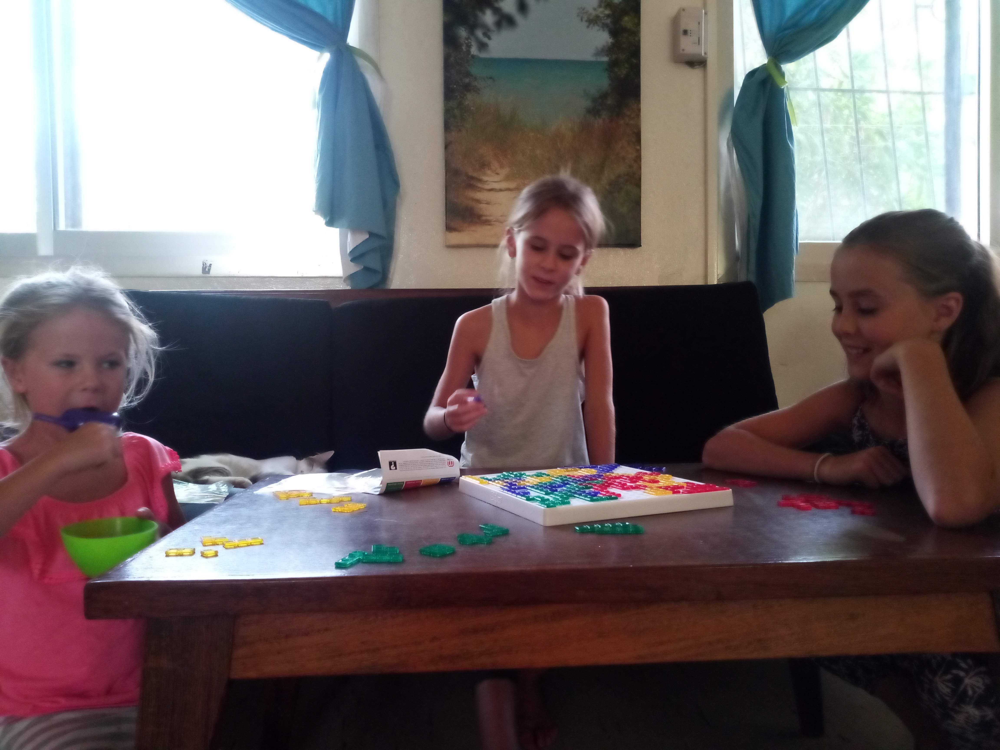

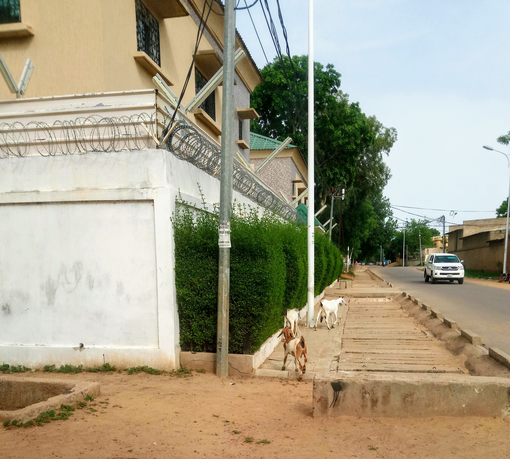
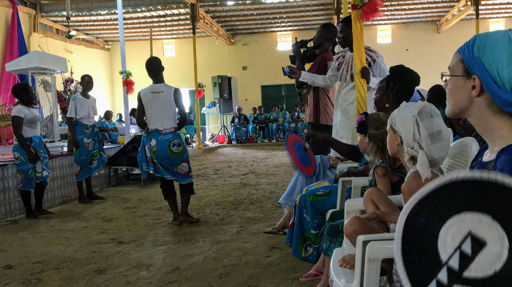

## Día de Canadá
¡Tuvimos una gran celebración por el Día de Canadá, con beaver tails, juegos de mesa y una fogata con los vecinos!

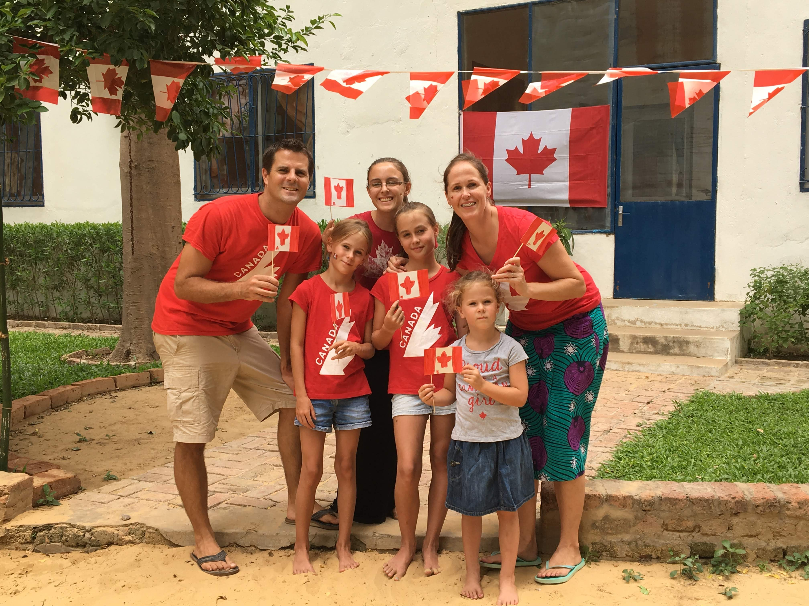
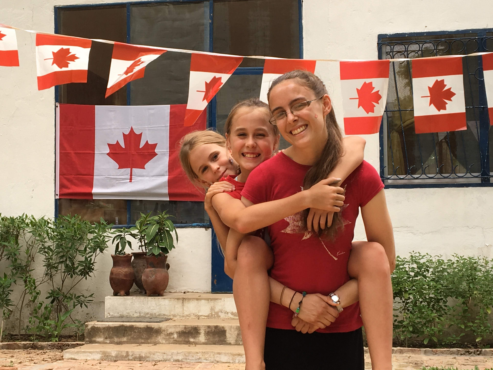

