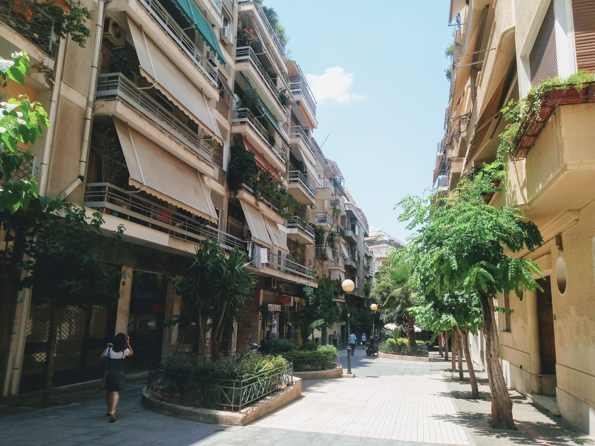
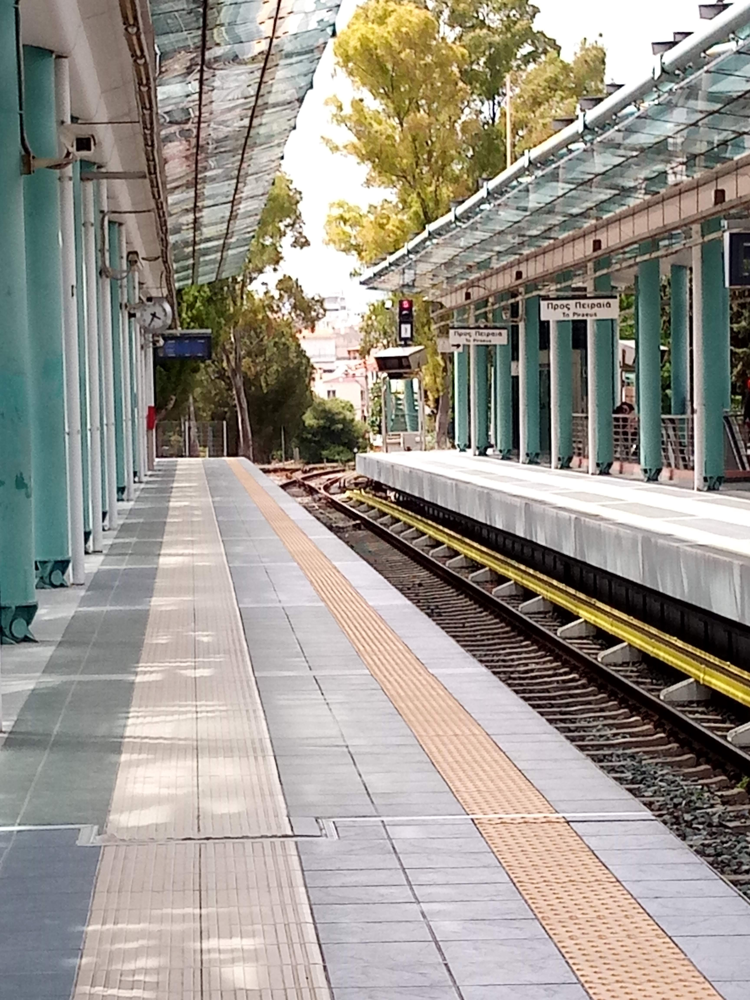
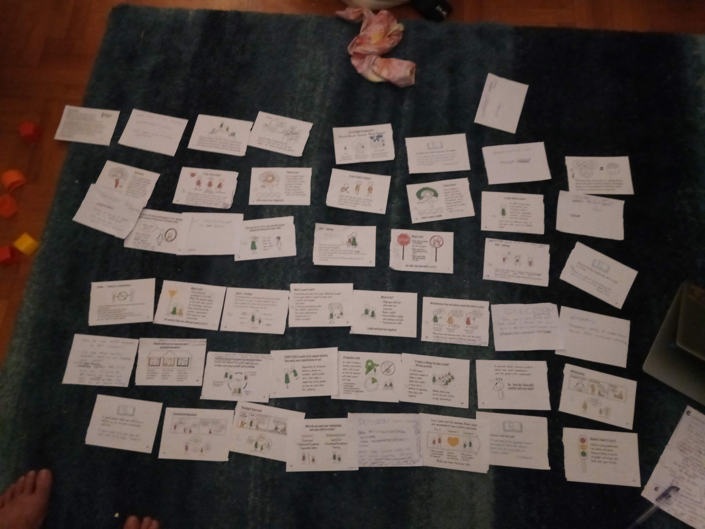
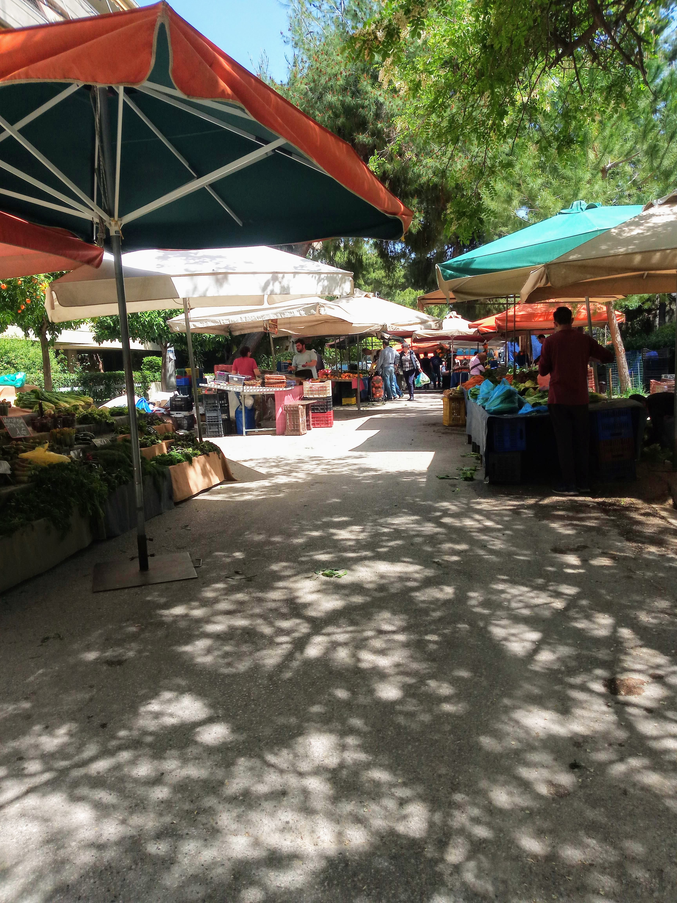
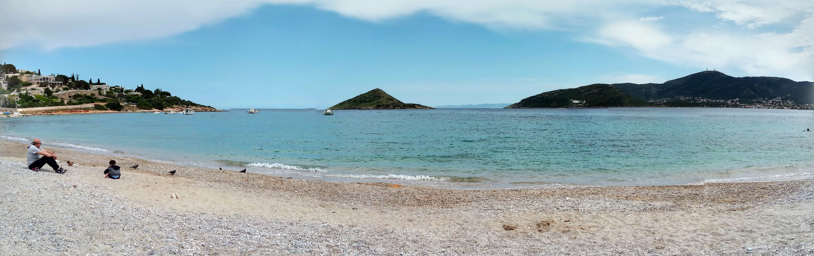
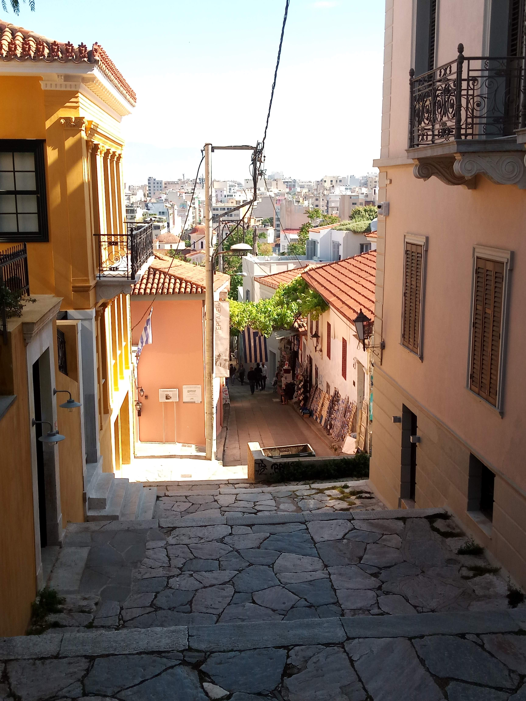
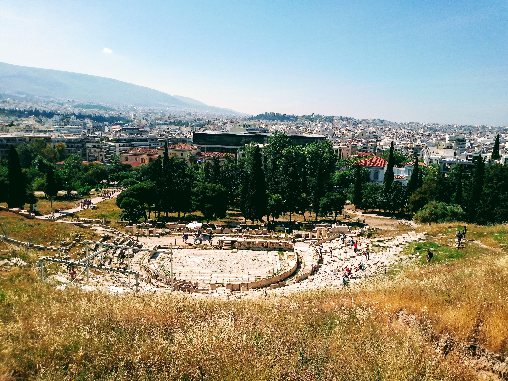
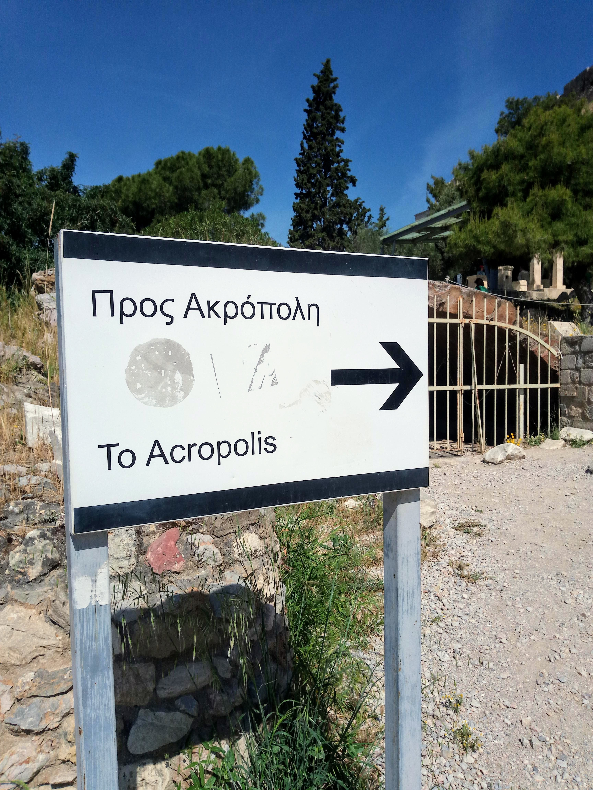
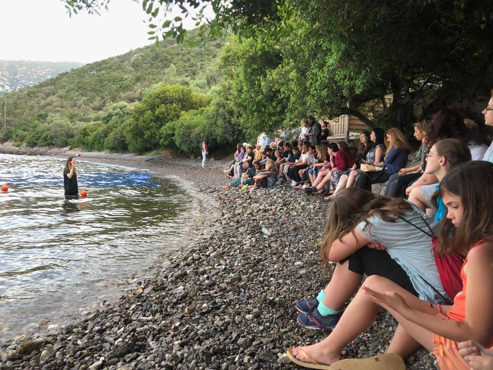
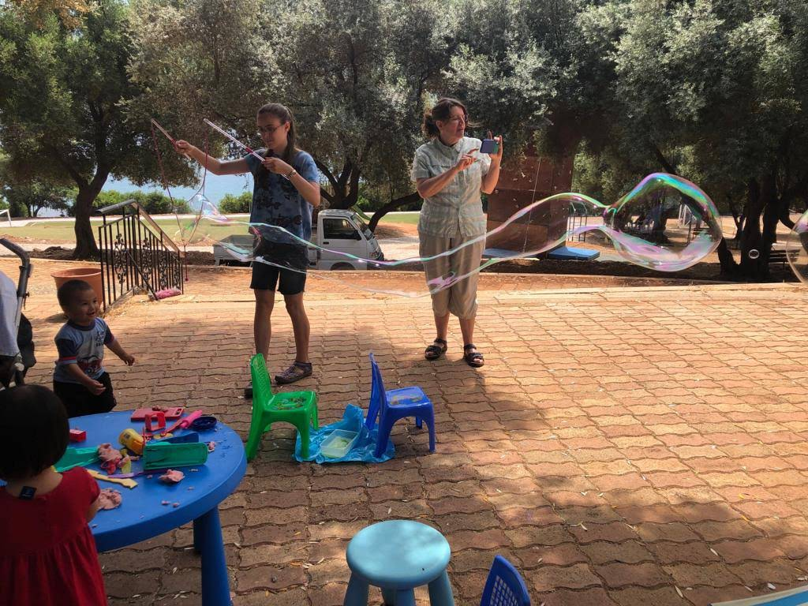

I visited Greece for about 7 weeks from April to June 2019, staying in Athens. I love the plants that everyone keeps on their balconies - it's so beautiful to look out on the city and see colour. 

## My Work
During my time in Greece, I lived with family friends the Orrs and worked both as an Education Assistant with the kids and supporting resource development for The Stoplight Approach.

## Life in Athens
This is the weekly Laiki (market) where we usually went to buy fruits and veggies.

Getting ice cream at the mall.

Visiting the nearby playground with the kids.

Every Friday, I went with some of the kids to volunteer at a program for refugee children.

On Sundays, I often led Sunday School at a Farsi-speaking church.

Occasionally, we took day trips to the beach.

## Downtown Athens
This is downtown Athens, near the Acropolis.

Mars Hill, where Paul preached!

The Theatre of Dionysus (just beside the Acropolis) - this theatre is still used for concerts today!

Visiting the Acropolis, and subtly listing in on English speaking tour groups.

`

## Porto Astro
For one week while in Greece, I served at Porto Astro, a Christian camp, where a retreat was held for Farsi-speaking refugees.

While at the camp, I primarily worked with the pre-school aged children.

