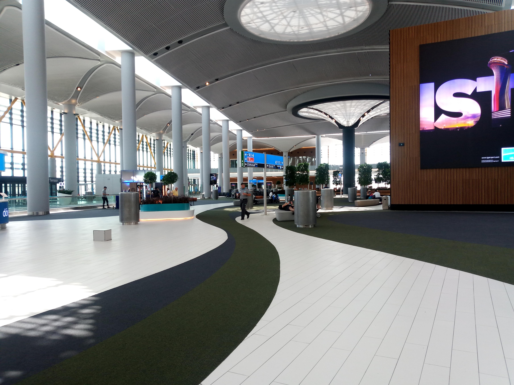
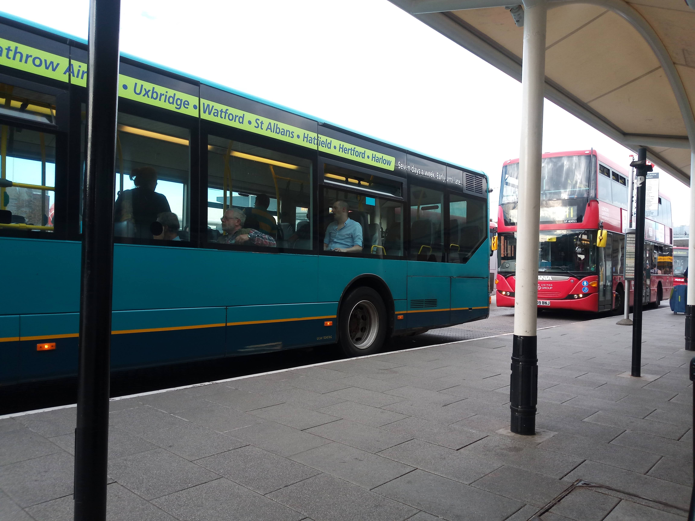
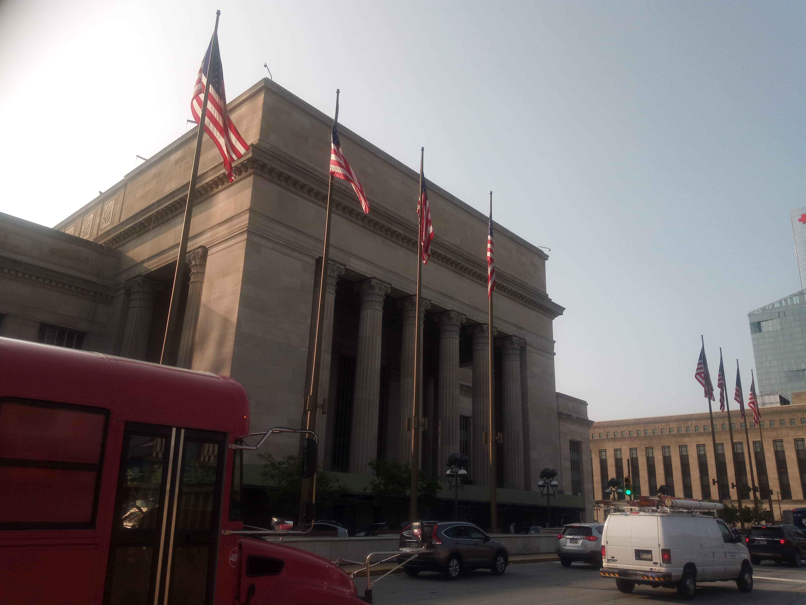

Viajando de regreso, volé N'Djamena -> Kinshasa (sin salir del avión) -> Estambul (escala) -> Londres (una noche) -> Toronto (para pasar el fin de semana en Waterloo) -> (autobús a) Baltimore.

## Estambul
Desayuno en Estambul. Mucho que ver en el aeropuerto.

## London
Pasé una noche en un hotel en Londres debido a una escala larga.

## Waterloo
Luego pude pasar dos días con Sebastian en Waterloo. Visitamos el parque Waterloo, fuimos a la iglesia y disfrutamos el tiempo para ponernos al día después de unos meses separados.

## Baltimore
Regresé a Baltimore donde pasé los dos meses restantes del verano con mi familia.

