Our flight back to Waterloo left us with a layover in Montreal, we were able to make it a long layover, so we could leave the airport and see the city. This was Sebastián’s first time in Montreal, and Rachel’s second, having visited for a week at age 10.

We got shuttle bus tickets (a surprisingly confusing process) and took the bus from the airport into the city centre, where we had a walking tour booked. Walking from the bus stop to the tour start location, Rachel was reminiscing about her previous trip to Montreal. One of the most memorable parts was a Chinese bakery that sold cheese buns and sweet sugar buns. After texting with her parents, she realized that the area we were walking through was right near the same bakery. So we took a little detour, and found it! We bought the famous buns and Rachel got to try them again after exactly a decade.

::: carousel
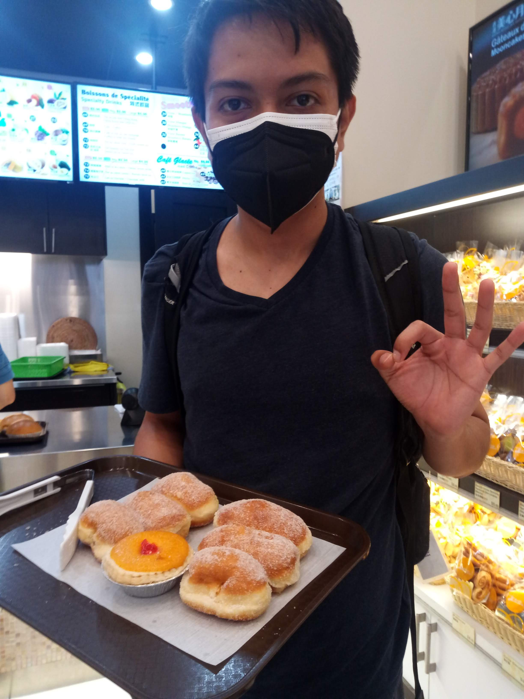
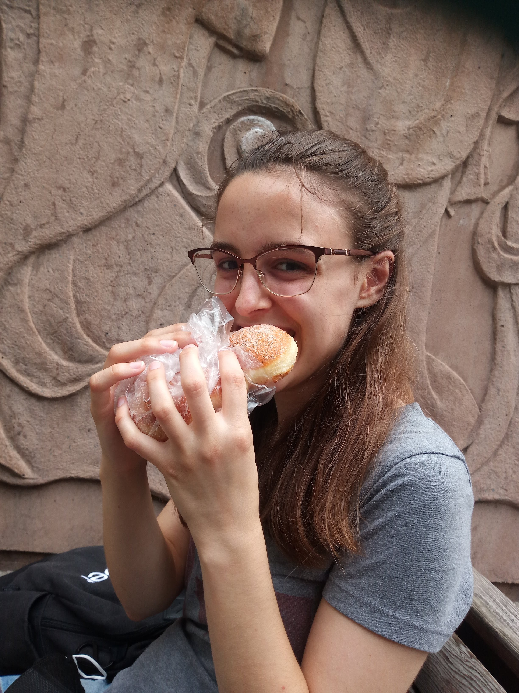

:::

We then met up with our walking tour guide, who led us all over the old city, sharing story after story about the history of Montreal and the buildings we passed. Our main takeaway was that basically every building in Montreal:
1. used to be a bank
2. burned down at least once sometime in the last few centuries

::: carousel
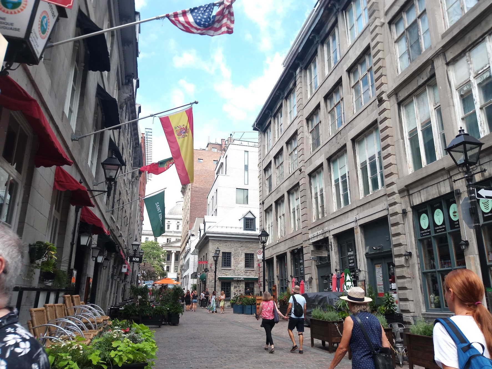
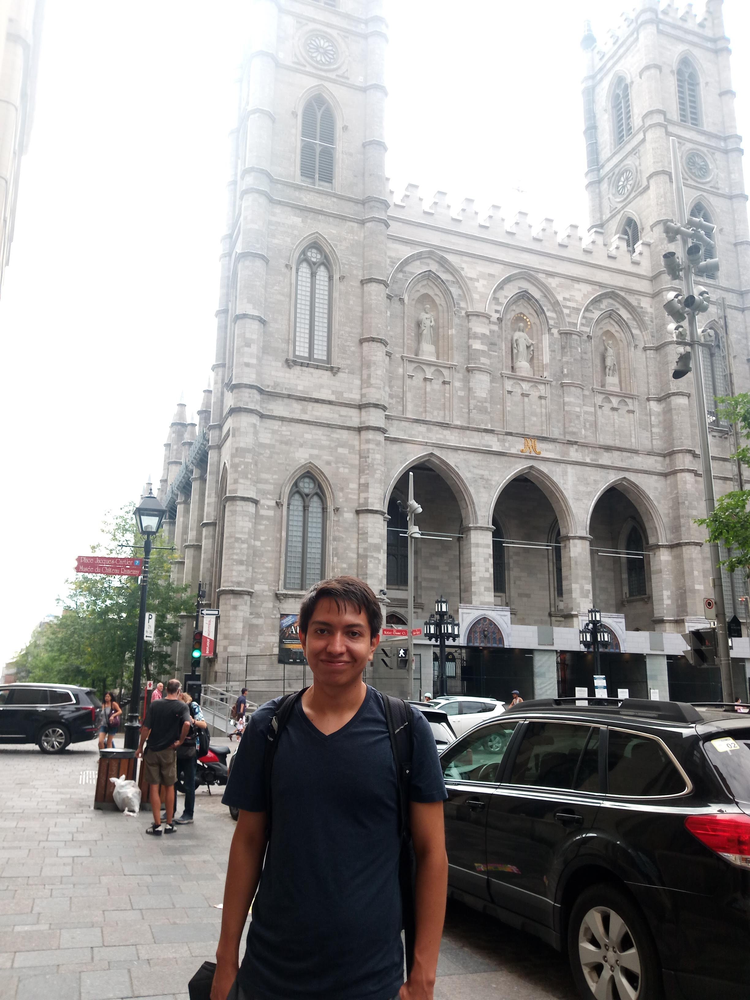
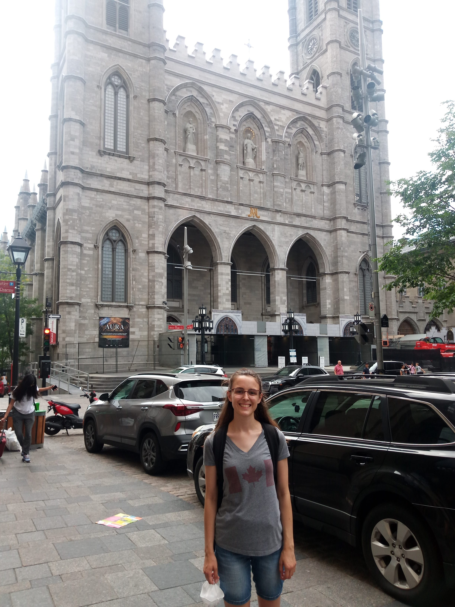
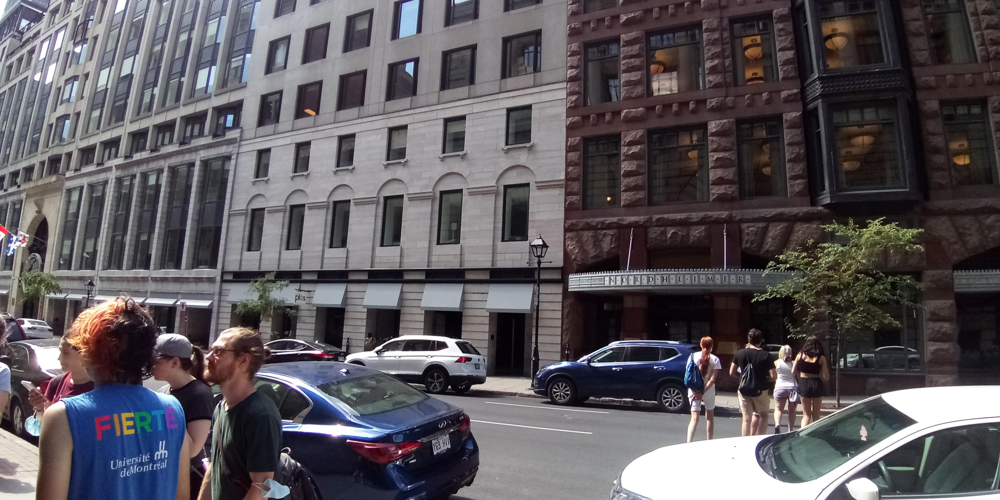
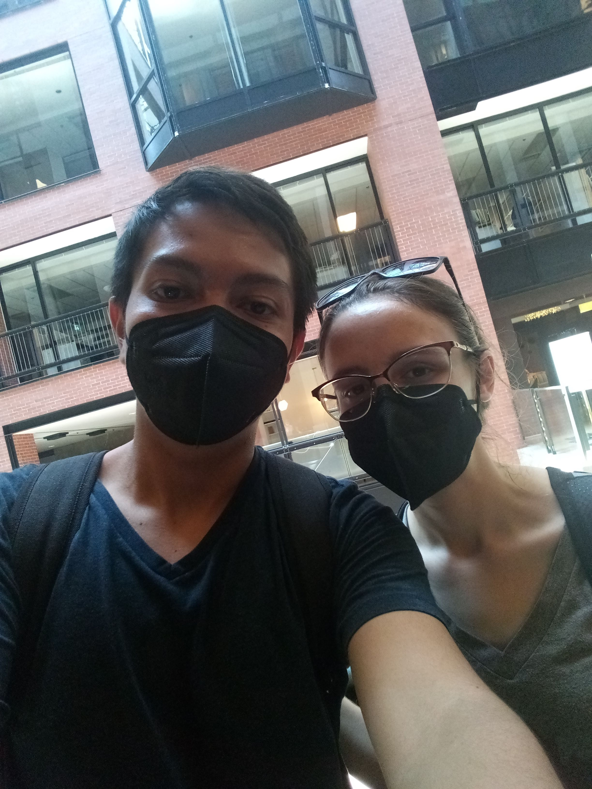
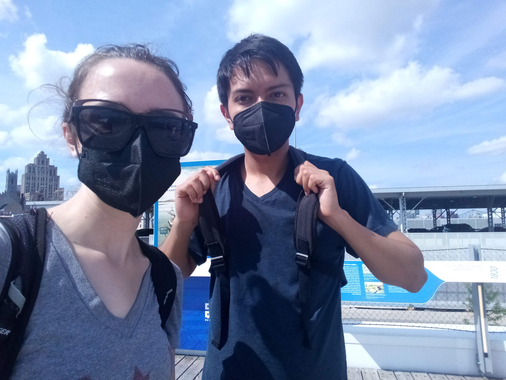
:::

The day was scorchingly hot, and by the end of the three-hour walking tour, Sebastián was dying. We made it to an air-conditioned restaurant where he was able to recover a bit, and we got poutine (of course - it’s Quebec!) and some (mediocre) shawarma.

::: carousel
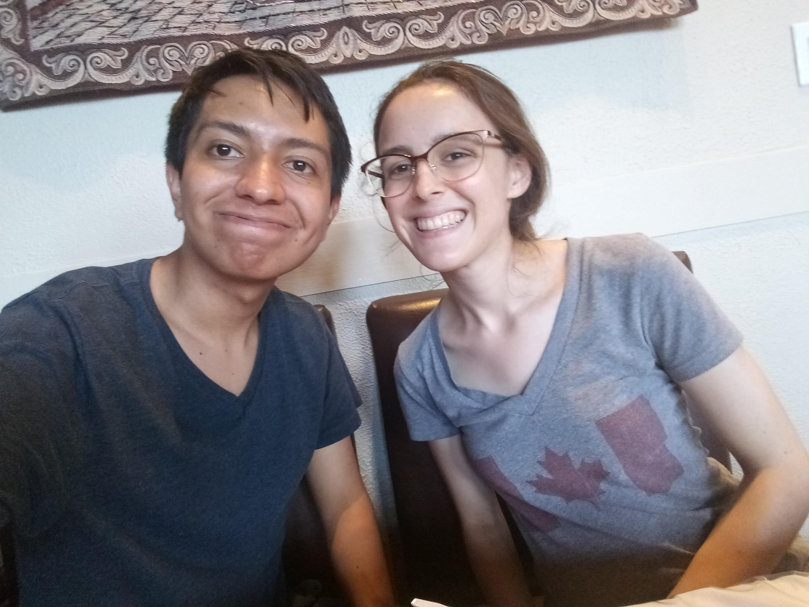
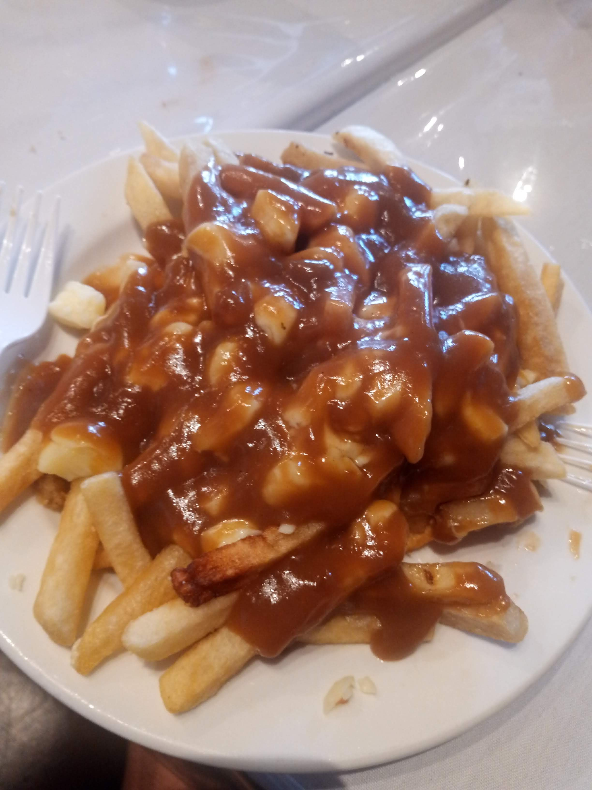
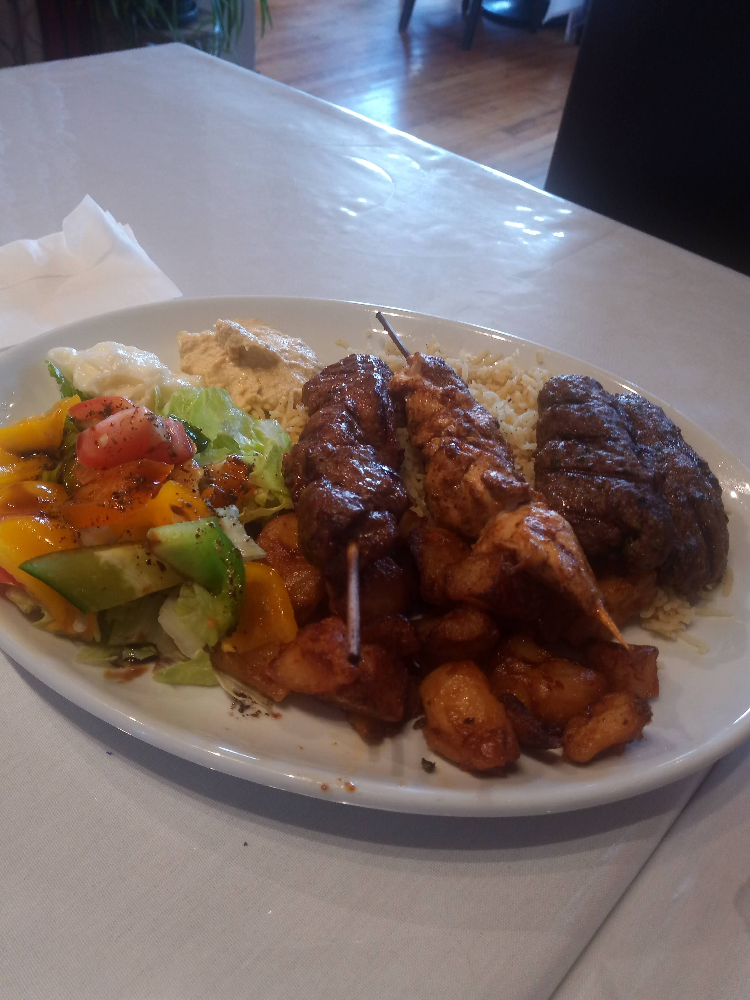
:::

After dinner, it was time to head back to the airport to catch the flight home. Now it was Rachel’s turn to die - of stress. We were already cutting it a little bit close for the flight, but made it to the bus stop with enough time to catch the bus. But when we go to board the bus, the driver takes one look at our tickets and tells us we can’t board. We had bought one-way tickets instead of the day pass, which meant we were allowed to ride the bus back to the airport. We tried to ask about paying another way or buying the tickets online, but the driver wasn’t having it. So now we were stuck with a flight leaving shortly. Sebastián tried to order an Uber, but his phone died just as it was ordering, and we weren’t sure if it went through. The reception was also terrible in that area, but Rachel was running down the sidewalk trying to get a connection to arrange transit and stressing about missing the flight. The Uber arrives to where Sebastián is waiting, he looks over, sees Rachel down the road, and calls her over. She gratefully sees the Uber, and runs back to get in.

All in all, we made it to the airport and onto the plane with enough time, and got back home safe and sound.

::: carousel
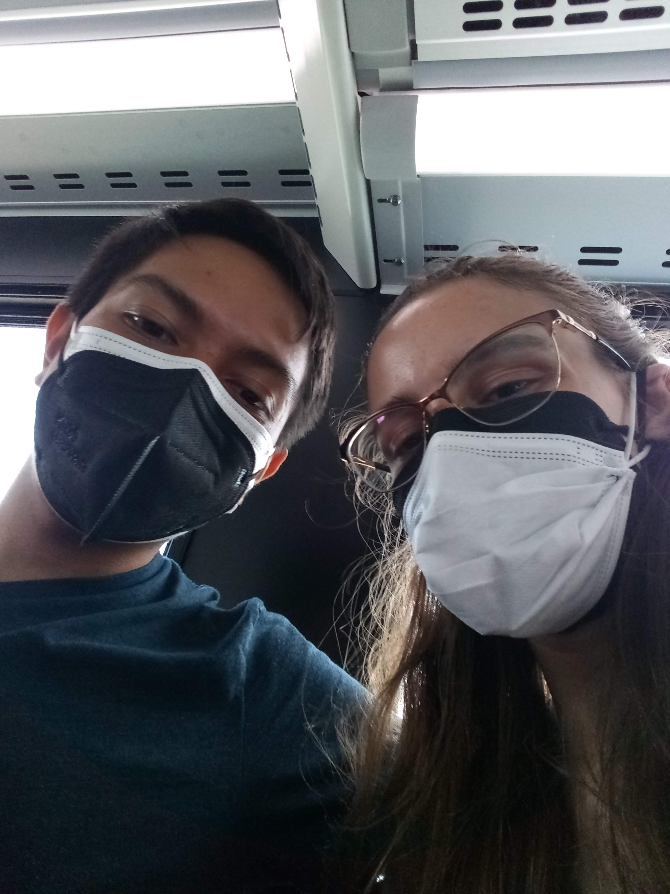
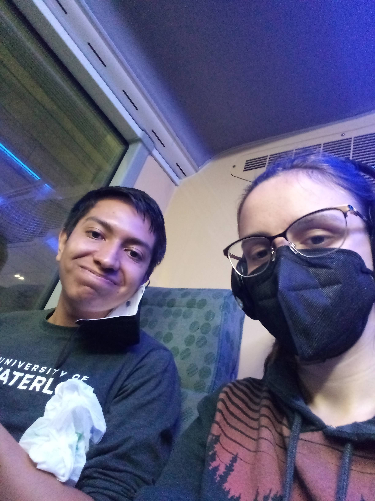
:::
