### Navidad 2022 - El viaje

Sebastián y Rachel tenían vuelos reservados para la Nochebuena, saliendo de Toronto hacia Baltimore y llegando esa tarde.

::: carousel
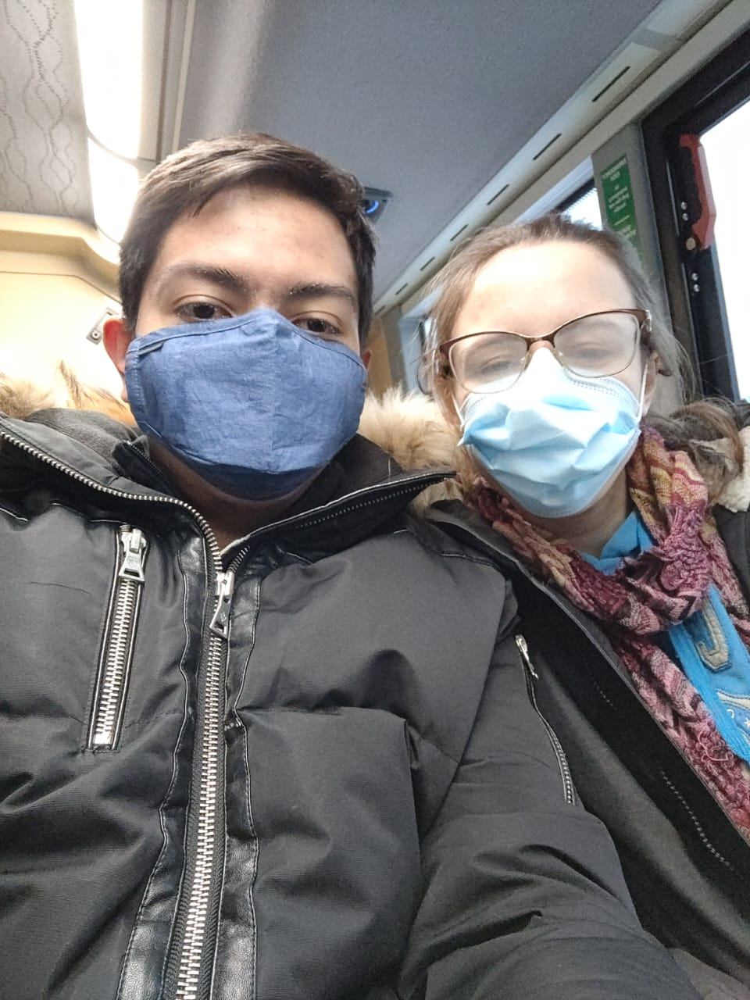
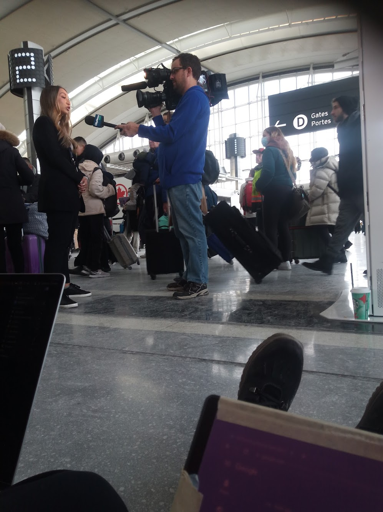
:::

Cuando llegaron al aeropuerto, descubrieron que su vuelo había sido cancelado. Las tormentas de nieve estaban causando retrasos y cancelaciones por todas partes, y las líneas telefónicas de Air Canada estaban saturadas. Después de intentar hacer un plan, se encontraron atrapados en una larga fila para recibir ayuda con la reprogramación.

::: carousel
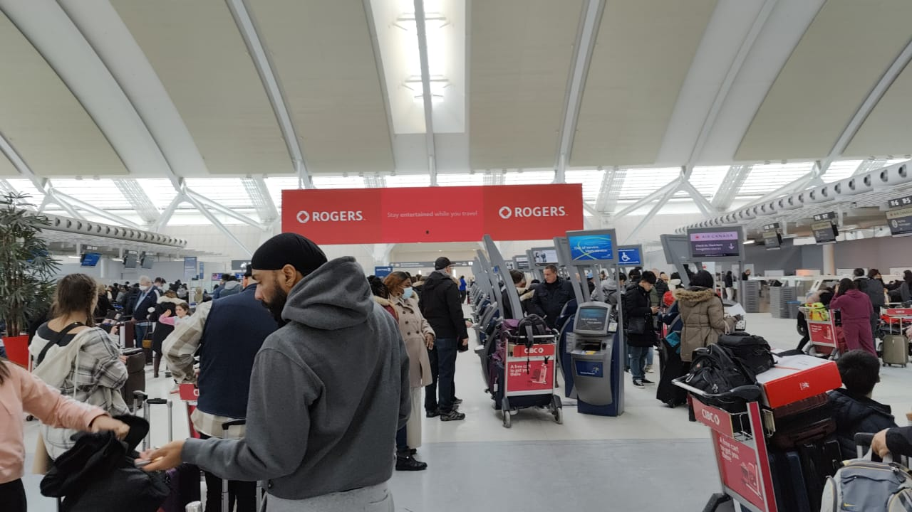
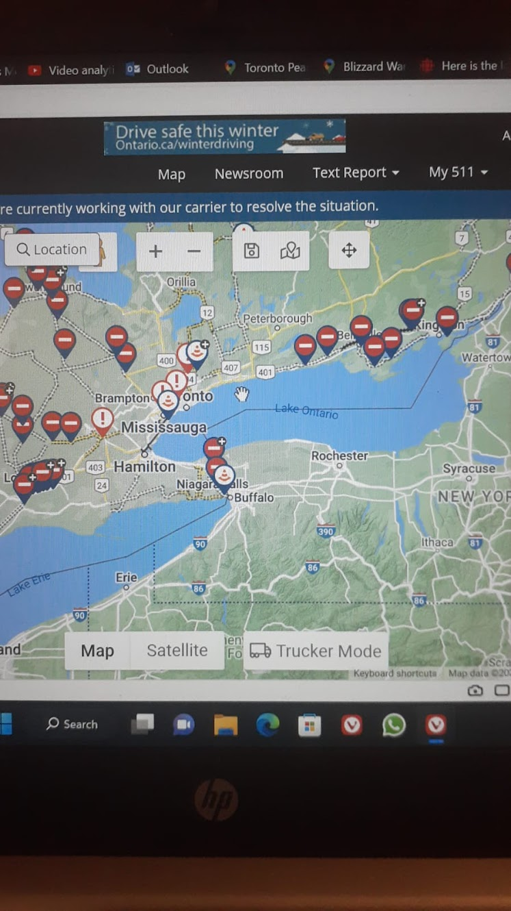
:::

Exploraron todas las opciones: autos de alquiler, otros aeropuertos y ciudades cercanas, pero las condiciones eran demasiado peligrosas. Con ninguna buena opción restante, finalmente aceptaron un vuelo posterior que llegaría a Baltimore después de Navidad. A la mañana siguiente apareció una nueva oportunidad y corrieron al aeropuerto otra vez.

::: carousel
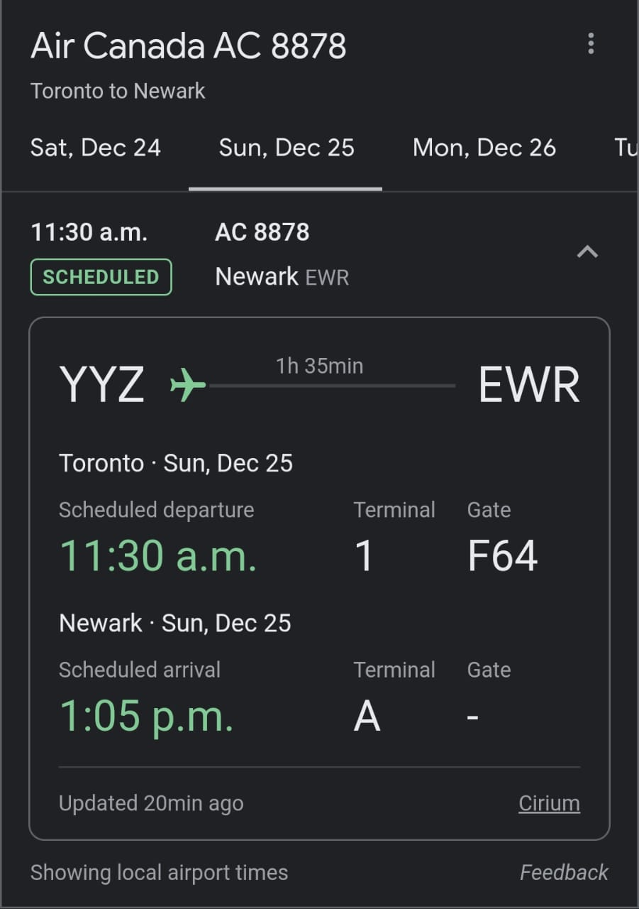
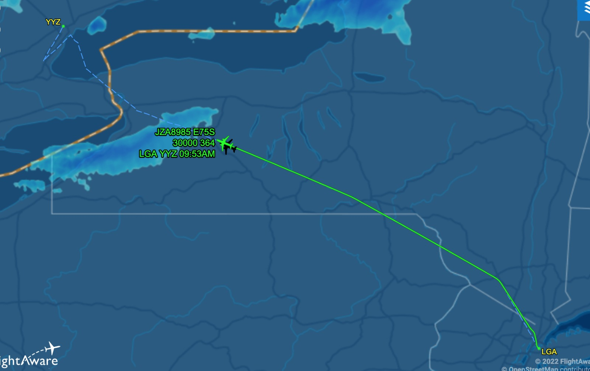
:::

El plan era sorprender a la familia de Rachel fingiendo que tomaban un vuelo distinto. Subieron al avión real, esperaron por un largo retraso y finalmente aterrizaron en Newark. Desde allí, tomaron un Uber hacia la estación de tren y siguieron hacia Baltimore.

::: carousel
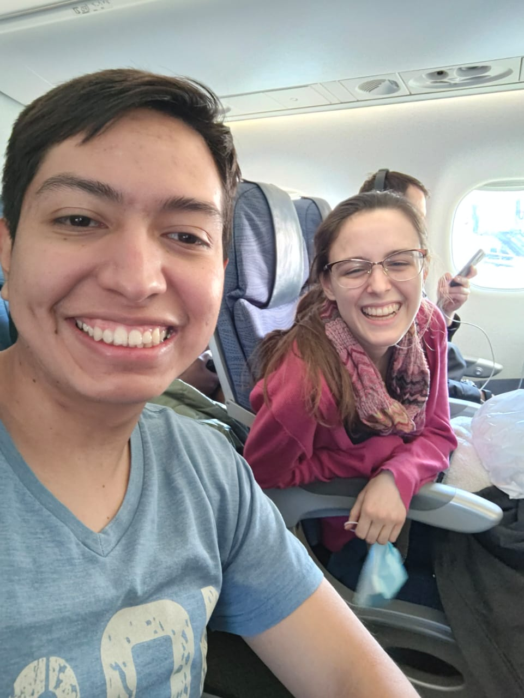
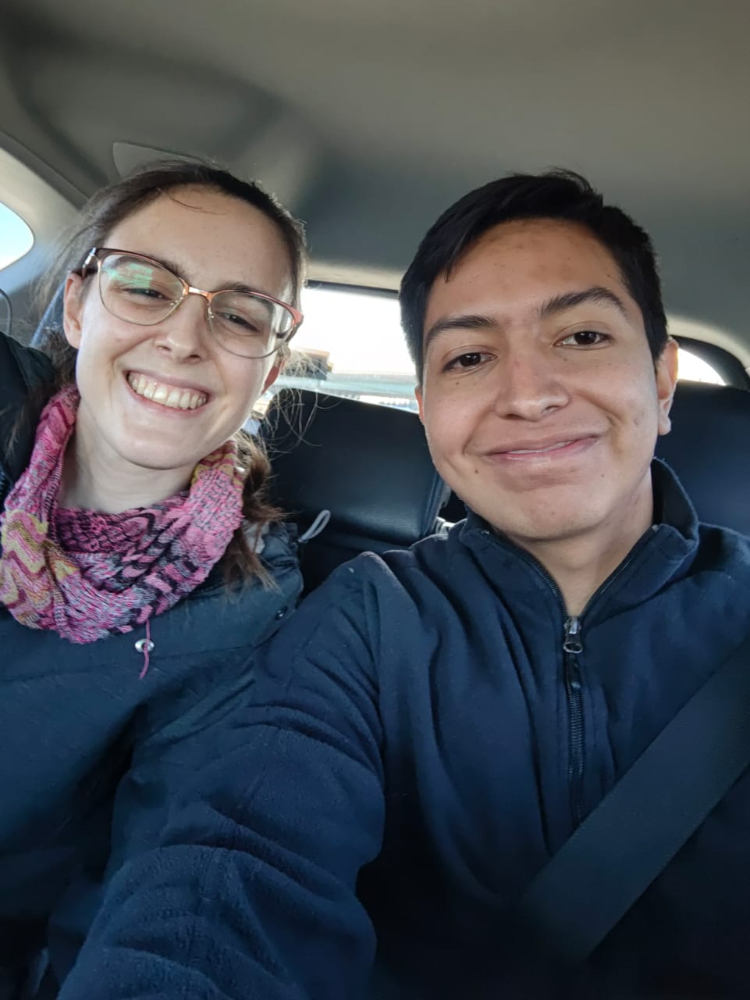
:::

Después de un viaje largo y estresante, llegaron a la estación y luego a la casa, donde la sorpresa finalmente se hizo realidad. La familia de Rachel abrió la puerta a dos viajeros muy cansados pero muy felices.

::: carousel
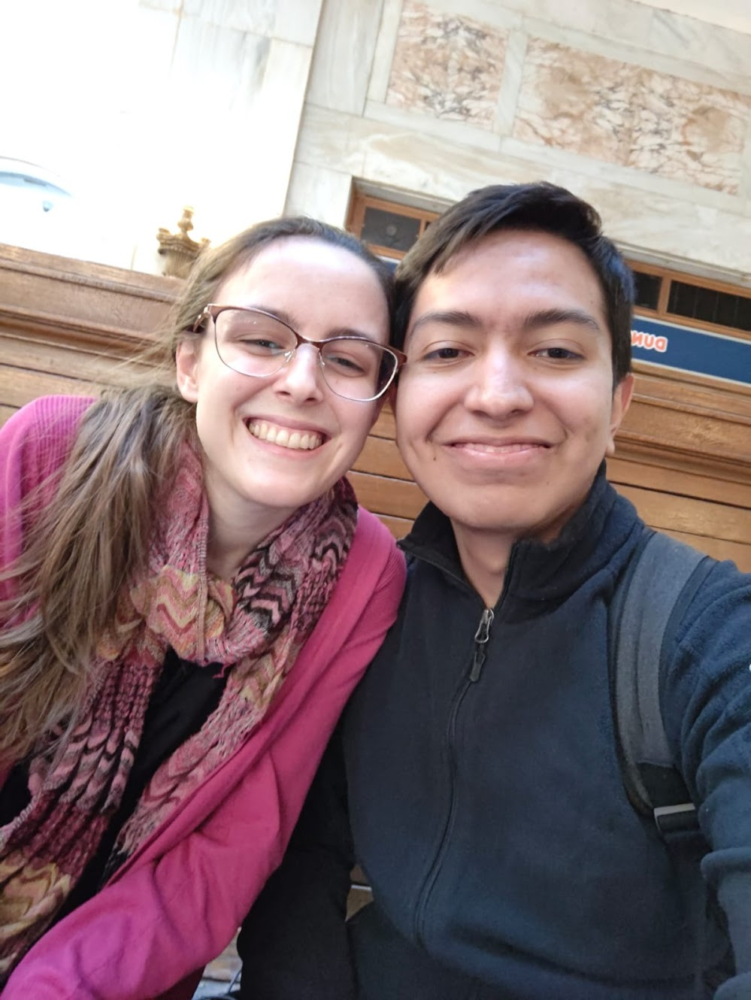
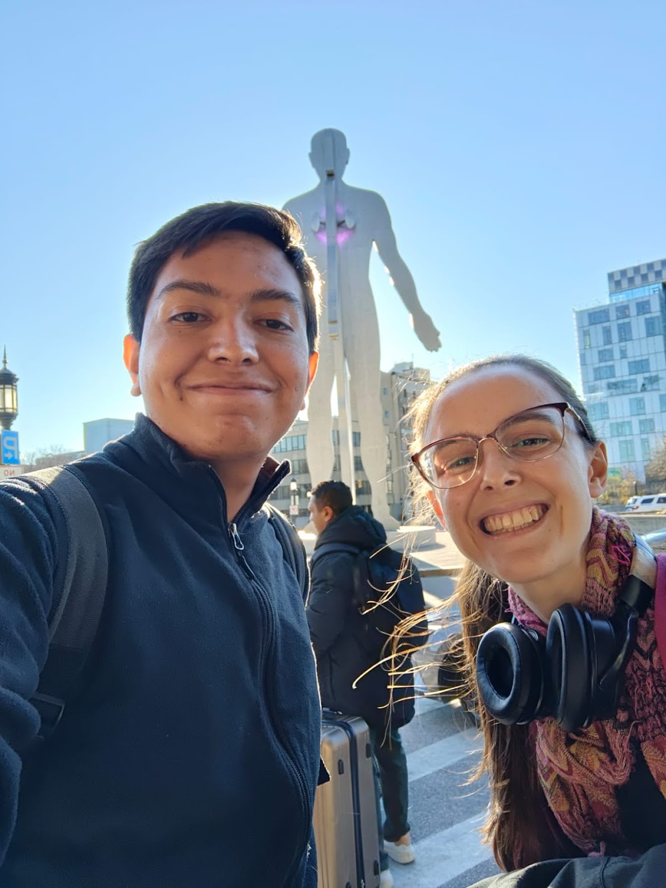
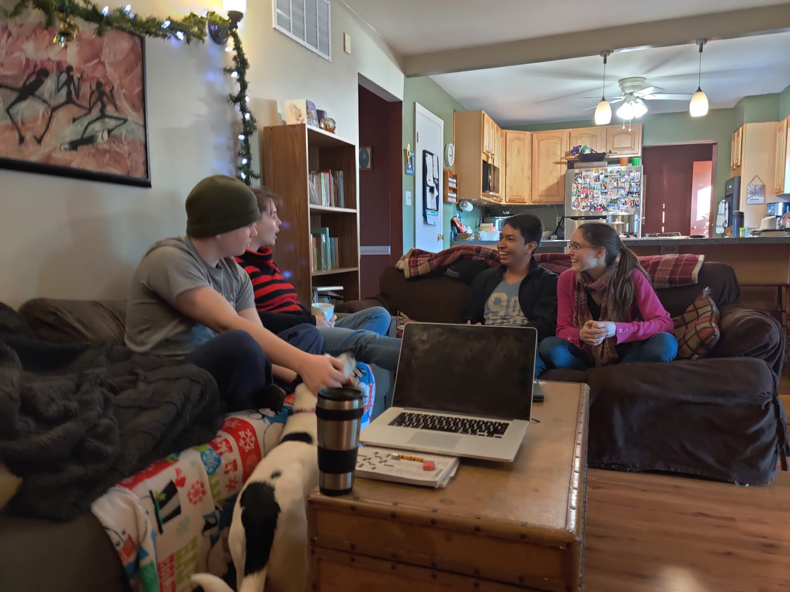
:::
