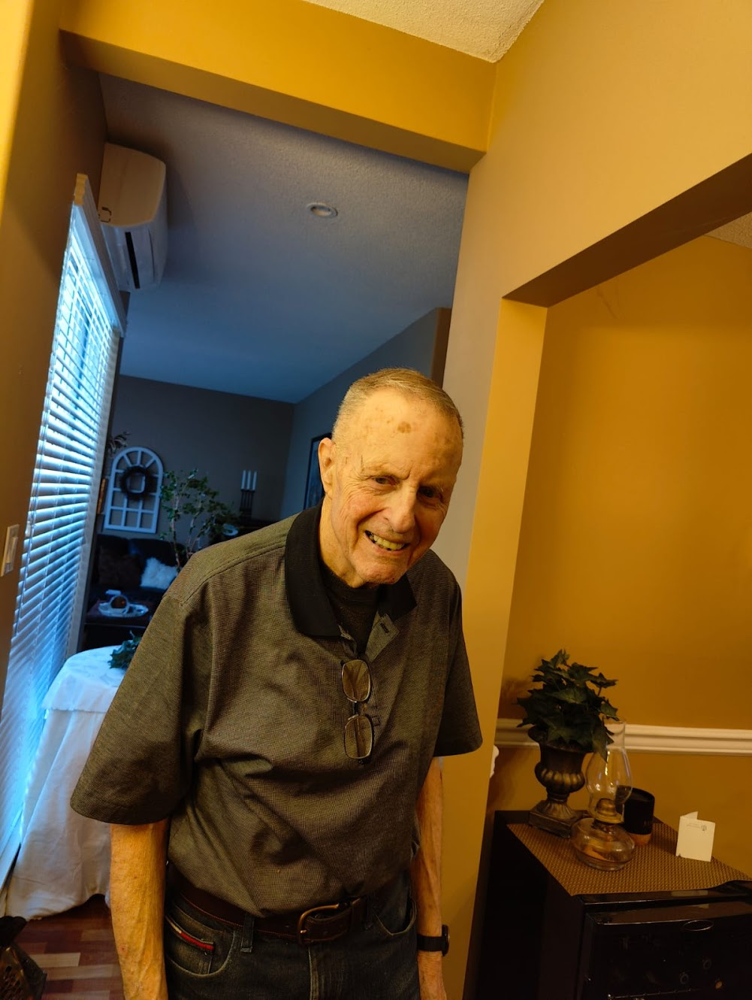

### Vancouver 2023

Visiting Rachel’s Grandparents in Vancouver

Rachel and Sebastián flew to Vancouver to spend a week with Rachel’s grandparents.

::: carousel

:::

### Casino

::: carousel

:::

### Aquarium

Rachel and Sebastián went to the Vancouver aquarium.

::: carousel

:::

### Around the City

Grandpa took us to see where Rachel used to live (in the basement of this house).

::: carousel

:::

Everywhere we went, Grandpa (who had some memory loss) introduced us as his “son and daughter-in-law.” Sebastián felt very welcomed into the family!!

### Out for Dinner

We went for a walk along the river with Grandpa and stopped at a restaurant for lunch.

::: carousel

:::

### Spending Time Together

Most of the time we enjoyed hanging out, talking, and spending time together.

::: carousel

:::

Overall we had a lovely time with the grandparents. Lots of wonderful memories.
