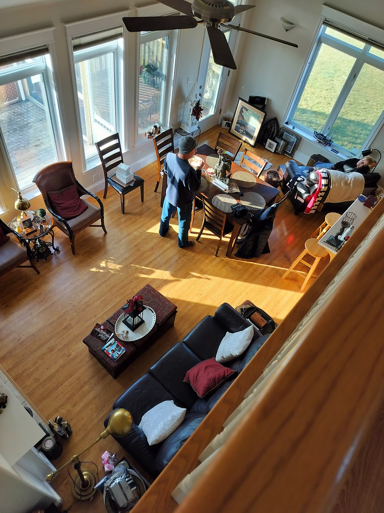
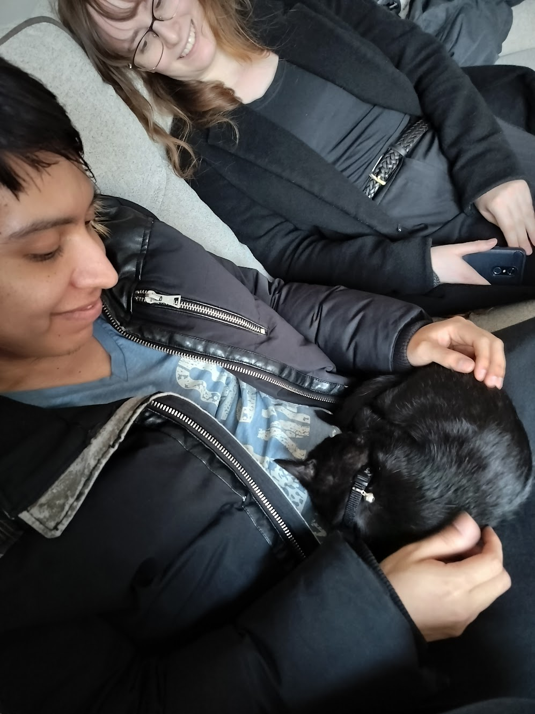
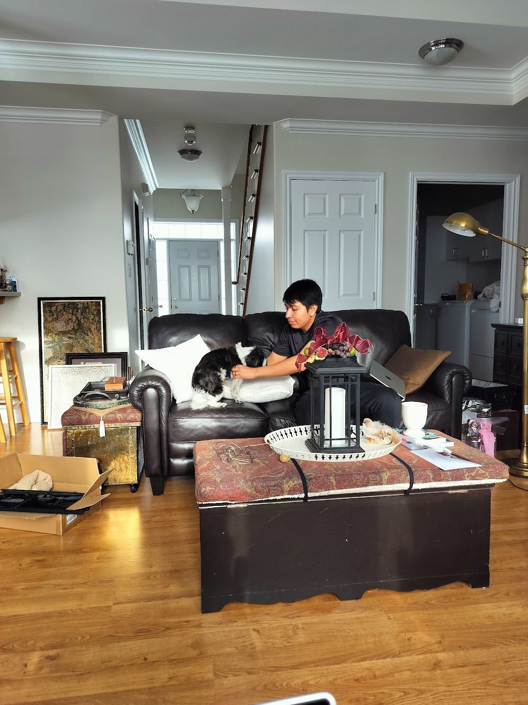
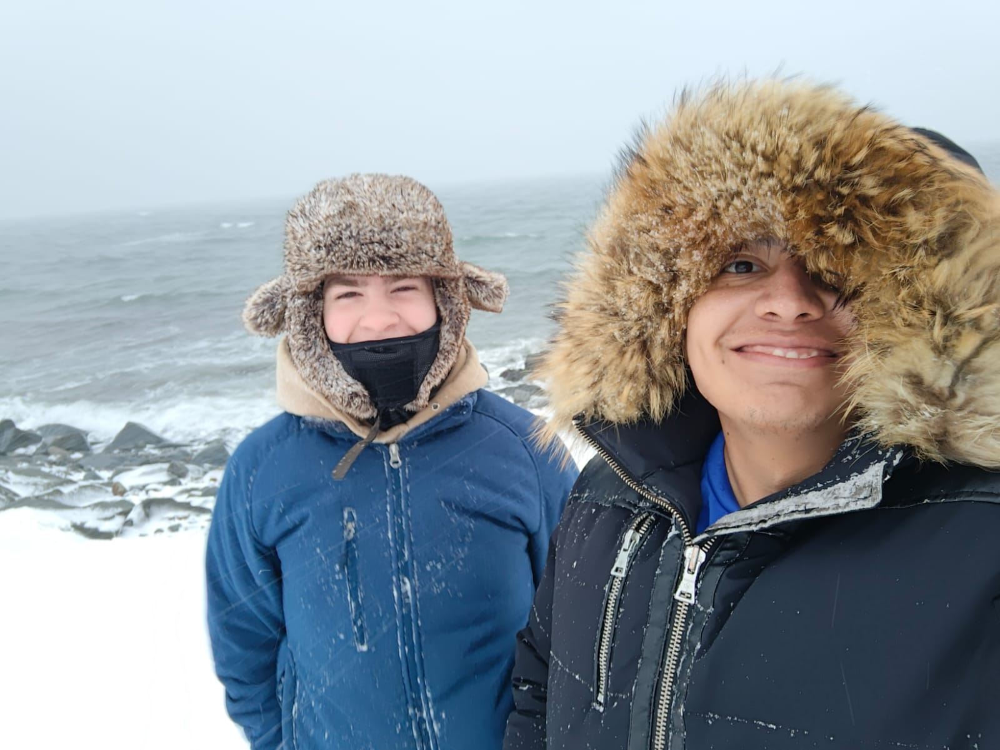
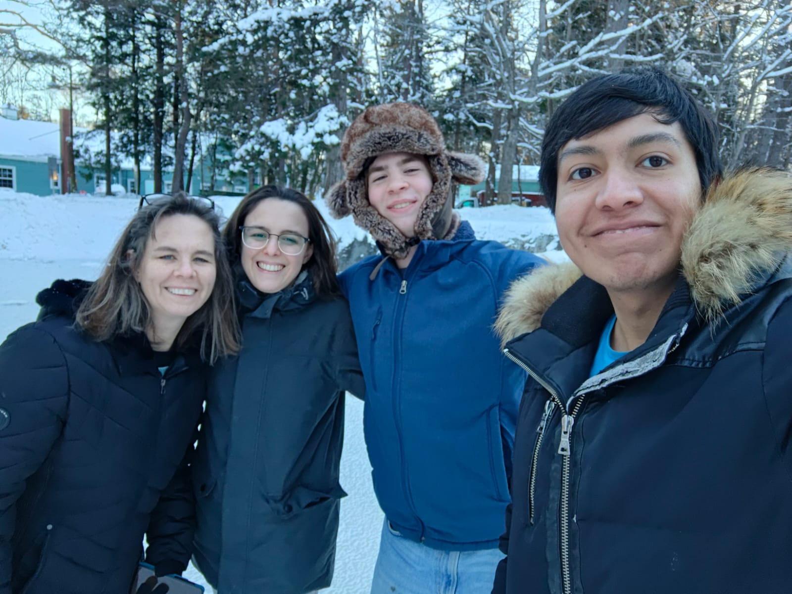
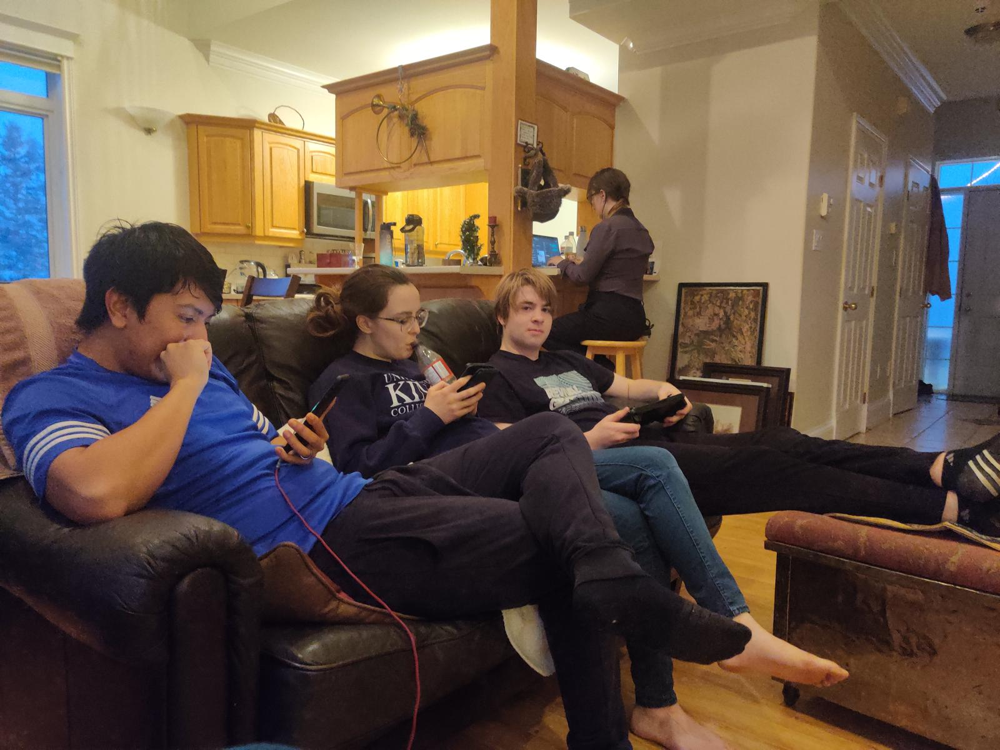
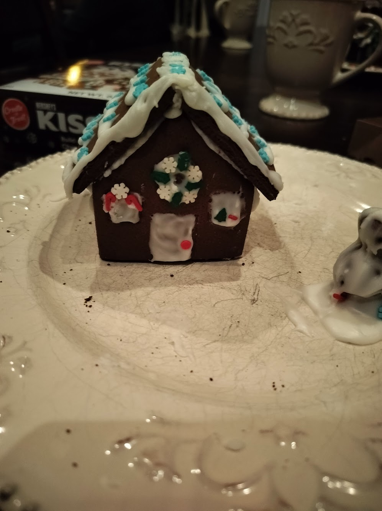
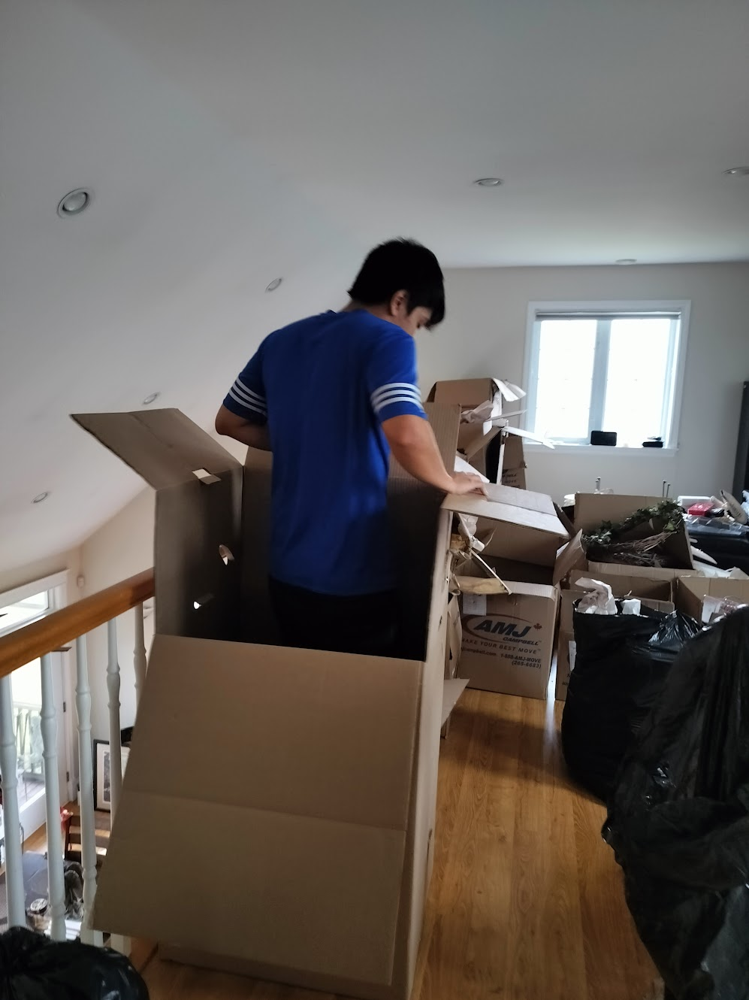
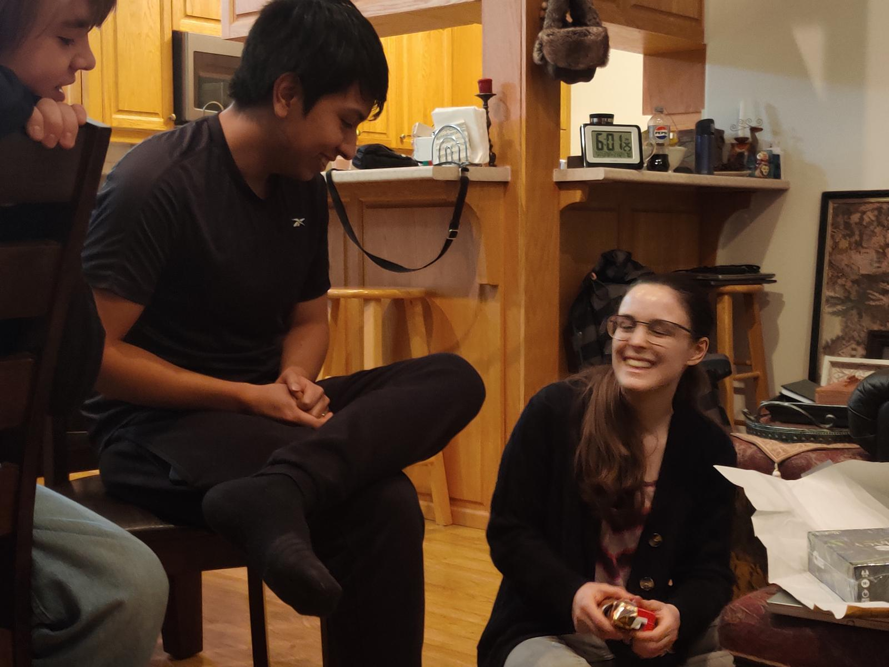

Para Navidad de 2024 volamos a Halifax para pasar las fiestas con la familia de Rachel en la nueva casa de su abuela.

### Caroline
Visitar a Caroline (la hermana de Rachel) fue una de las primeras cosas después de llegar. Salimos a cenar y fue genial ponernos al día.

### Doggie
También conocimos al nuevo perro de la abuela, llamado “Doggie”.

### Visitando Halifax
Sebastián y Rachel tomaron el ferry a Halifax y pasaron el día caminando.

### Nieve
Hubo una gran tormenta de nieve mientras estábamos allí.

### Tiempo en familia
Fue lindo pasar tiempo con la familia.

### Día de Navidad
El día de Navidad fue todo sobre dar regalos y disfrutar juntos.

