Arrived at the IMO! It's been so cool to be on the other side of this competition. I get to talk to leaders from other countries (including Canada), learn the (bureaucratic) ways of the IMO, voted on the problems for the test, wrote translations to Spanish with the Latinos, discussed grading schemes, and, most importantly, talked math.

As usual, I'll describe the food, lol.

# Breakfast

Breakfast was buffet-style at the Hotel. A mix of local and North American food. It was overwhemly agreed on breakfast was the best meal at this hotel.

::: carousel

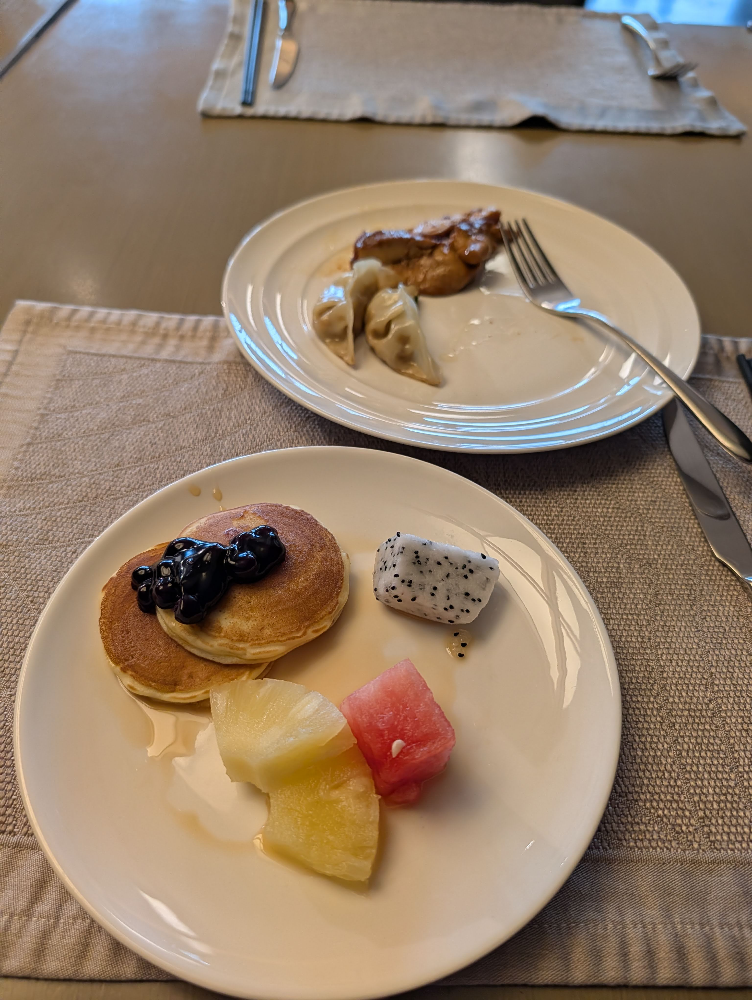
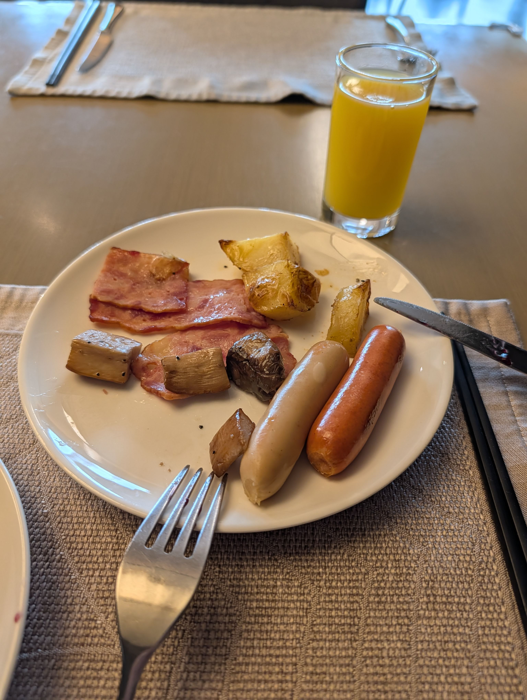
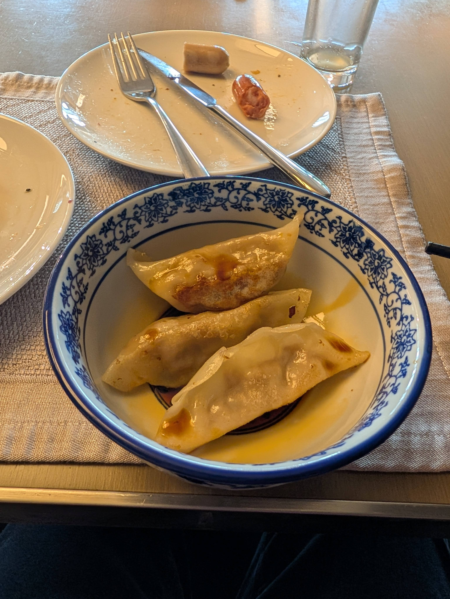
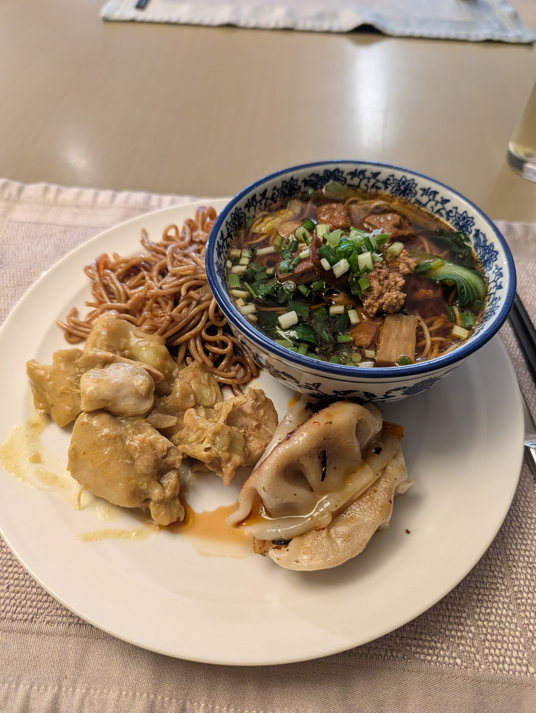
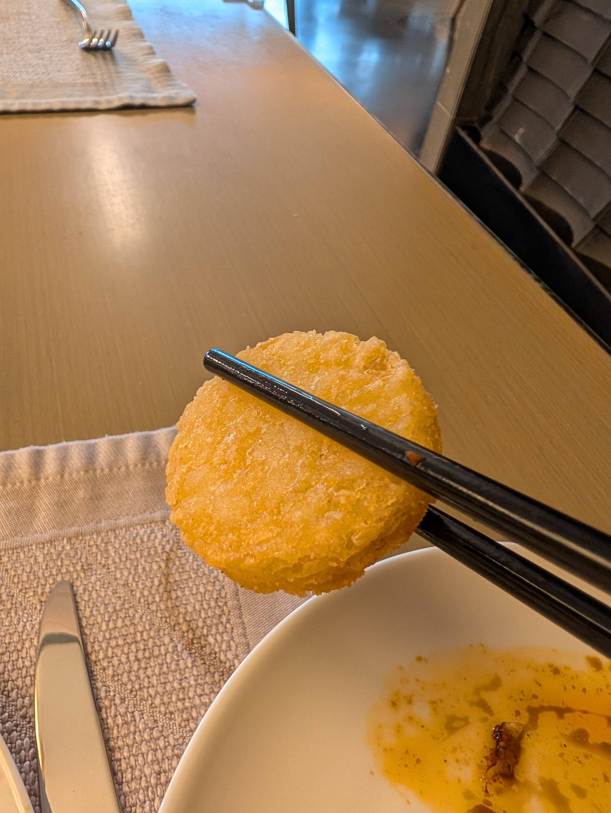
:::

# Lunch & Dinner

This was ok. I think they did some catering for lunch and dinner. Had some issues with food getting cold quickly if you didn't come early, but the flavors were just ok and food in general was very greasy. Probably why I don't have many photos of this, lol. That said, desserts where amazing (and I'm not a dessert person).

::: carousel
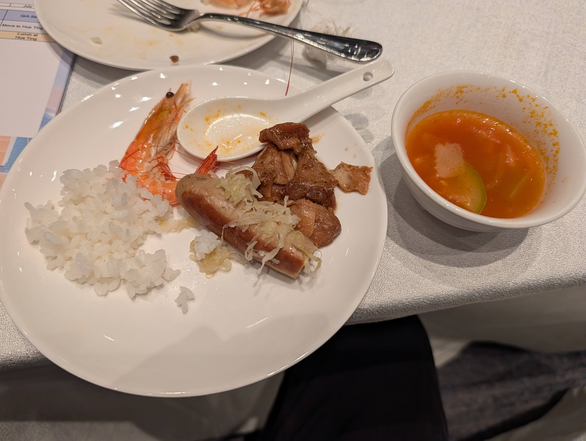
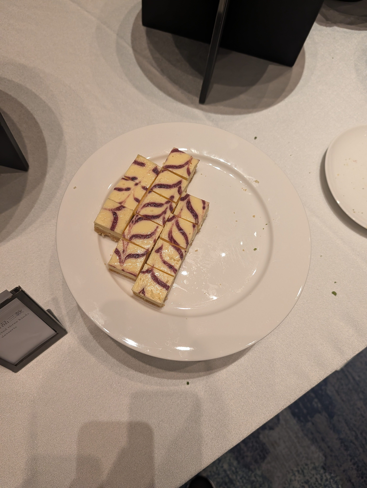
:::

# Hotel

The hotel is awesome. Probably one of the fanciest places I've stayed at. A view to a garden and artificial lake, huge modern room, couch and desk, walk-in closet. Definitely leader perks are much better!

We even have peacocks!

::: carousel
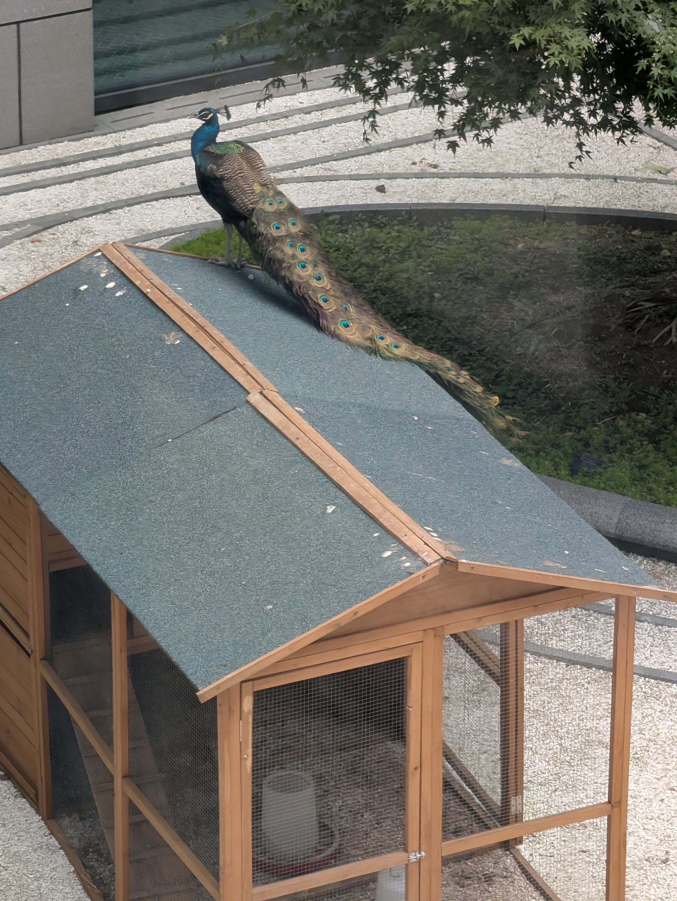
:::

# Gifts

There are tons of IMO traditions. One that I really like is cultural gifts. The host country usually gives you bag, shirt, and some cultural item. It's also very common that some contries will bring a small object/food from their country to share with the other leaders. Additionally, countries will also bring booklets with math questions from their own math competitions as a way to share math!!

::: carousel
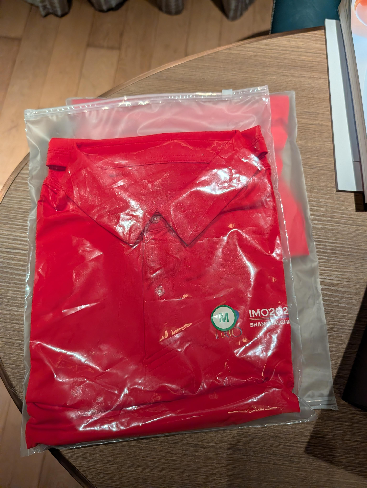
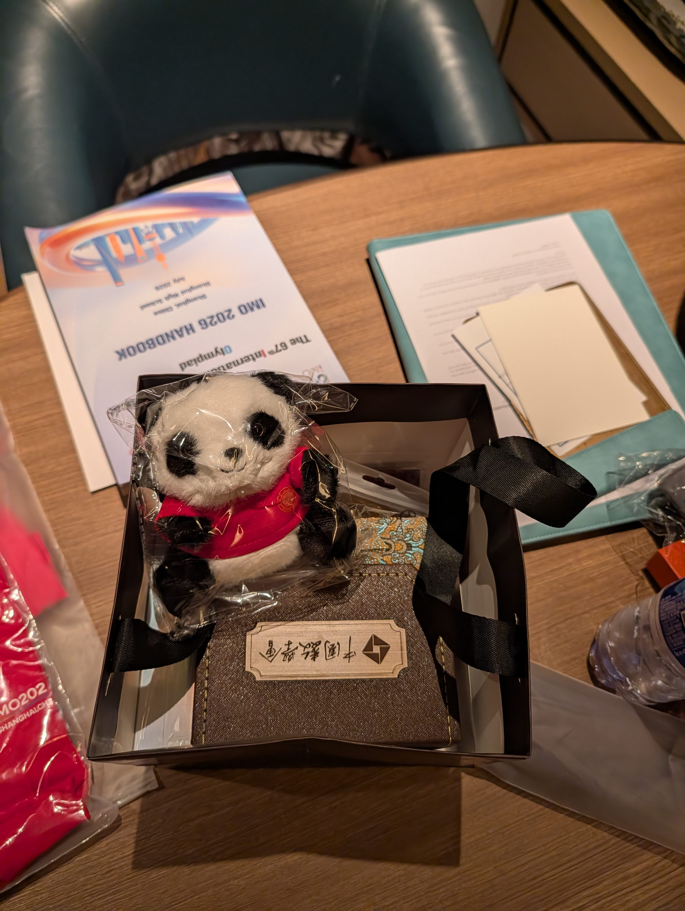
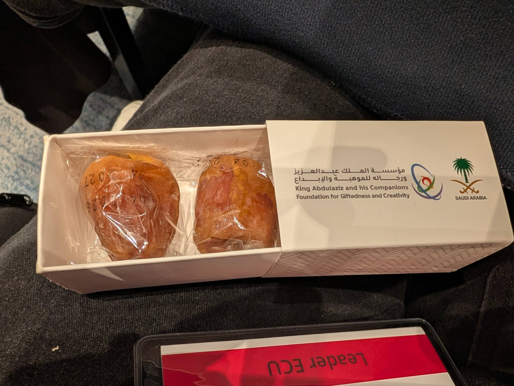
:::