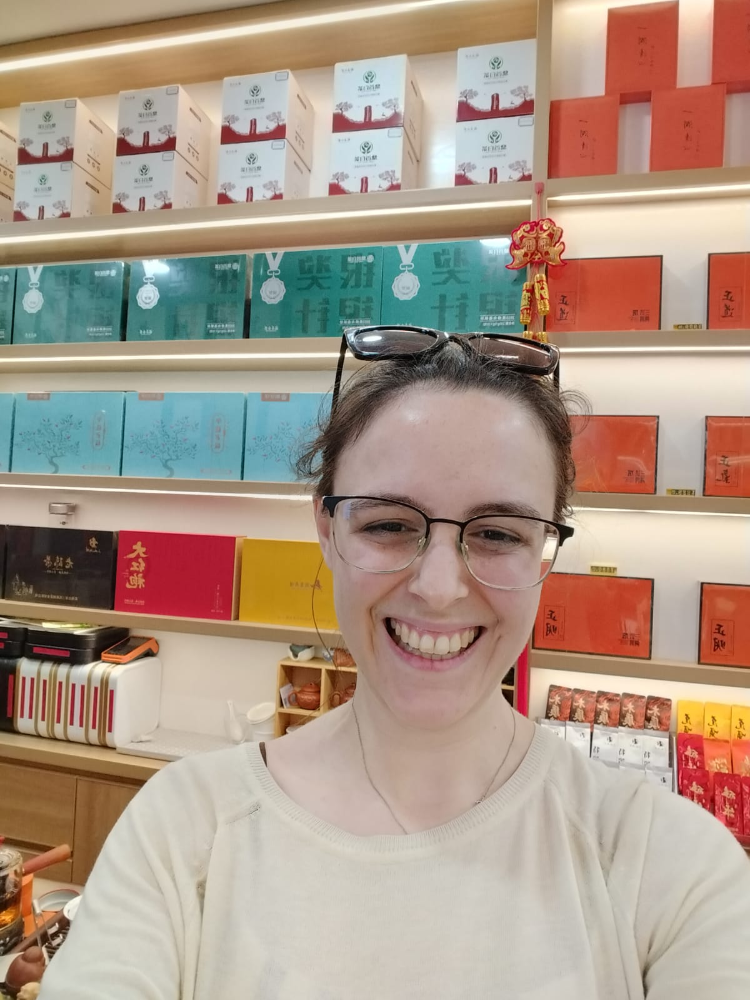
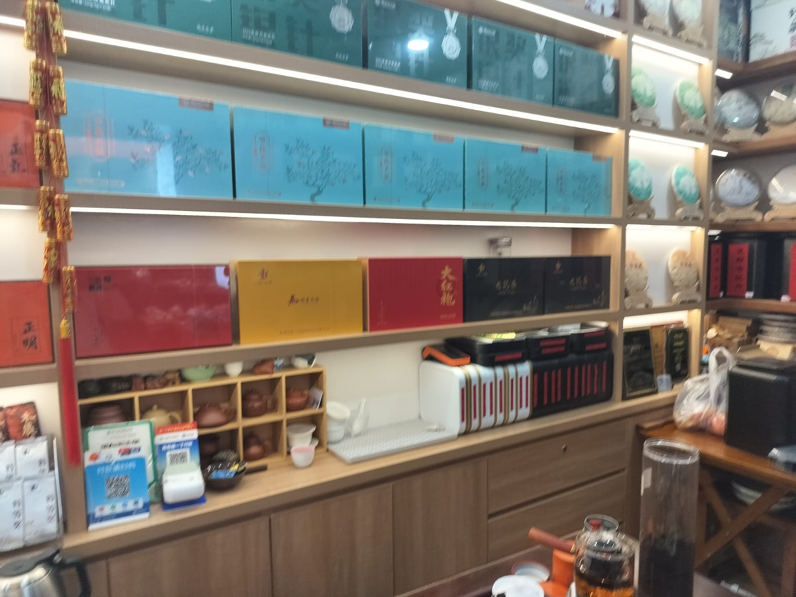
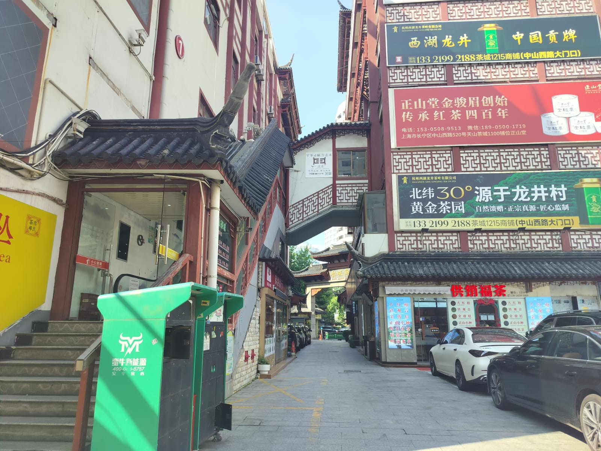
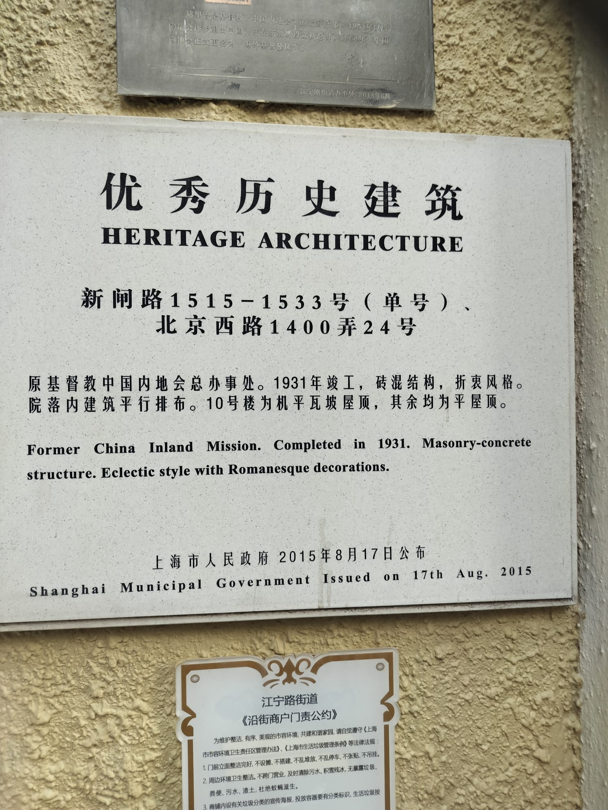
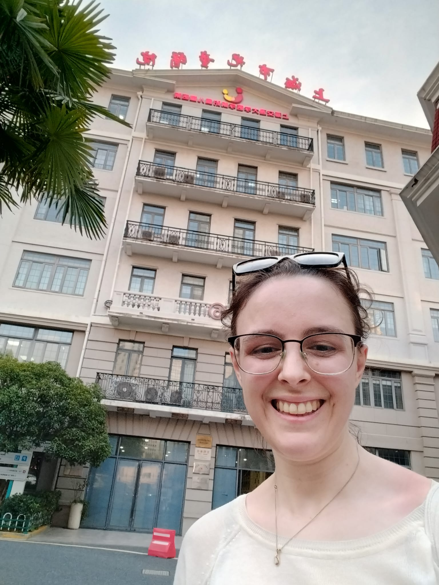
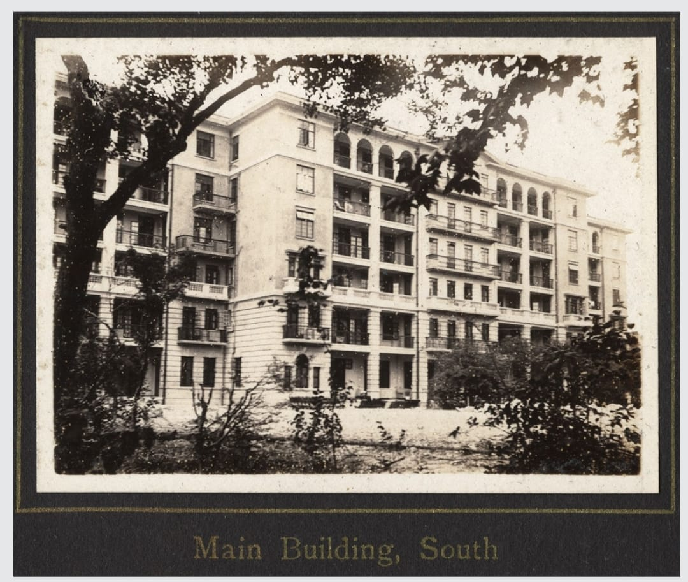
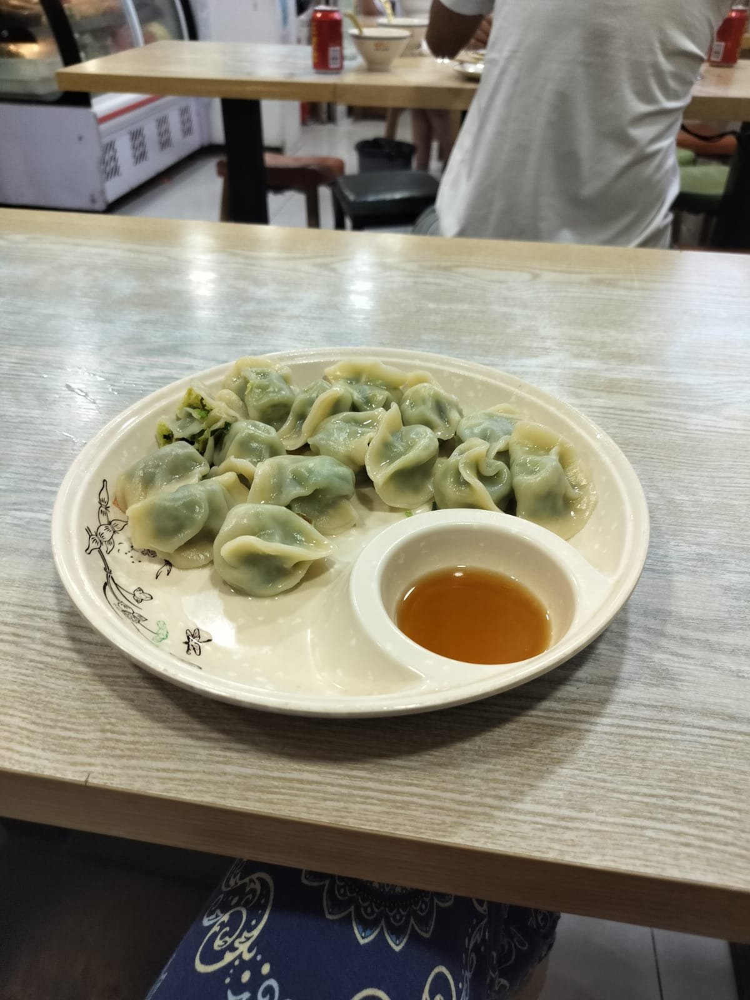

¡Sebastián por aquí!

# Desayuno

Con solo quedarnos la ceremonia de clausura, pude pasar la mañana con Rachel, así que ella vino a mi hotel en la mañana para encontrarnos a desayunar.

::: carousel

:::

# Jardín Botánico

Después de eso fuimos al jardín botánico. ¡Estaba precioso!

::: carousel

:::

# Almuerzo

Parada rápida para almorzar antes de que tuviera que regresar para la última parte de...

::: carousel

:::

# Tarde de Sebastián

## Ceremonia de clausura

Similar a la ceremonia de apertura, tuvimos actuaciones maravillosas. Niños de diferentes edades bailaron danzas de cada continente. También hubo un poco de ópera y orquesta. Mostraron nuestras menciones honoríficas en el escenario y vimos a todos los medallistas recibir sus medallas (y un panda de peluche). Además, felicitamos dos logros excepcionales: un estudiante que obtuvo una puntuación perfecta por segunda vez consecutiva y un estudiante que encabezó el Salón de la Fama del IMO con 5 oros y 2 platas en 7 participaciones.

::: carousel

:::

## Fiesta de despedida

Después de la ceremonia, fuimos a cenar a la cafetería principal de Shanghai High School. Había muchos juegos y actividades (arte y manualidades) donde los estudiantes obtuvieron muchos souvenirs y premios. También pusieron suficientes puestos con postres y snacks como para tener toda una cena de 7 tiempos después de la cena, lol.

::: carousel

:::

## Vino :)

Un grupo de líderes latinoamericanos se reunió después de la fiesta de los estudiantes para tomar vino y conversar sobre nuestras olimpiadas nacionales de matemáticas. Fue genial escuchar cómo, incluso con recursos limitados, todos estamos tratando de hacer lo mejor por nuestros estudiantes. Con esto me despedí de ellos y del IMO. ¡Esperando con ganas el próximo!

::: carousel

:::

# Tarde de Rachel

## Tianshan Tea City

La Tianshan Tea City es un mercado interior de tiendas de té. Una de las dueñas, una señora mayor encantadora, se sentó conmigo durante más de una hora explicándome los distintos tés y dejándome probar cada uno. La pasé muy bien y compré varios tés diferentes para llevar como souvenirs.

::: carousel

:::

## Xinzha Road

Mis bisabuelos eran misioneros en China en los años 30 y 40. La sede de la organización con la que estaban estaba en Shanghái, pero los edificios fueron entregados cuando la organización tuvo que salir de China en los años 50. Antes de venir a China, mi abuela me contó las historias y me mostró fotos antiguas. ¡Pude encontrar los edificios y todavía siguen en pie!

::: carousel

:::

## Una lección aprendida

De camino de regreso al hotel, empezó a llover. Al principio solo fueron unas gotas, así que seguí hacia el hotel con la esperanza de dejar mis maletas antes de salir a cenar. Vi que todos los locales empezaban a resguardarse en las tiendas cercanas, pero como no me importaba mojarme un poco y llevaba impermeable, seguí hacia mi hotel que no estaba lejos.

En cuestión de minutos ya no eran solo gotas y empezó a llover a cántaros. Además, estaba teniendo problemas con el mapa y seguía pensando que estaba a solo una o dos cuadras del hotel, así que continué cubriéndome bajo los aleros cuando era posible. La lluvia empeoraba cada vez más. Al final me di cuenta de que no tenía sentido seguir y decidí entrar al restaurante más cercano para cenar antes de regresar.

Vi lo que parecía un restaurante y entré, solo para darme cuenta de que era un salón de masajes. Las trabajadoras fueron muy amables, me trajeron toallas de papel y me secaron con cuidado. Me dieron una taza de té caliente y me ofrecieron un masaje. Esperé allí unos minutos hasta que hubo una pausa en la lluvia y luego corrí de regreso al hotel. Llegué empapado de pies a cabeza y decidí que, la próxima vez que vea a los locales buscando refugio, debo seguir su ejemplo.

::: carousel

:::
