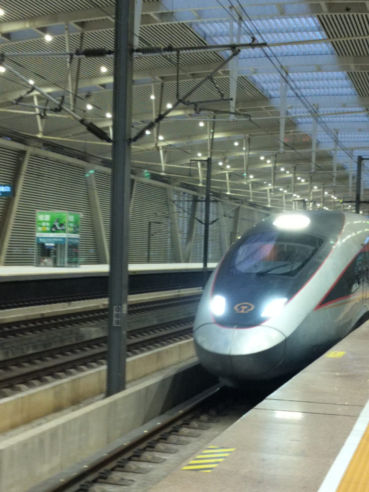

¡Sebastián por aquí!

# Desayuno

Gracias a la recomendación de un compañero de trabajo, terminamos en este restaurante de dumplings de sopa para desayunar. Estaba muy delicioso.

::: carousel

:::

# Nanjing Road

::: carousel

:::

# El Bund

::: carousel

:::

# Almuerzo

Íbamos caminando por el río y encontramos este restaurante de la guía Michelin con 6 estrellas. No puedo creer que podamos conseguir comida tan bien calificada por tan barato.

::: carousel

:::

# ¿Tim Hortons?

Supongo que China también los tiene?

::: carousel

:::

# Museo Histórico de Shanghái

::: carousel

:::

# Trenes

::: carousel

:::

Super cansado, pero llegamos a Pekín.
