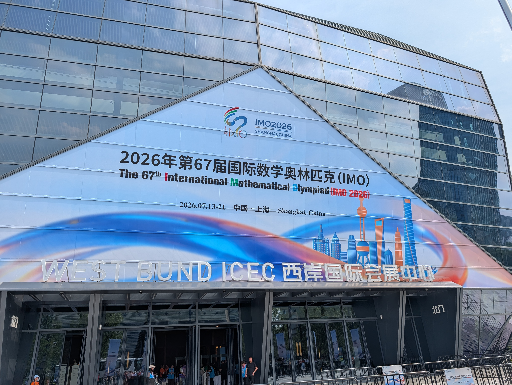
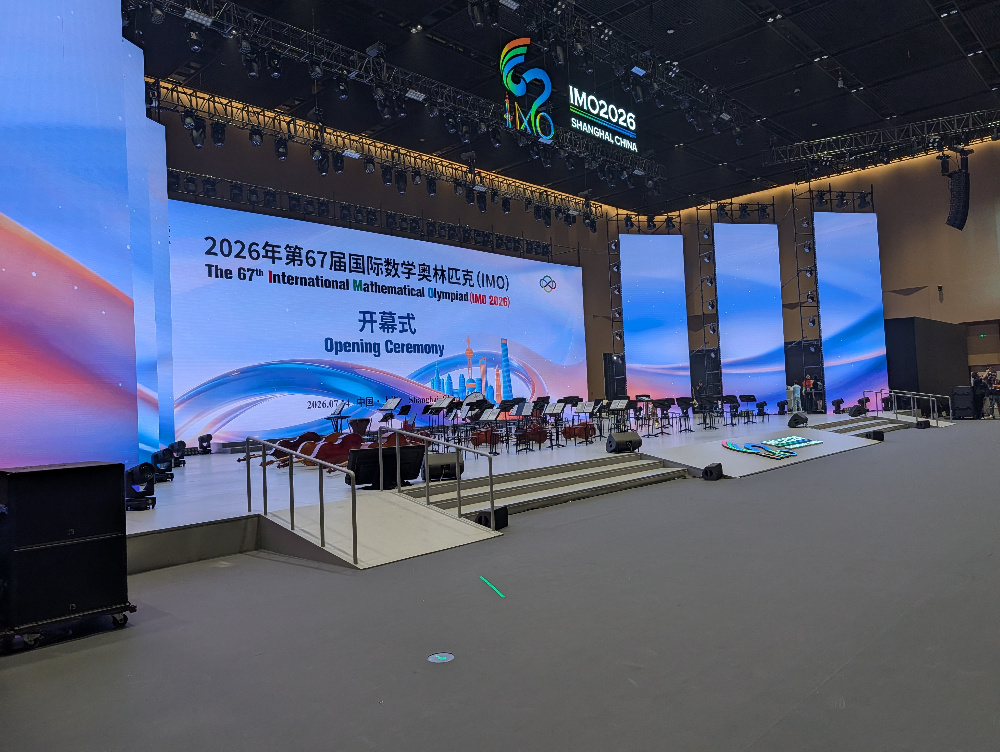
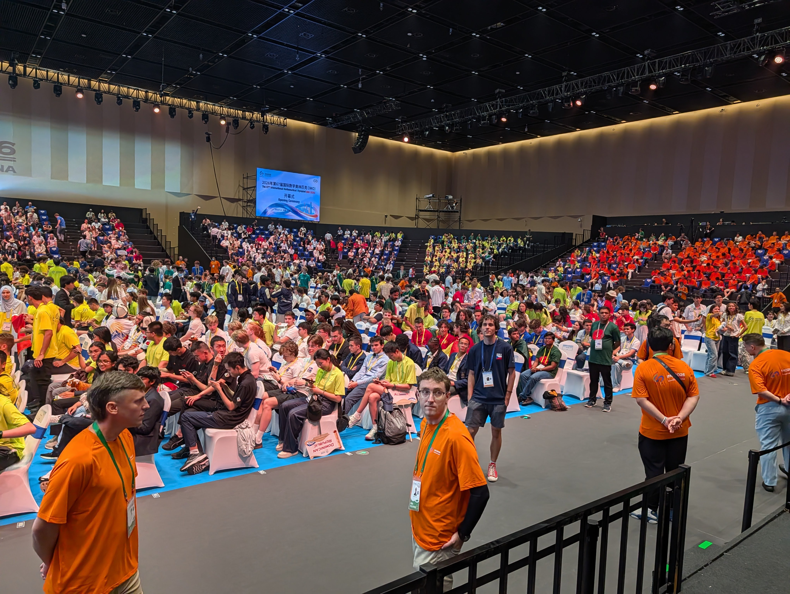
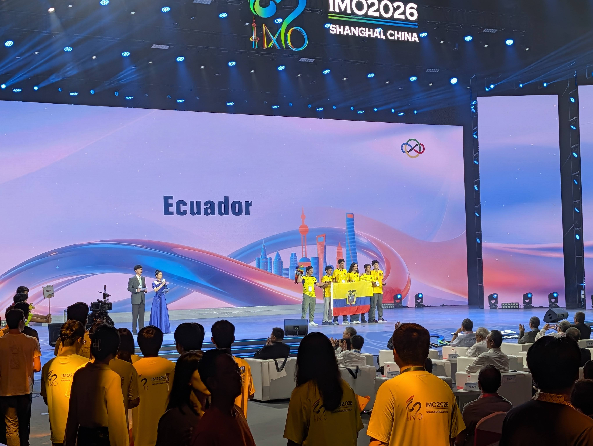

Aprobar los esquemas de calificación y terminar las traducciones ha sido mucho trabajo. Días muy largos y noches muy tarde, pero estamos muy contentos con el examen!

# Ceremonia de apertura

Viajamos al centro de Shanghái para el inicio de la IMO. Tras haber estado encerrados en el hotel los últimos días, esto fue un recordatorio de lo caluroso que es Shanghái. Bajamos del autobús y hacía 38 grados y la sensación era de 48 según nuestras apps del tiempo. Se sentía horrible aunque era solo una caminata desde el autobús hasta el recinto.

La ceremonia de apertura siempre es emocionante. Hubo discursos geniales y actuaciones artísticas muy chulas, pero lo más impresionante fue ver a 120 países y 680 estudiantes de todo el mundo. Todos están muy emocionados y orgullosos de representar a sus países en el escenario.

::: carousel

:::
