Hoy fue la segunda y última prueba! Después de responder todas las preguntas de nuestros estudiantes durante la parte de preguntas y respuestas del examen, nos mudamos al hotel donde se alojan los Subdirectores, que está mucho más cerca de los estudiantes. Mi habitación es bastante lujosa. El baño es más grande que la sala en nuestro departamento, lol.

Después del almuerzo, fuimos a ver a los estudiantes a Shanghai High School (donde están alojados). Este colegio es uno de los mejores colegios de China con los mejores estudiantes de cada área de estudio que te puedas imaginar.

::: carousel
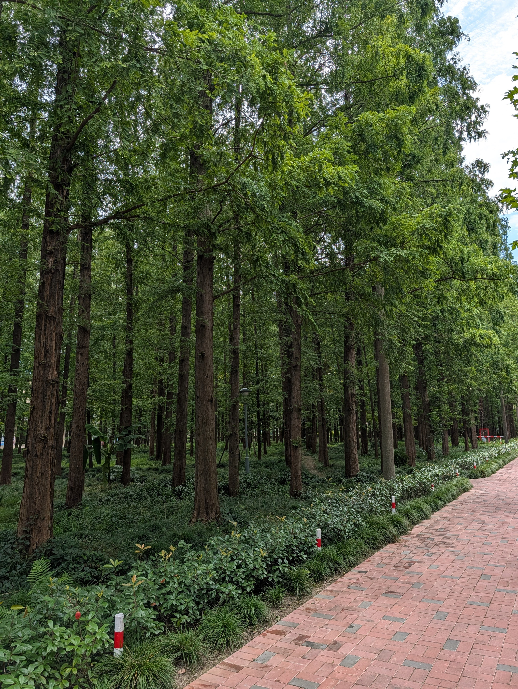
:::

Las pruebas han terminado y con eso espero que los estudiantes solo se preocupen por divertirse el resto de la IMO. Con eso en mente, queríamos asegurarnos de que se tomaran tiempo para hacer algo divertido, y realmente querían ir a la Oriental Pearl TV Tower. Hay reglas que seguir para que los estudiantes salgan del colegio cuando no es una excursión programada. Después de firmar un montón de exenciones y casi una hora de averiguar cómo conseguir taxis, nos dirigíamos a la Torre.

# Oriental Pearl Tower

La vista fue genial. No estoy seguro de que mis fotos lo muestren realmente, pero me gustó mucho cómo el lago atraviesa la ciudad. Me sorprendió cuántos locales estaban en esta atracción. Había leído en línea que, a diferencia de otros países, las atracciones turísticas son bastante comunes también para los locales, y esto realmente me lo confirmó.

::: carousel
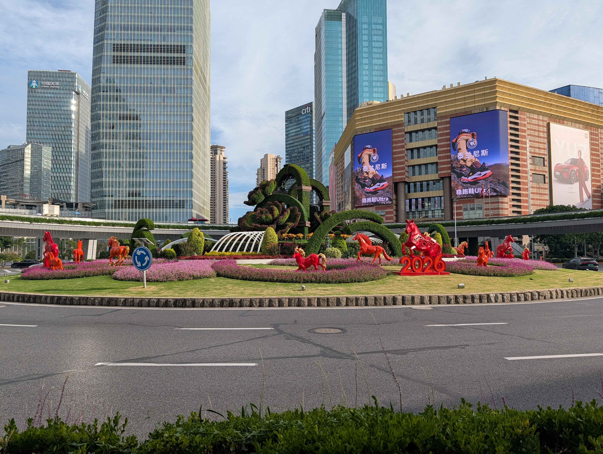
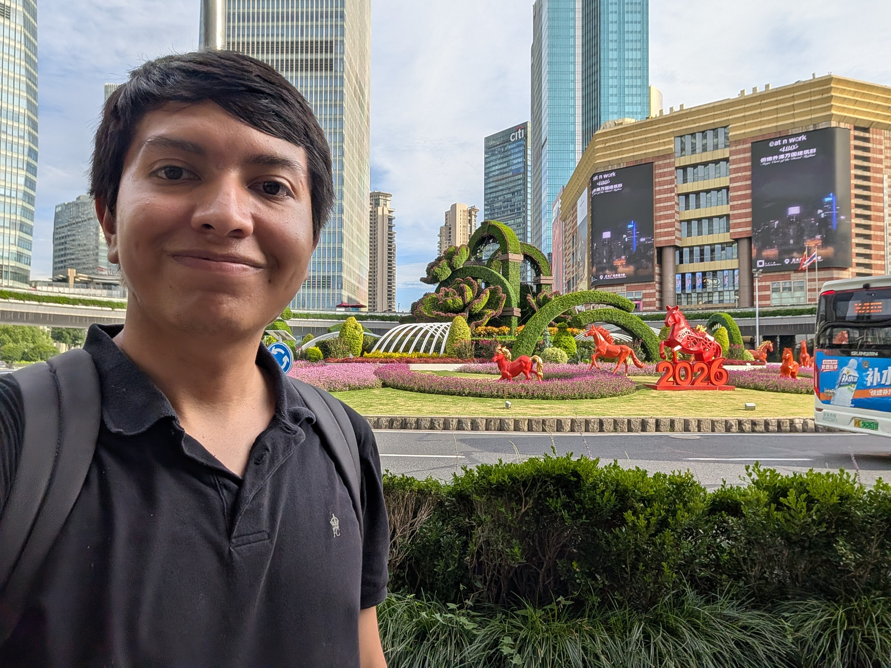

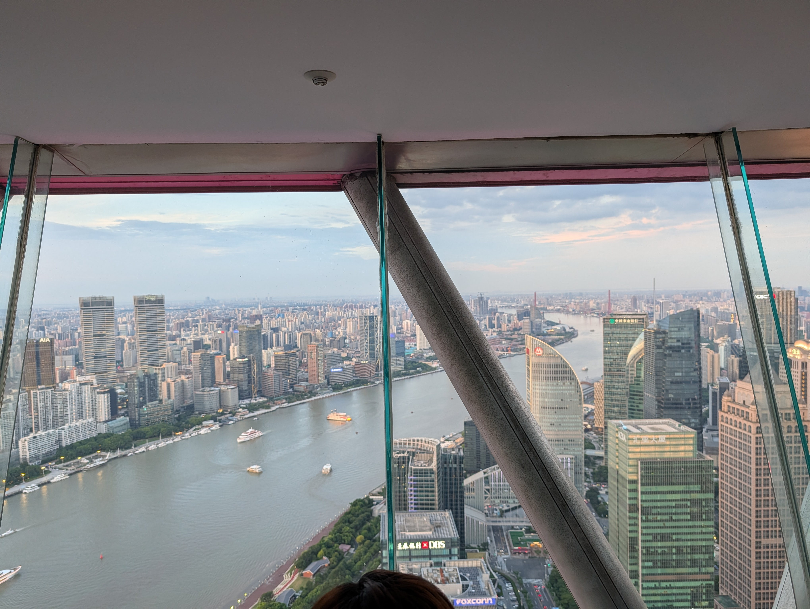
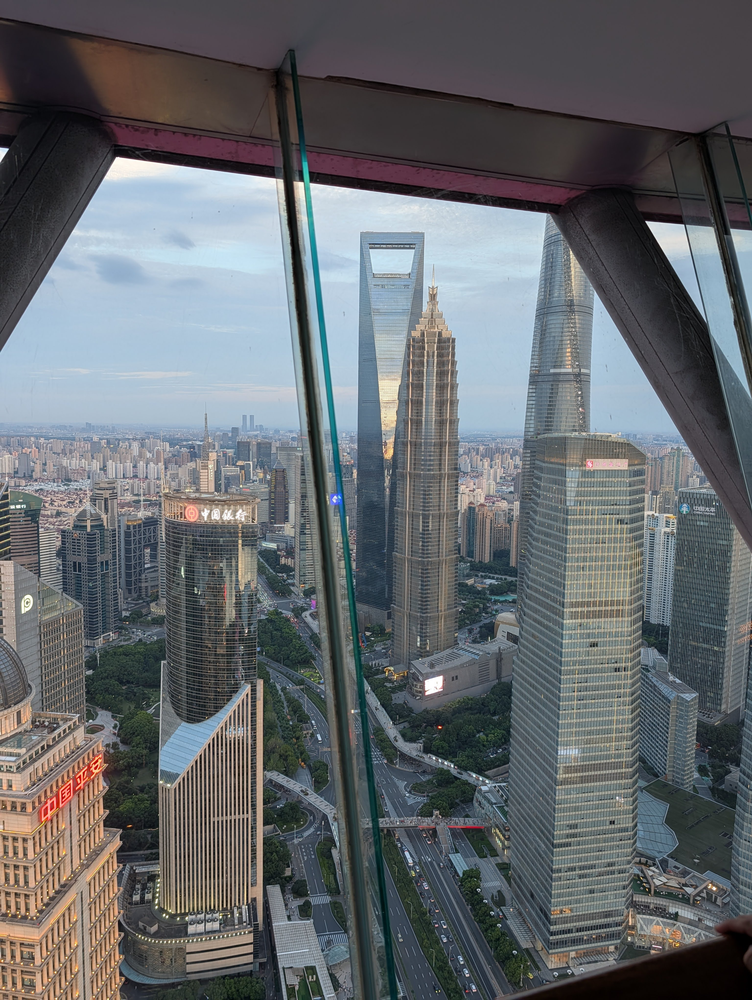
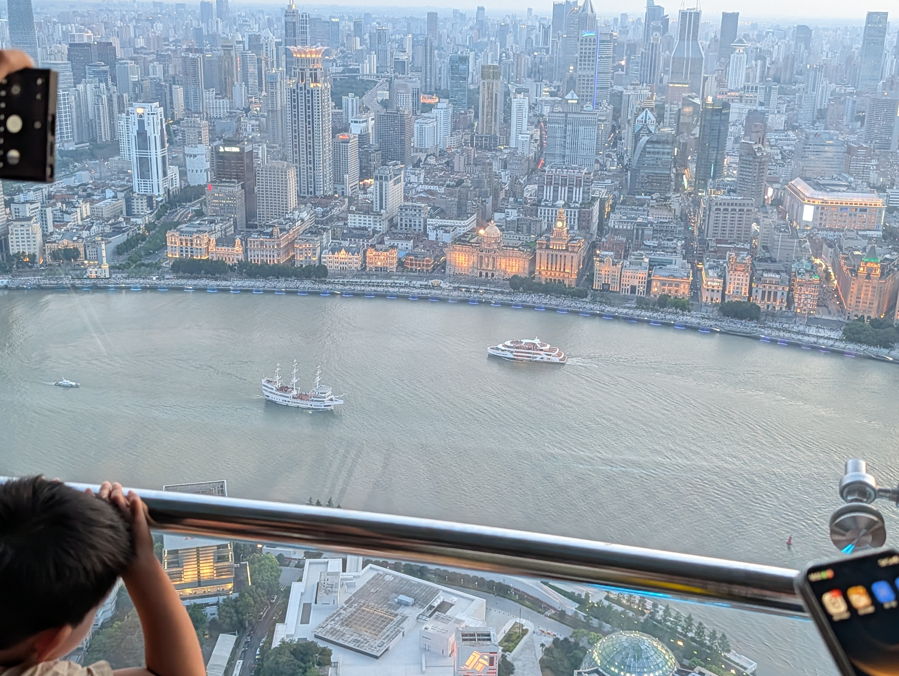
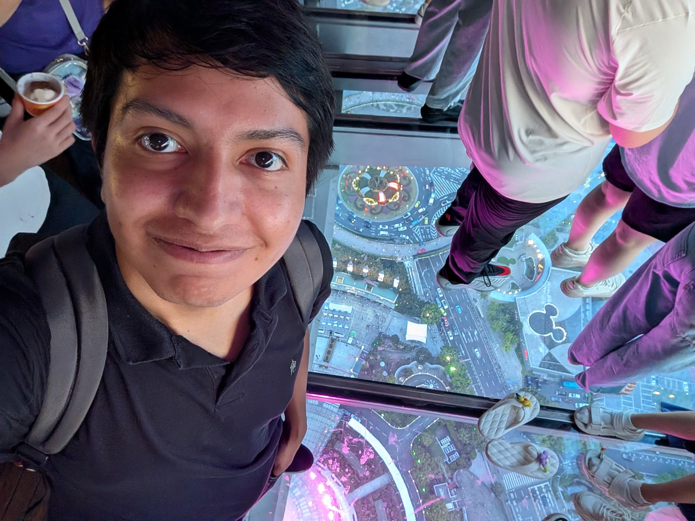
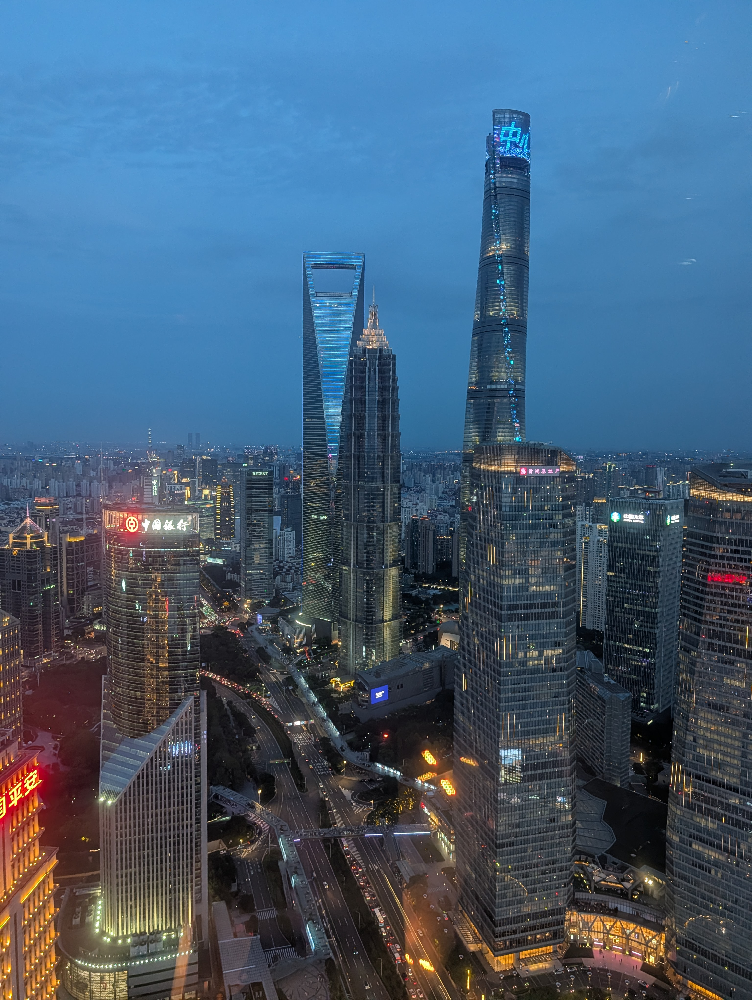
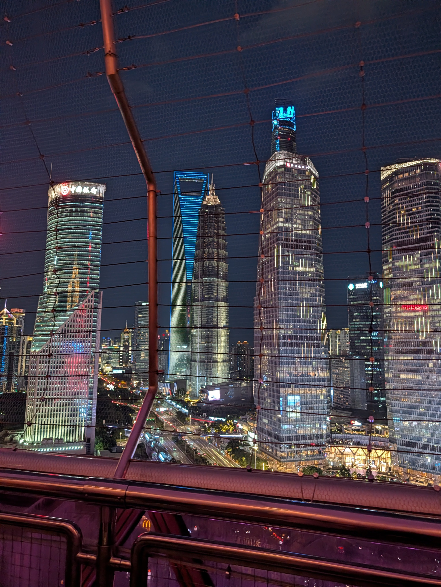
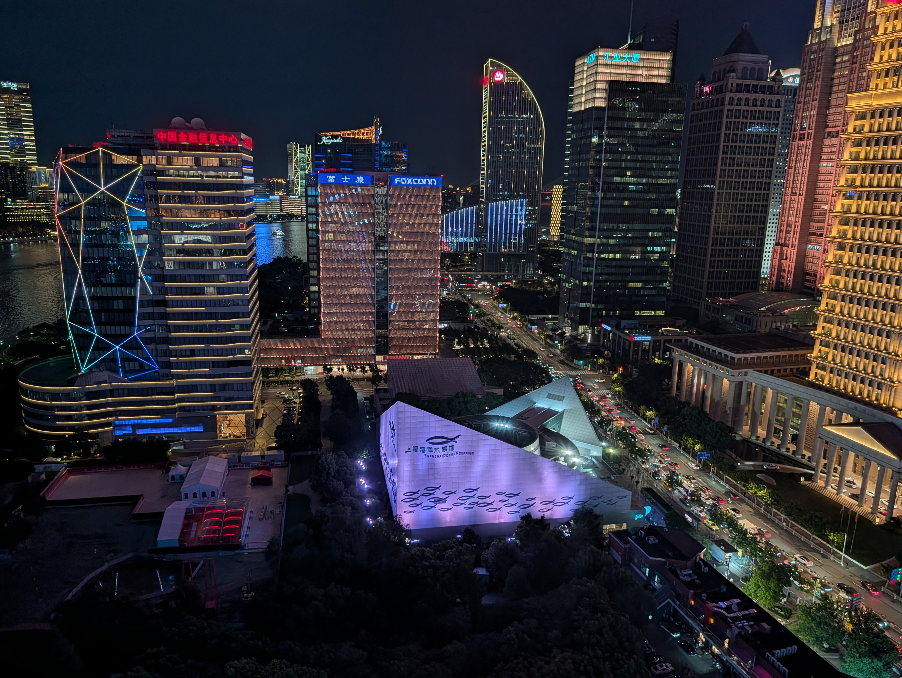

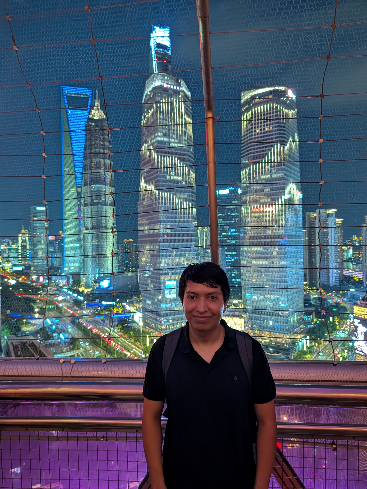
:::

# Taxis

Antes de venir a China, Rachel y yo investigamos las mejores formas de pagar cosas y cómo pedir un taxi. Configuramos Alipay y WeChat para esto. Algunos de los chicos que vinieron también lo habían hecho. Desafortunadamente, para la mayoría de las personas el proceso adicional todavía requiere recibir códigos SMS de verificación que ya no era posible obtener aquí. Afortunadamente mi configuración estaba (inicialmente) bien, así que pude conseguir un taxi camino a la Torre. Sin embargo, mi cuenta fue marcada como sospechosa y ya no pude usarla después sin hacer una verificación completa en persona. De regreso tuvimos que tomar taxis en la calle que claramente querían estafarnos cobrando 3-4 veces el precio normal. Finalmente tuvimos que aceptar una tarifa un 30% más alta porque necesitábamos llevar a los chicos de vuelta a los dormitorios antes del toque de queda. Al regatear el precio con el conductor, estábamos usando una app de traducción y dije “Este viaje es X% más caro de lo que DiDi muestra”, a lo que él respondió “Pero eso no lo puedes conseguir ahora, ¿verdad?” lo cual me pareció hilarante y al final acordamos algo más razonable.
