# Coordinación

¡Último día de coordinación! Después del día agotador de ayer coordinando la mayoría de los problemas, estábamos programados para volver a la sala de coordinación por algunos estudiantes/problemas cuyos puntajes no coincidían. Nos preparamos para una pelea agotadora. Había un estudiante en particular con soluciones muy largas a dos problemas (28 y 37 páginas, respectivamente). Aunque sus soluciones estaban un poco desordenadas, eran completas, así que estaba dispuesto a llevar la pelea hasta el jurado internacional si fuera necesario. Afortunadamente no tuvimos que escalar este desacuerdo más allá del capitán del problema y completamos la coordinación de manera amistosa. No hace falta decir que desde entonces ya le dijimos a este estudiante que necesita trabajar en organizar mejor sus ideas y soluciones.

# Excursión

Como terminamos la coordinación temprano en el día, pudimos unirnos a uno de los viajes con algunos de los otros líderes. Elegimos ir al Museo de Ciencia y Tecnología.

Algunas de las secciones que vimos y que encontré interesantes incluyeron

## Fuentes de energía

::: carousel
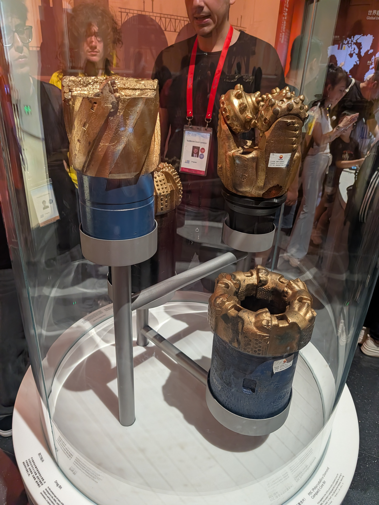
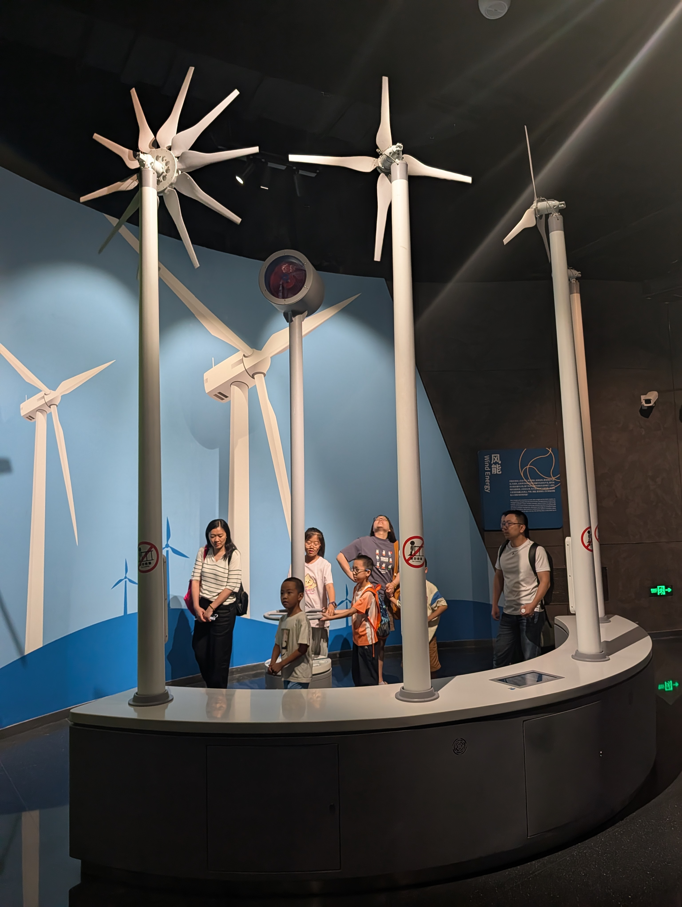
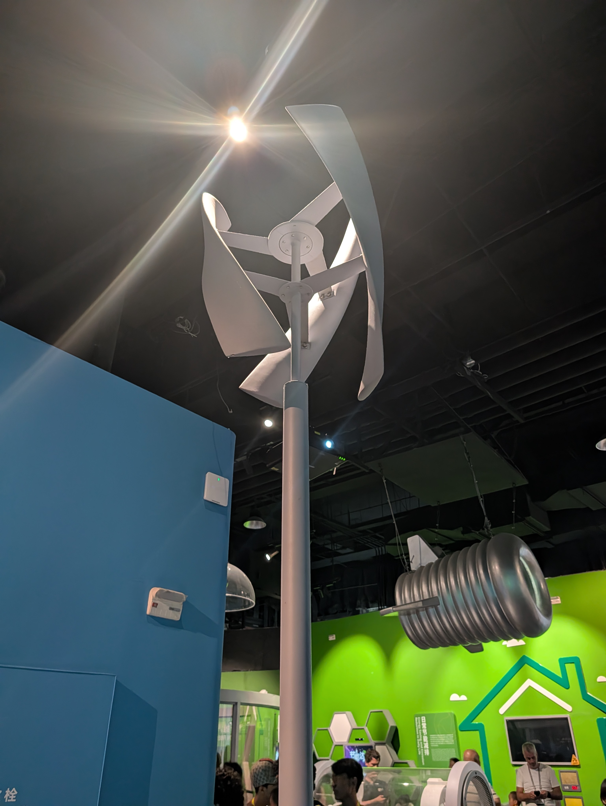
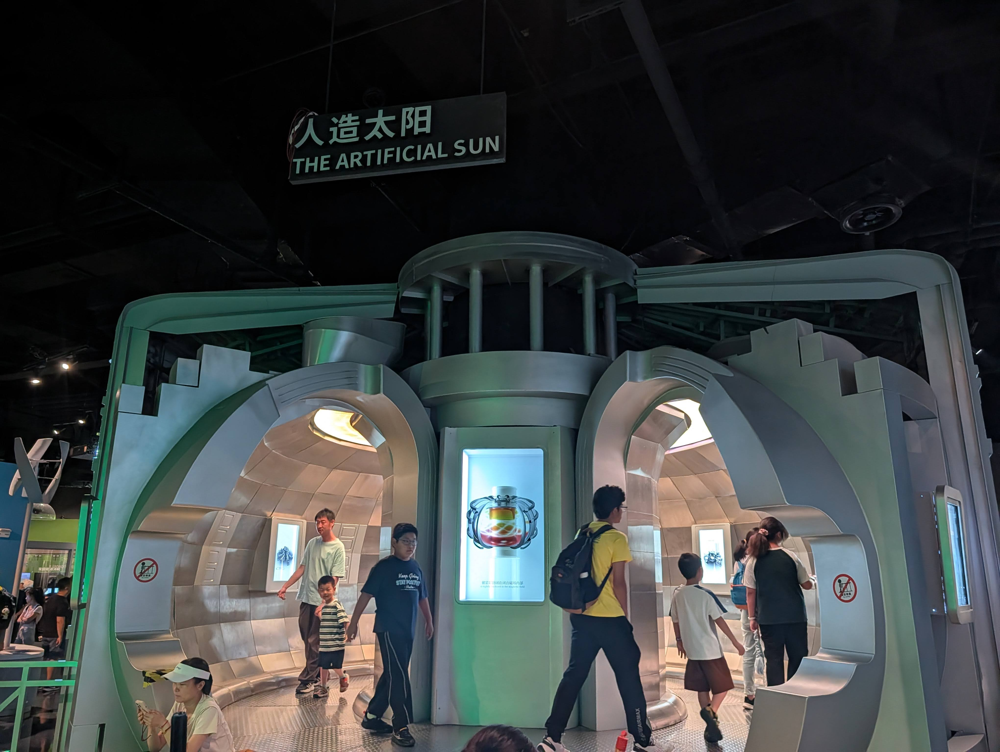
:::

## Cambio climático y sostenibilidad

::: carousel
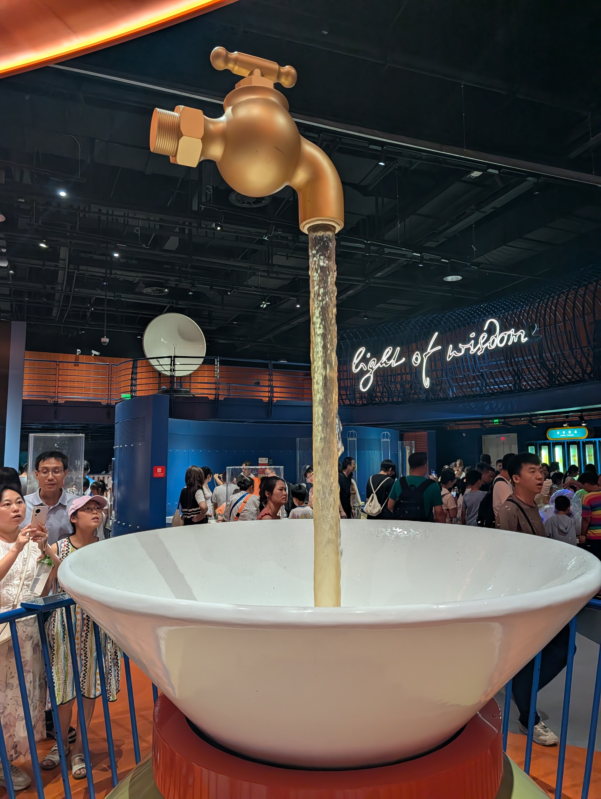

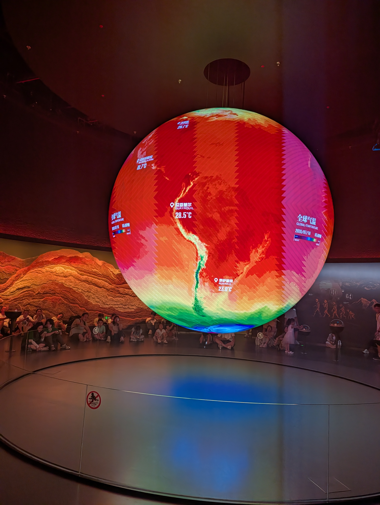
:::

## IA y robots

::: carousel
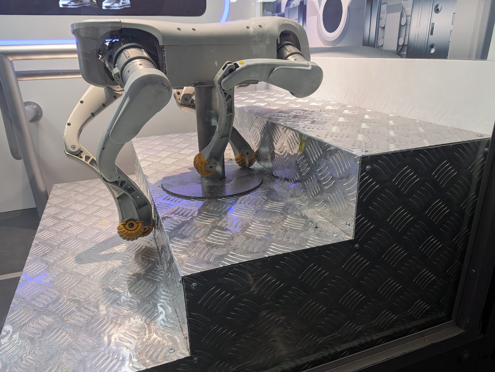
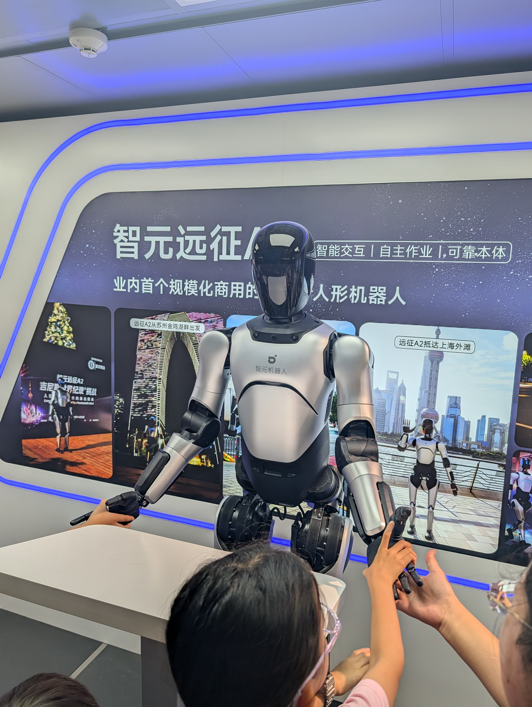
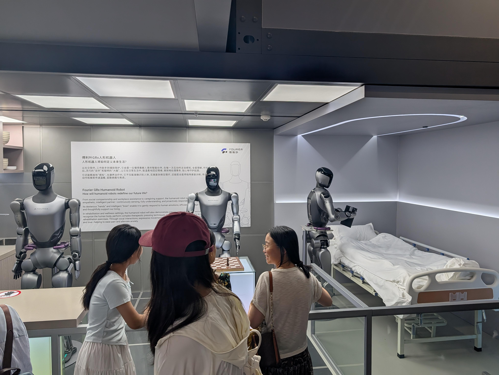
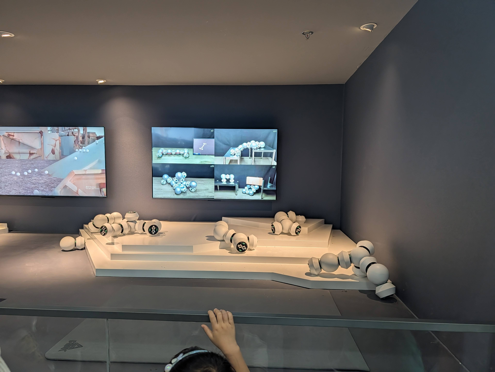
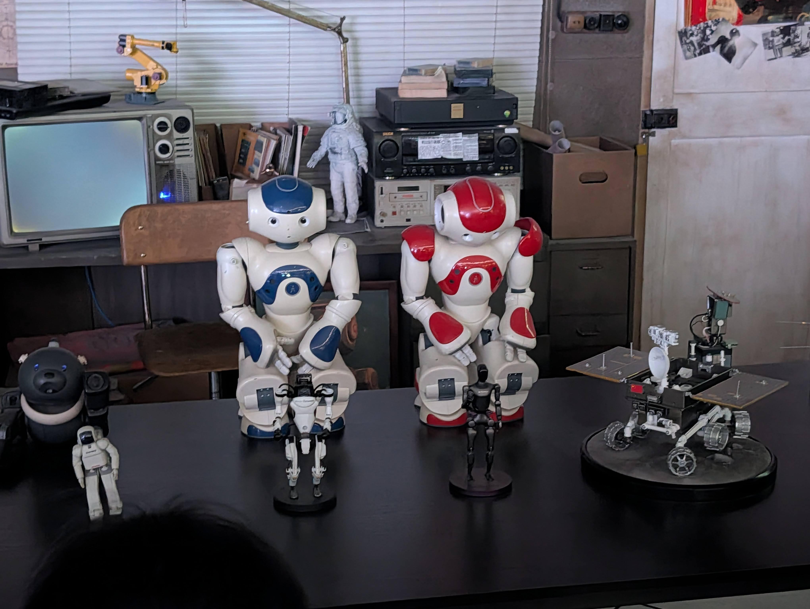

:::

## Escalera mecánica transparente

::: carousel

:::

# Centro comercial

Los chicos se sintieron como si estuvieran atrapados. Para ser justos, la seguridad alrededor del campus y el largo procedimiento para sacarlos me sorprendió mucho comparado con ediciones anteriores de esta competencia. Por eso los llevamos al centro comercial más cercano para cenar y comprar algunos snacks/souvenirs. También les hice probar Yakult a todos. Aunque Yakult es japonés, lo vi en la tienda y pensé que era algo que debíamos probar mientras estábamos allí.

::: carousel

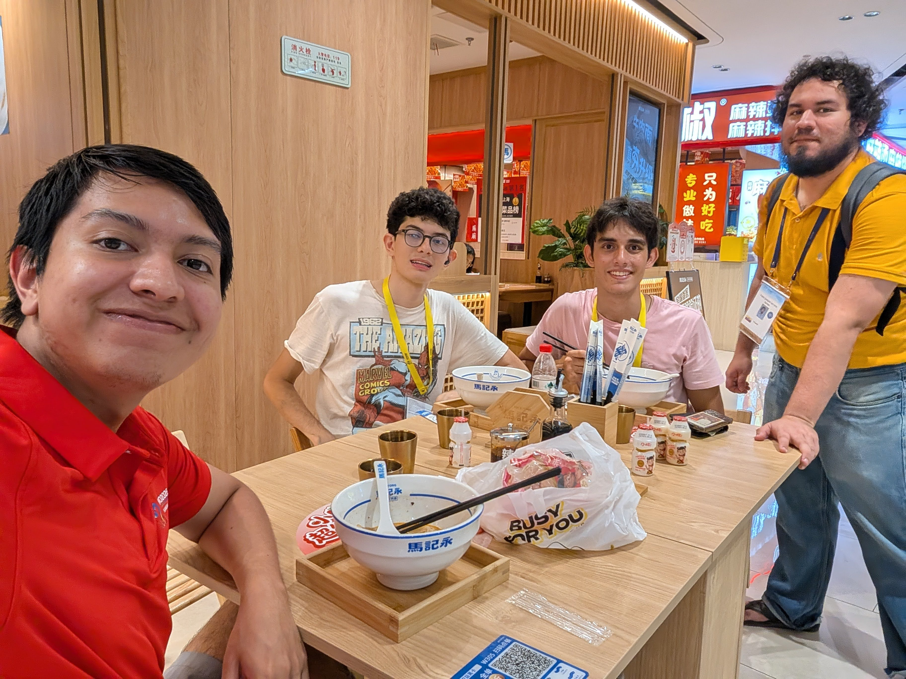
:::

De regreso, todos compramos CoCo! hubo un caballero muy amable que ayudó a nuestros estudiantes con sus pedidos. Sin embargo, esta parada no resultó ser muy inteligente. Empezó a llover bastante fuerte. Afortunadamente no estábamos muy lejos de la escuela, así que solo tuvimos que correr. Estaba muy empapado cuando regresé al hotel donde inmediatamente tuve que secar mis zapatos. Nota para el próximo viaje: llevar más de un par de zapatos.

# ¡Rachel llegó!

Durante todo el día seguí el viaje de Rachel a Shanghái. Me mantuvo informando todo el tiempo, pero aun así estaba muy preocupado debido a las restricciones para usar algunas apps aquí en China. Ambos teníamos WeChat para evitar problemas, pero no iba a poder dormir hasta que me dijera que había llegado segura al hotel después de tomar el taxi desde el aeropuerto. Afortunadamente todo salió bien, llegó al hotel y le gustó mucho, así que me fui a dormir, lol.
