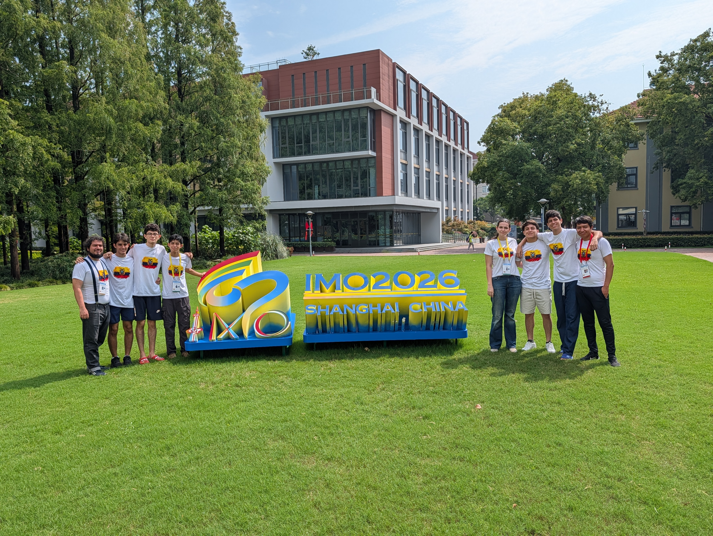
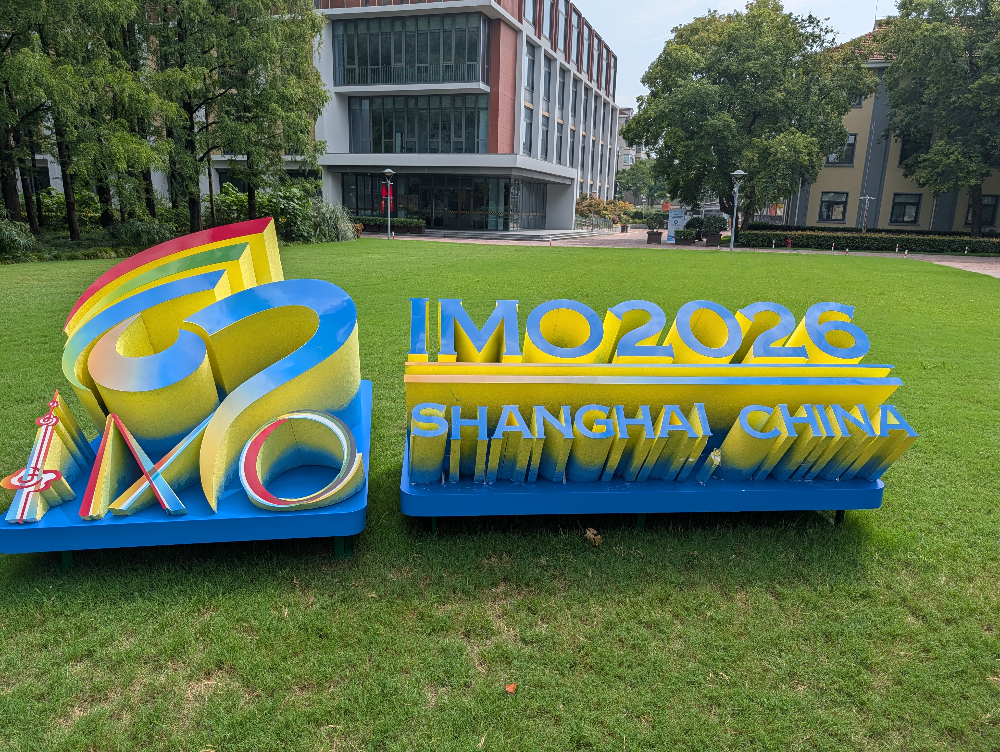
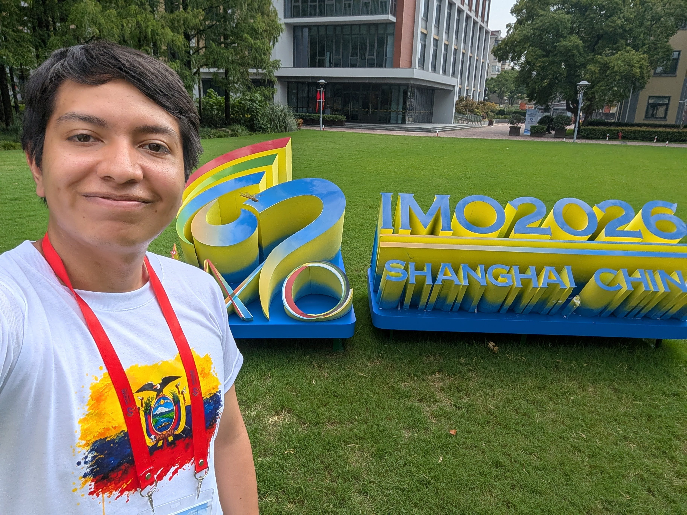
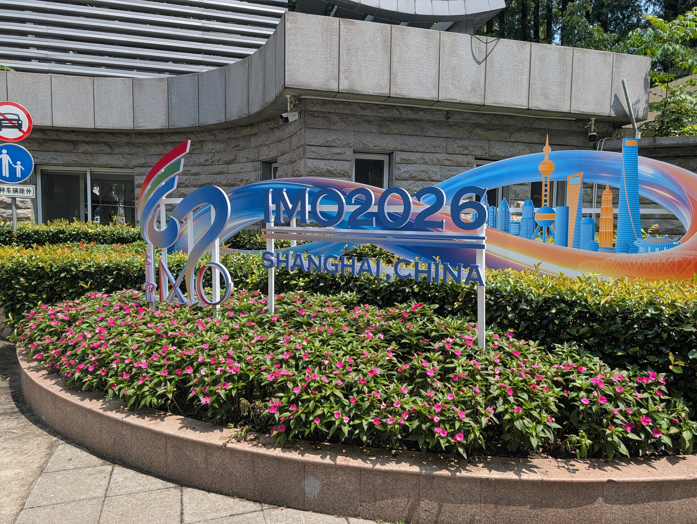
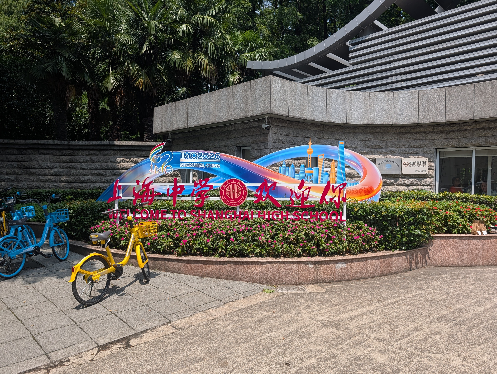
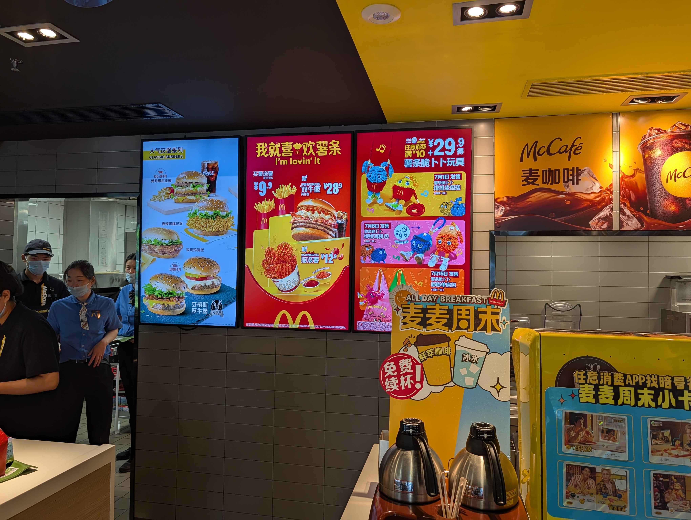
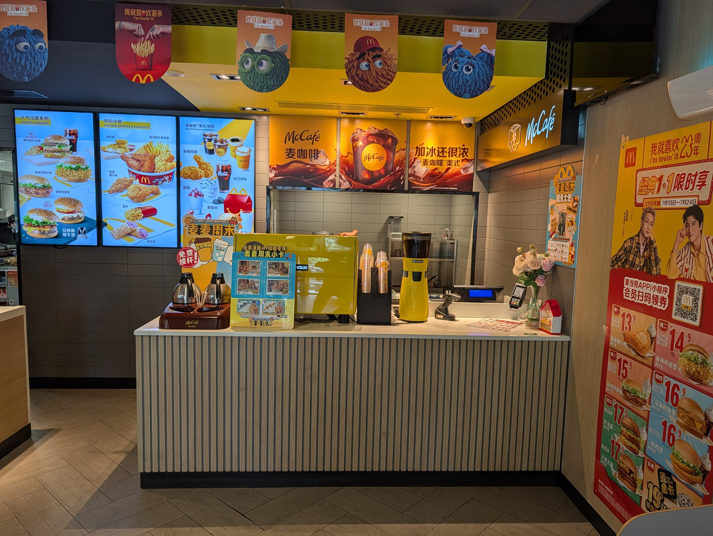
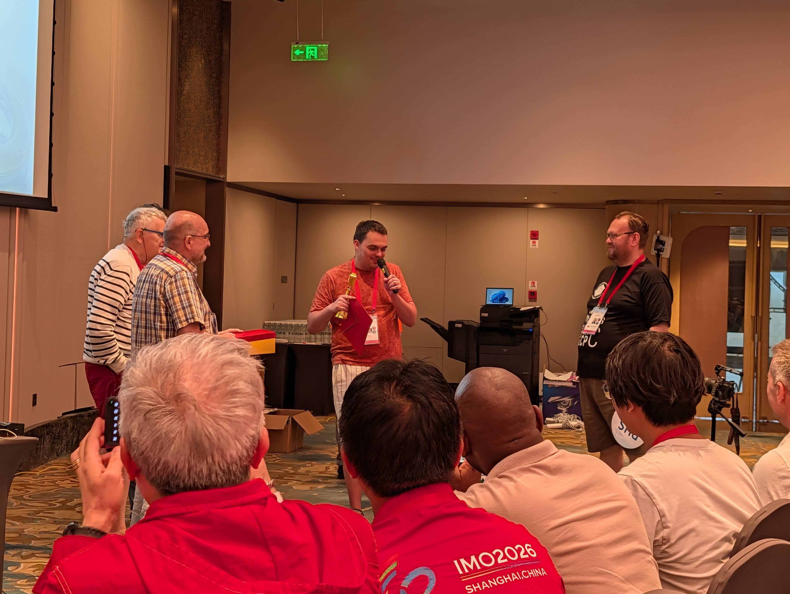

# Centro comercial otra vez

Los chicos pidieron ayuda otra vez queriendo salir. Fuimos por la mañana y los llevamos a otro centro comercial cercano. Antes de salir, nos tomamos algunas fotos con una camiseta que nos dio un patrocinador. La mía estaba un poco apretada, así que creo que Rachel terminó consiguiéndose una nueva camiseta, lol.

::: carousel

:::

Han tenido problemas con la comida que les dan en el colegio, así que la mayoría aún no había desayunado. Inmediatamente corrieron a Starbucks. Puedes estar seguro de que yo les estaba mirando con cara de juicio, lol. De hecho, fueron a suficientes Starbucks, Popeyes y McDonalds para durarles varias comidas. Tomé algunas fotos de McDonald’s. Su menú se veía un poco como el de KFC.

::: carousel

:::

# Reunión final del jurado

Tuve que volver corriendo al hotel porque tenía algunas reuniones del jurado (burocráticas) y la reunión muy importante para decidir los cortes de medalla.

## Microphone D'or

Aparte de los cortes de medalla, una cosa muy genial que hicimos en esta reunión del jurado fue la ceremonia del Microphone D'or. Este premio se entrega al Líder que habló más durante nuestras reuniones del jurado. Este año el Líder francés Theo ganó el premio por haber pedido el micrófono 47 veces.

::: carousel

:::

## Cortes de medalla

En este punto ya conocíamos las puntuaciones de nuestros chicos. Nuestros dos mejores estudiantes resolvieron 2/6 problemas perfectamente obteniendo 14 puntos. En esta competencia, 16-18 puntos es el corte usual para la medalla de bronce, así que sabíamos que probablemente no íbamos a obtener medallas este año. Además, basándonos en los problemas, sabíamos que el corte para bronce no iba a ser bajo.

No era la primera vez que estaba en una reunión para decidir los cortes de medalla, pero hacerlo en un IMO es otro juego. Muchos países presentaban argumentos sobre por qué deberíamos o no deberíamos otorgar más medallas (es decir, bajar/subir los cortes).

Este año, resultó que nuestra intuición era correcta y el corte fue 16. Tristemente esto significa que volvemos sin medallas, pero no puedo decir que no esté satisfecho con el desempeño de nuestros estudiantes. Al revisar sus soluciones, estaba claro que se esforzaron hasta el final. Además, nuestros dos mejores estudiantes tienen al menos dos IMOs más por delante, así que no puedo esperar a ver qué seguirán logrando.

## ¿Crucero?

Se planeó un crucero por el río Huangpu después de la reunión final con todos los estudiantes. Desafortunadamente tuvimos un clima terrible (lluvia intensa + viento fuerte) y por eso se canceló este plan. En su lugar, fuimos a visitar a los estudiantes para cenar.
