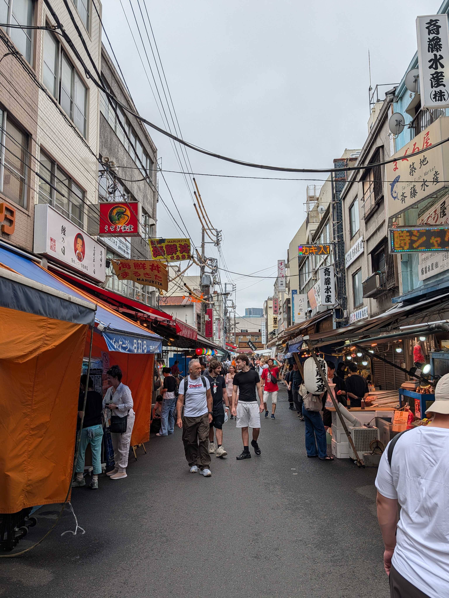
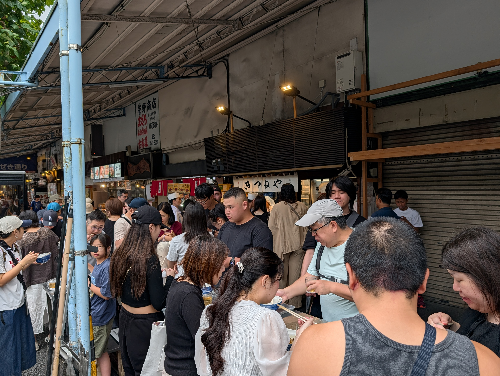
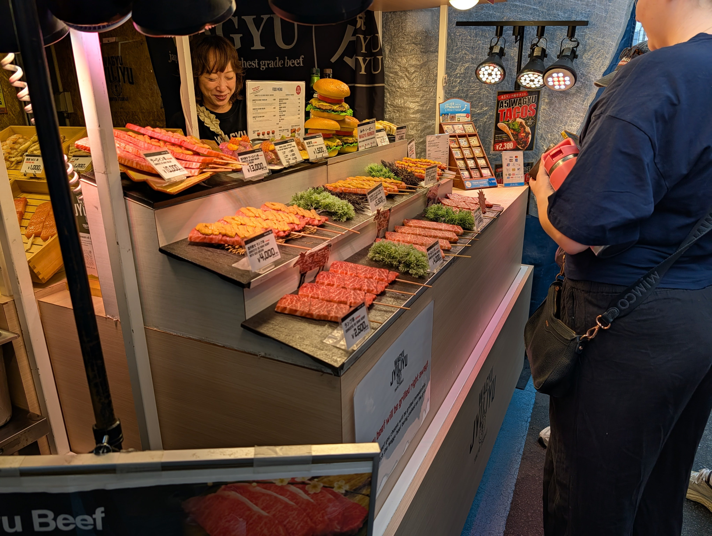
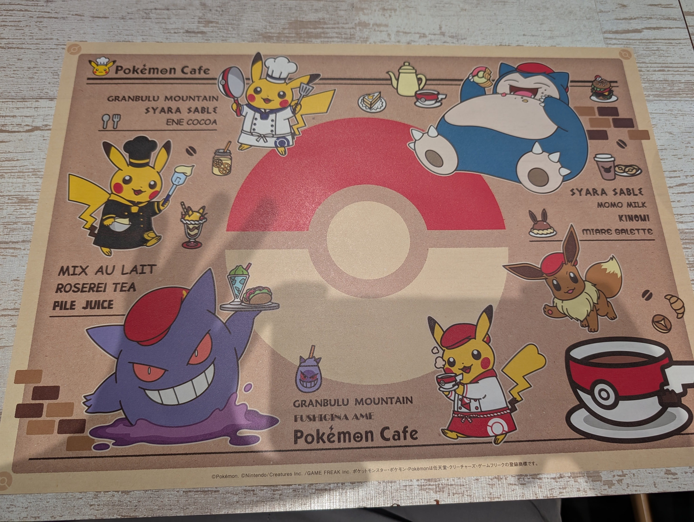
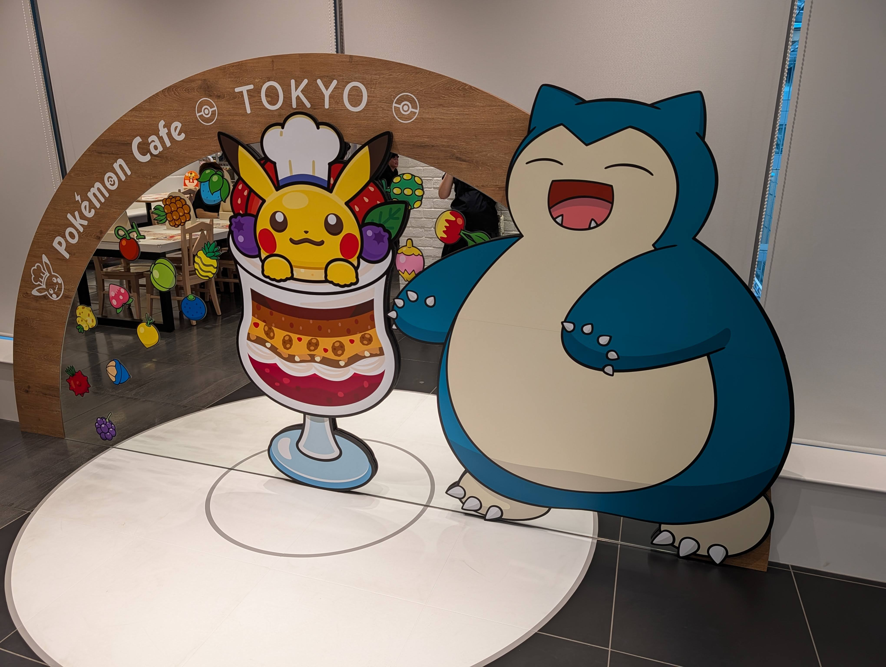
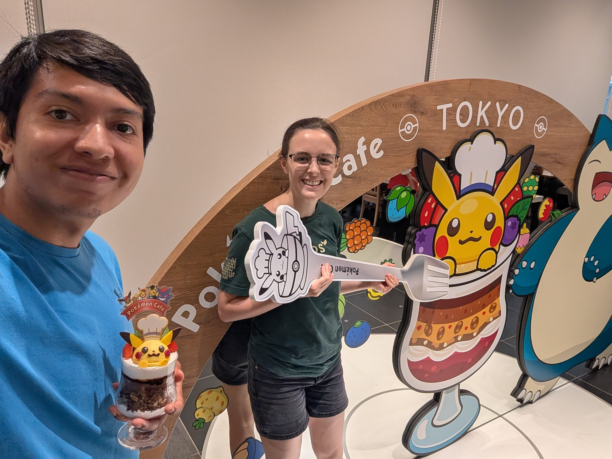
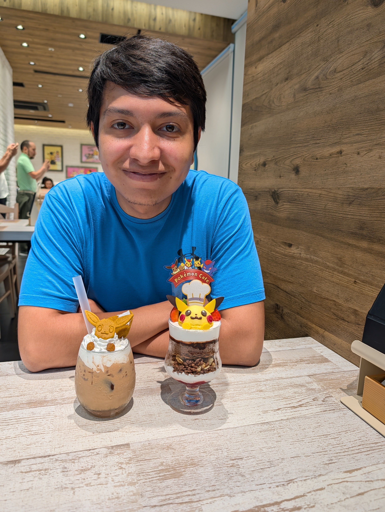
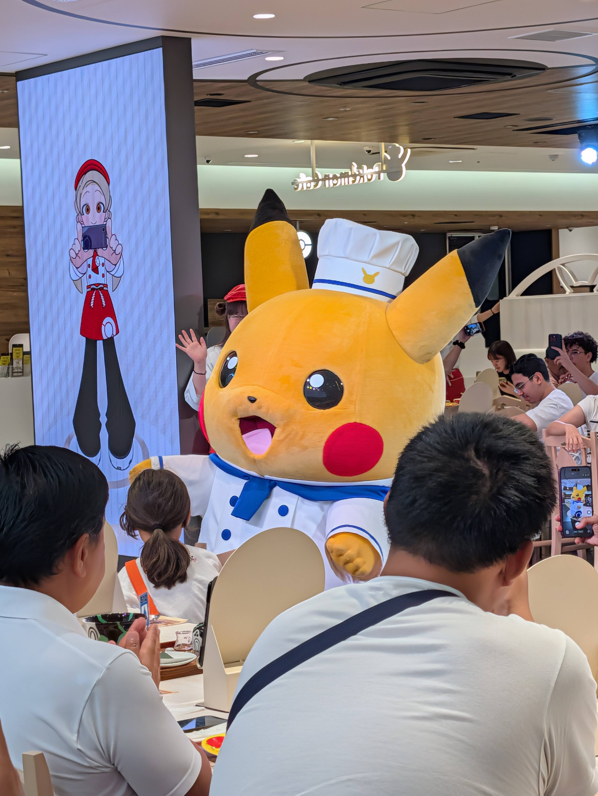
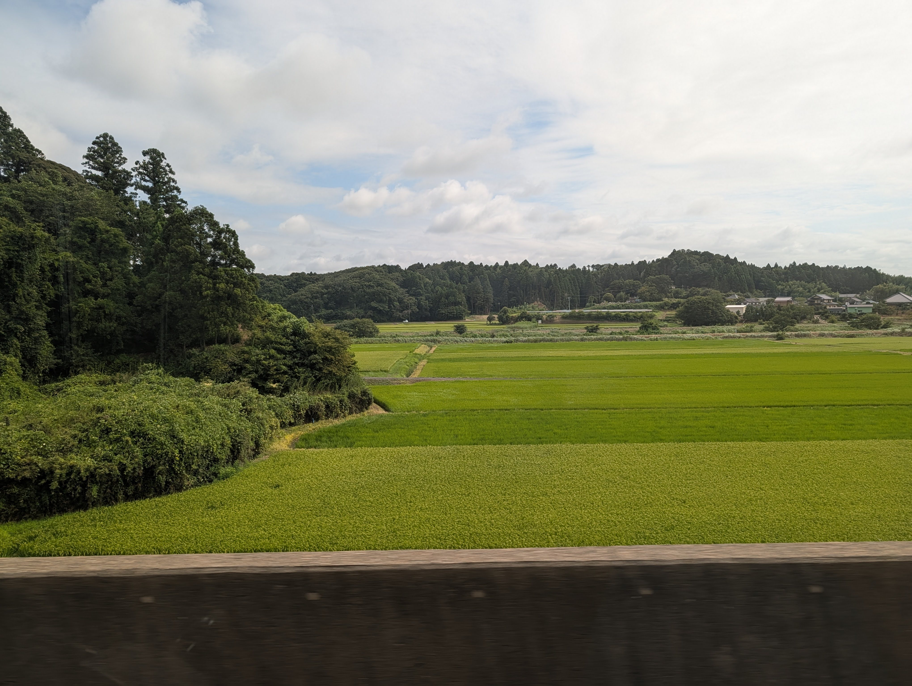
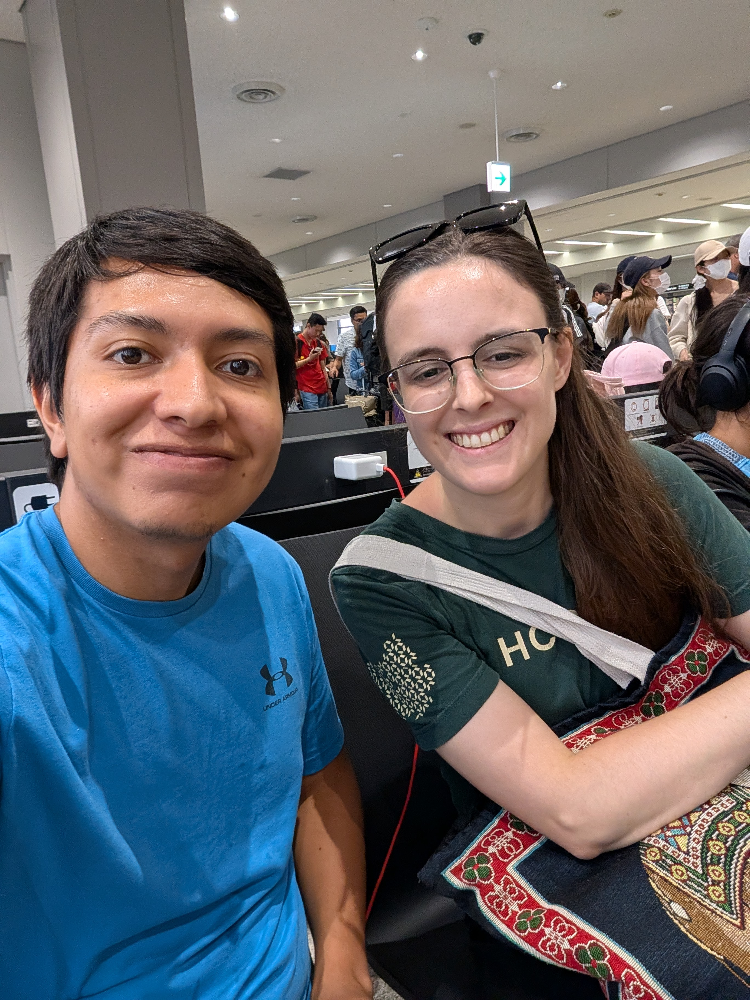

Rachel here - the last day of our trip.

# Tsukiji Market

This morning Sebastián got up early and visited the Tsukiji Fish Market - the largest first market in the world. I was exhausted so I skipped the market and slept in a bit. Sebastián got me a beef stew which was delicious. The market was very busy with lots of vendors selling both fresh fish/seafood and prepared dishes. Sebastián got a seafood sushi bowl and said everything tasted super fresh.

::: carousel

:::

# Pokémon Cafe

We met up at the Pokémon Cafe. They operate on a reservation basis and are always very busy, but because Sebastián had lined up early we were able to get a table due to a cancellation.

The cafe was super cute. All the dishes had characters incorporated. We got a Pikachu Parfait and an Eevee Royal Milk Tea. They were so cute it was hard to take the first bite and ruin it!

They also hada show were Pikachu came out and did a song and dance.

::: carousel

:::

# Flight

Then we headed to the airport for our flight home. This flight is funny because we cross the International Date Line, so we left Japan at 5:25pm on August 3rd and arrived in Toronto at 4:30 pm on August 3rd. The flight is -1 hour, haha.

::: carousel

:::

# Home

We landed in Toronto and made it home smoothly. It's nice to be back in our own appartment. Now we're headed to bed as it's time to go back to work tomorrow.