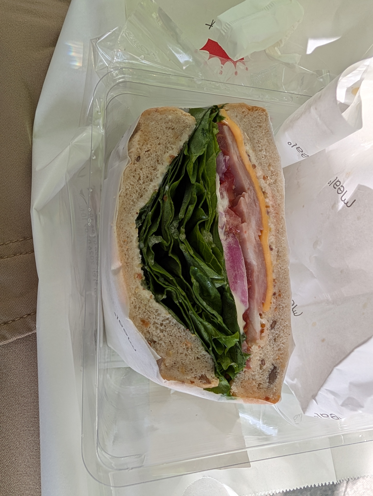
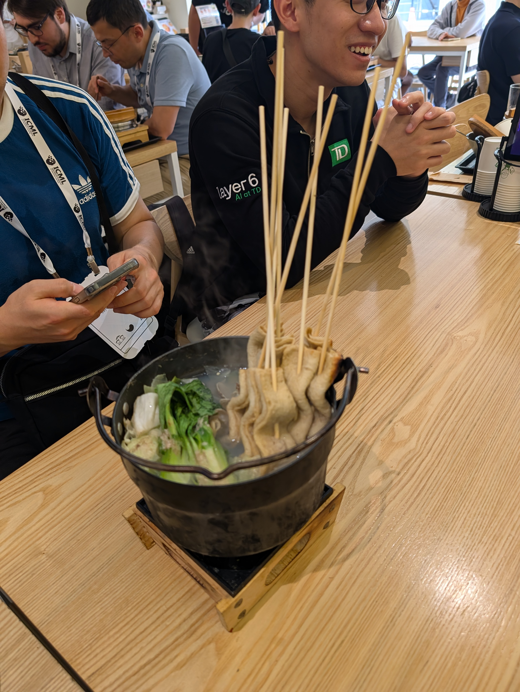
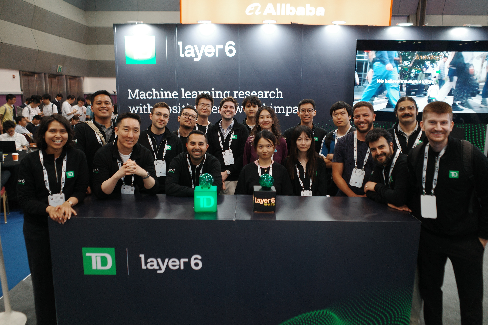
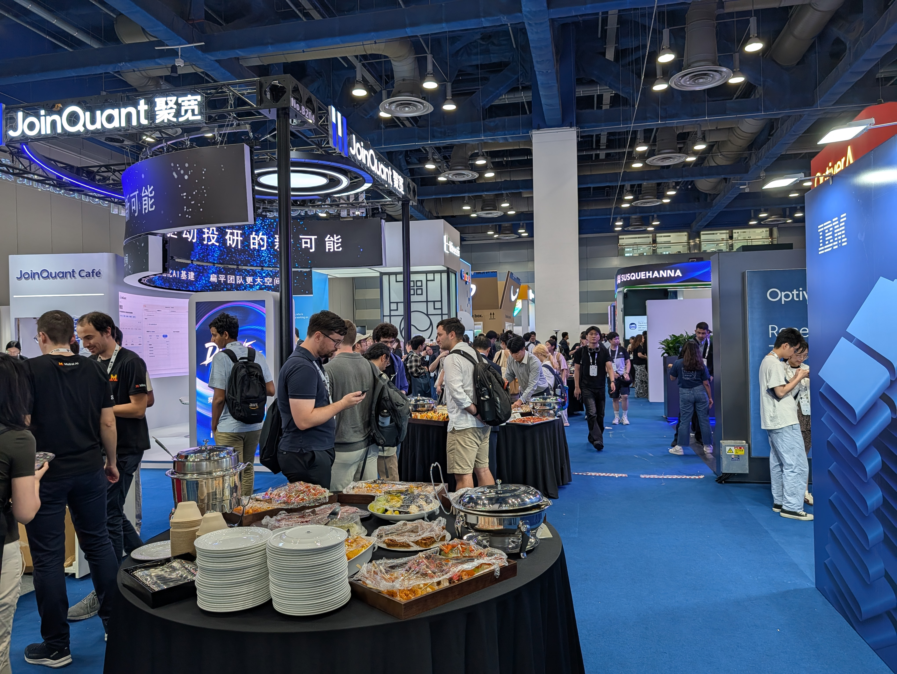
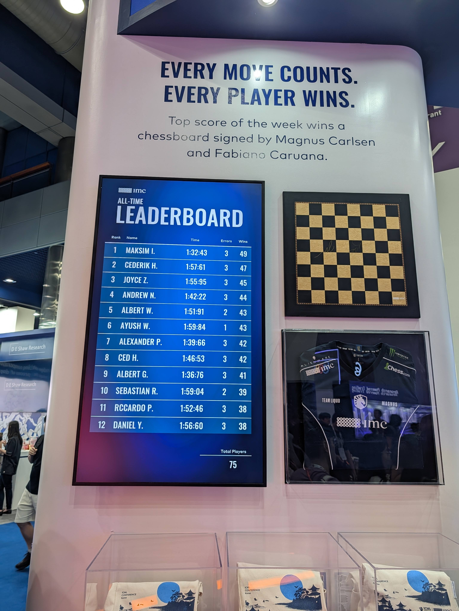
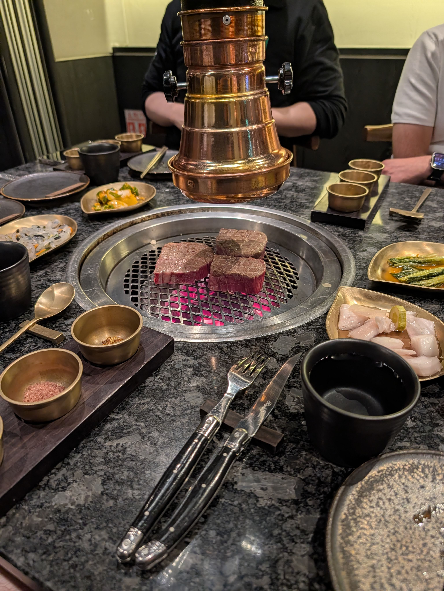
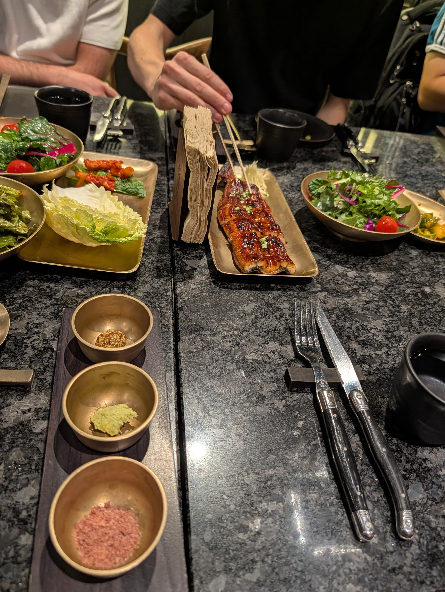

# Desayuno

::: carousel

:::

# Carteles

Ojalá hubiera tenido más tiempo hoy para las sesiones de carteles. Tuve buenas conversaciones sobre investigaciones relacionadas, pero tuve que pasar un rato en nuestro stand de patrocinadores.

::: carousel

:::

# Almuerzo

Fui a almorzar con unos colegas. La fila para el restaurante era larga; probablemente esperé 30 minutos. La comida estaba buena, pero no estoy seguro de si valió la espera, lol.

::: carousel

:::

# Stands de patrocinadores

TD está patrocinando ICML este año, así que tuvimos un stand. Pasé mucho tiempo ahí hablando con personas sobre nuestra investigación, oportunidades de carrera y la empresa. Incluso tuve la oportunidad de hablar con personas de mi área con las que no pude hablar en las sesiones de carteles, lo cual fue genial.

::: carousel

:::

# Cena

Tuve una buena cena en un lugar de Korean BBQ con todo el mundo que vino de TD. Pensé que la tradición del Korean BBQ era cocinar la carne uno mismo, pero este lugar tenía gente que la cocinaba por nosotros. Aparentemente esa es la forma elegante de hacerlo. La comida estuvo absolutamente increíble, al igual que las conversaciones (y el soju, lol).

::: carousel

:::
