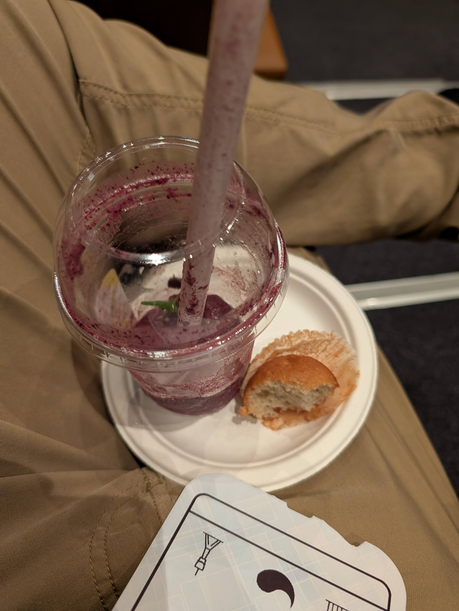
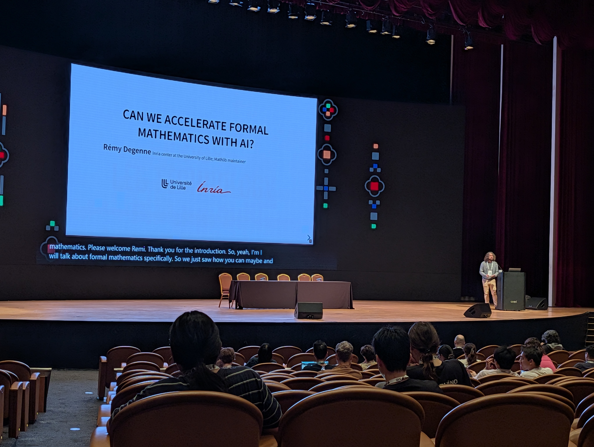
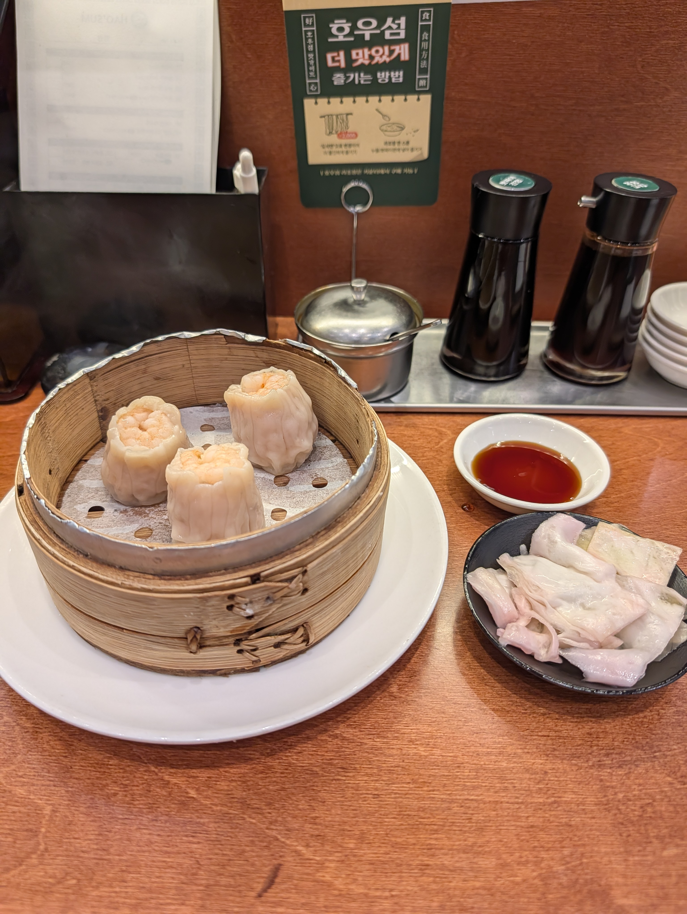
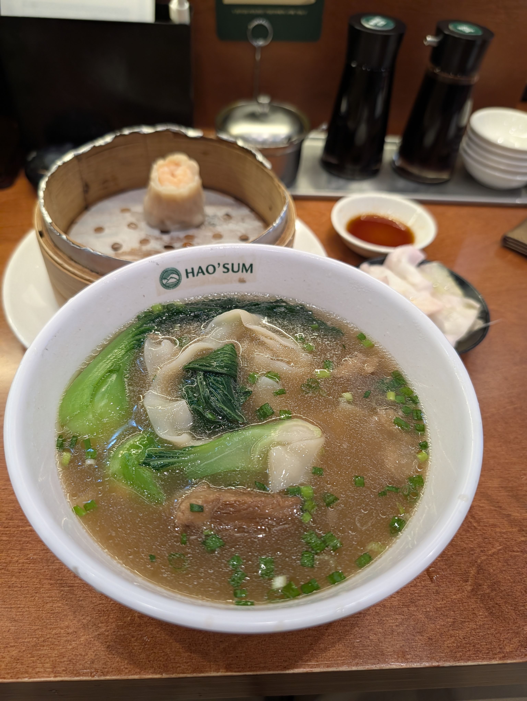
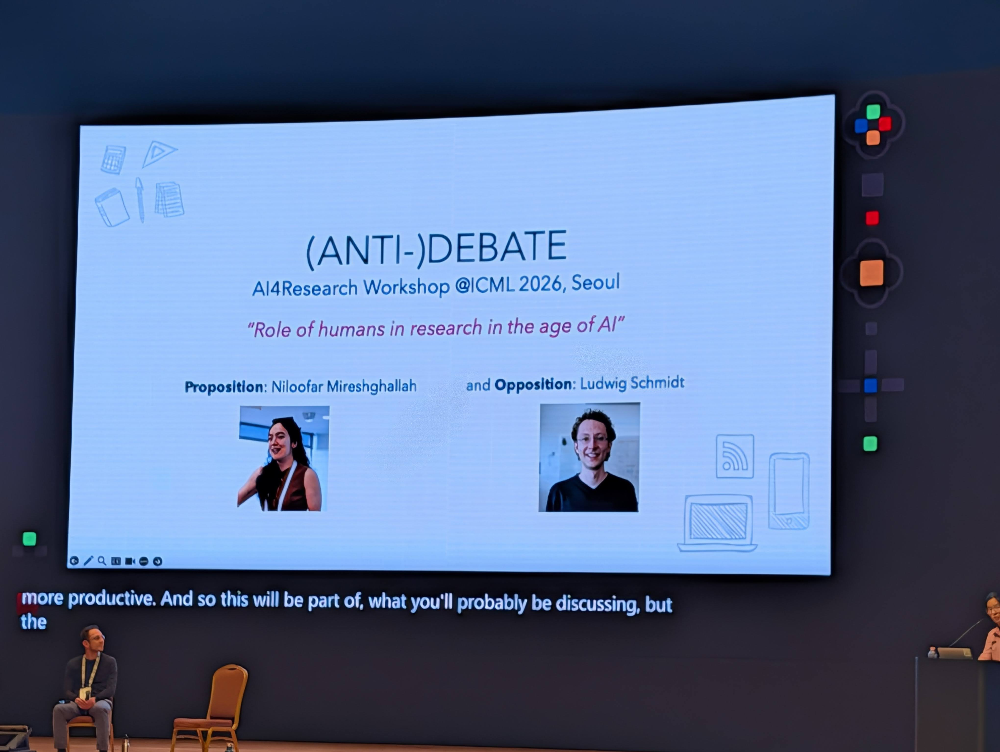
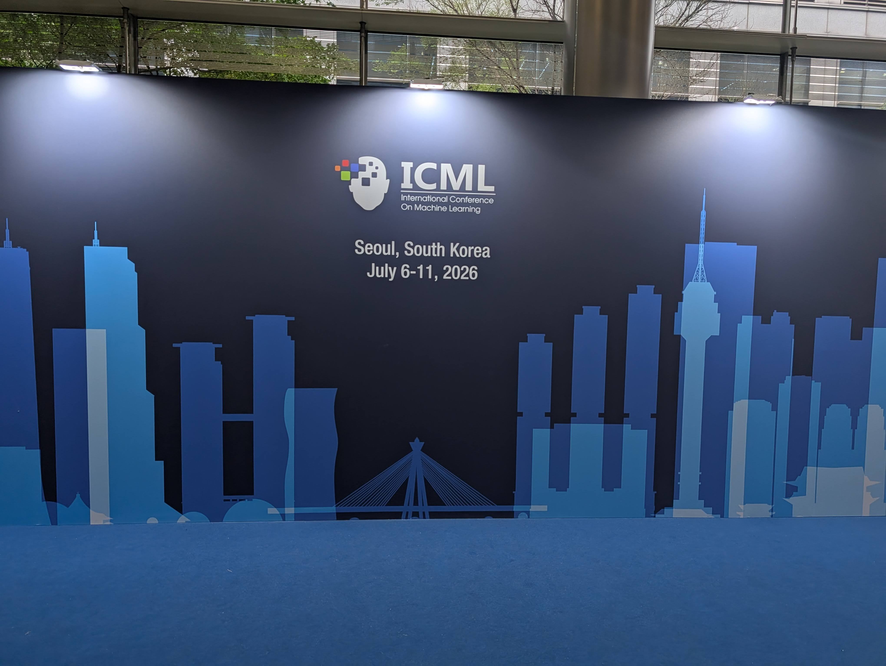
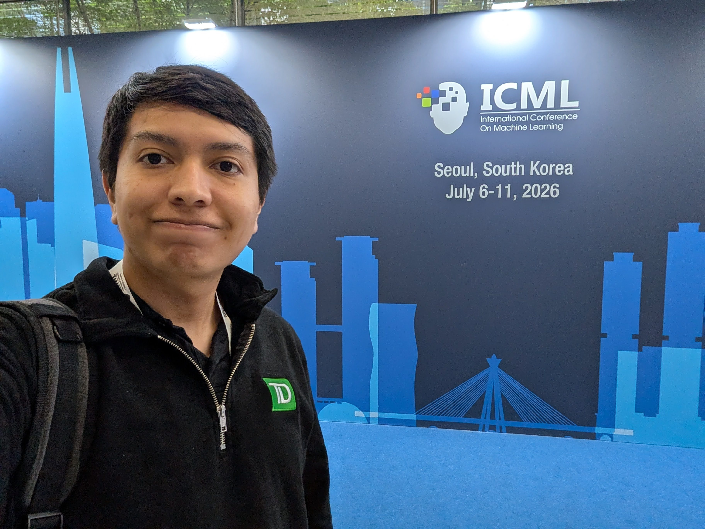
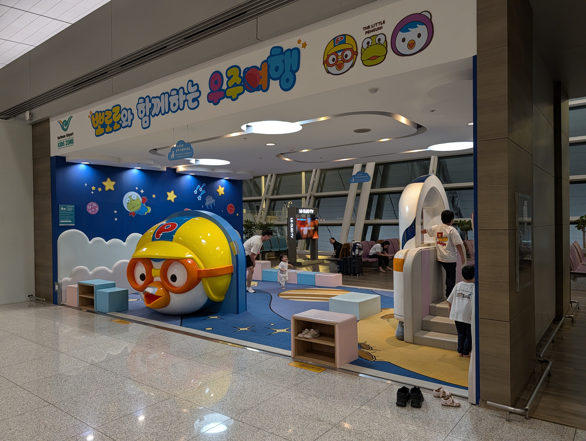
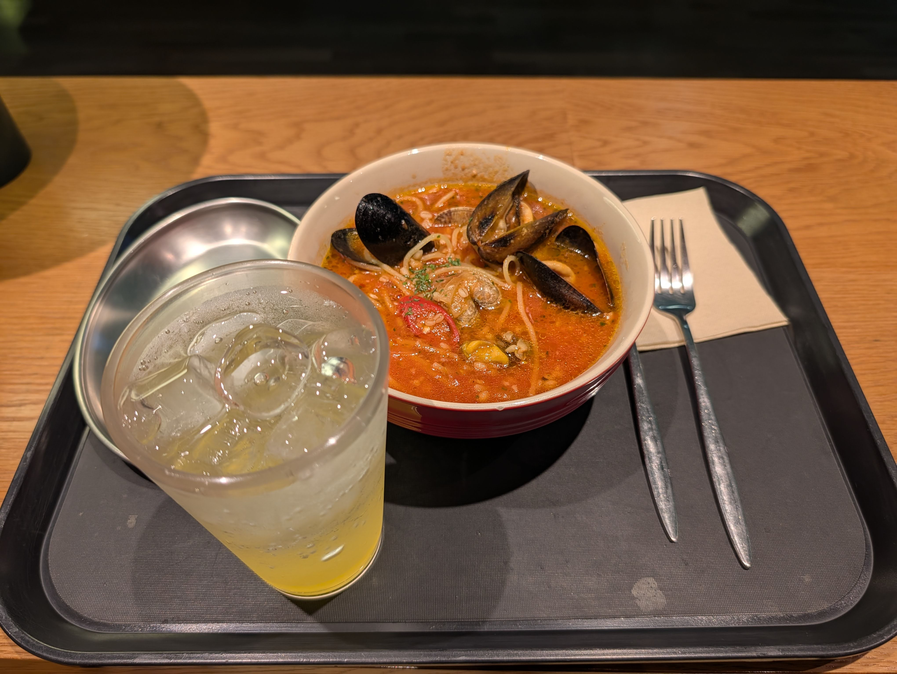
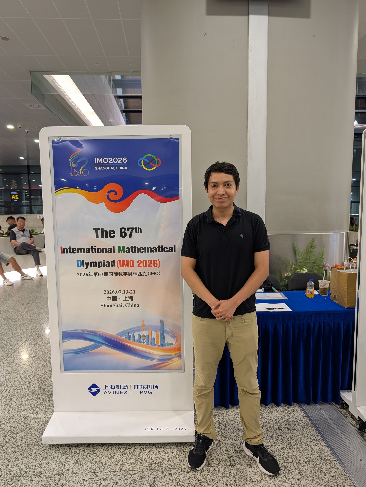

# Desayuno

Mi último Açaíberry Yogurt Frappe :(. 

::: carousel

:::

# Taller

¡Estuve muy emocionado por este taller sobre IA para investigación en matemáticas! Abajo está una de las charlas.

::: carousel

:::

# Almuerzo

Supongo que me estoy preparando para China? Comí dim sum estilo Hong Kong mientras hablaba con Rachel :).

::: carousel

:::

# Debate

Debate interesante sobre si deberíamos mantener humanos en investigación... Fue un anti-debate, así que el objetivo fue discutir ideas opuestas pero en última instancia acercarnos a un punto medio. TDLR: el número de investigadores inevitablemente disminuirá, pero aún necesitaremos guía/sovereignidad humana. Los investigadores se moverán a campos más aplicados para potenciar la investigación en ciencias más "duras". Estoy algo de acuerdo con esta opinión, pero contáctame si quieres debatir más.

::: carousel

:::

# Adiós ICML

Fue divertido, pero hora de la próxima aventura.

::: carousel

:::

# Aeropuerto

Tras una demora de 1 hora en mi bus, me preocupé un poco de que 2 horas no fueran suficientes para pasar seguridad o cualquier control dado que era mi primera vez yendo a China. Afortunadamente pasé seguridad en menos de una hora. Con poco tiempo para abordar, fui por la mejor opción cerca de mi puerta: un restaurante italiano. Pedí una pasta "de mariscos". Digamos que no deberías pedir comida italiana en este aeropuerto coreano. Solo había almejas (cuando anunciaban camarón y calamar), pasta extremadamente barata en una salsa de tomate aguada, picante pero con poco sabor. Su limonada también fue terrible :(. 

::: carousel

:::

# China

Aterricé en China para la Olimpiada Internacional de Matemáticas (IMO). Trajo muchos recuerdos de cuando fui concursante.

::: carousel

:::
